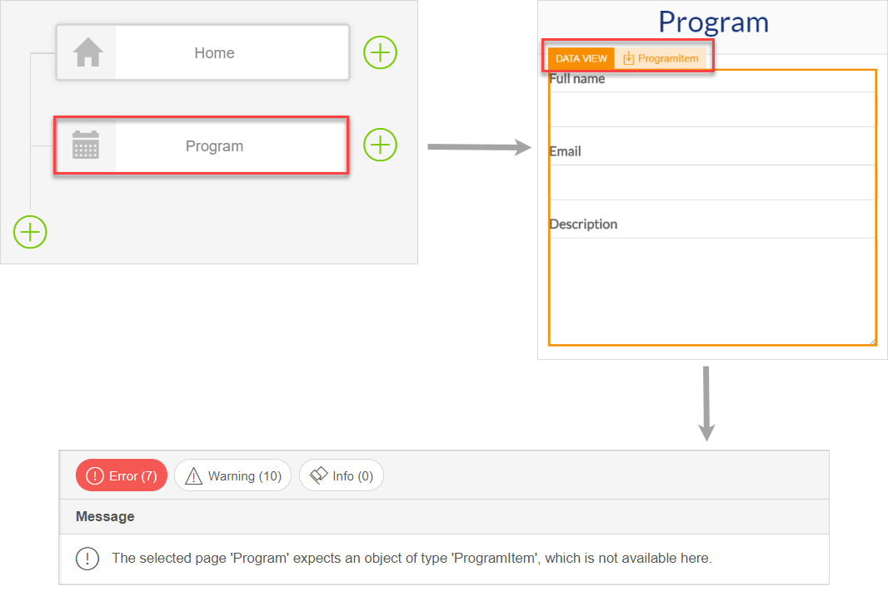
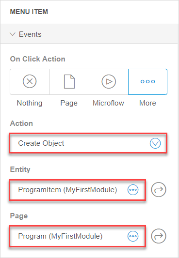
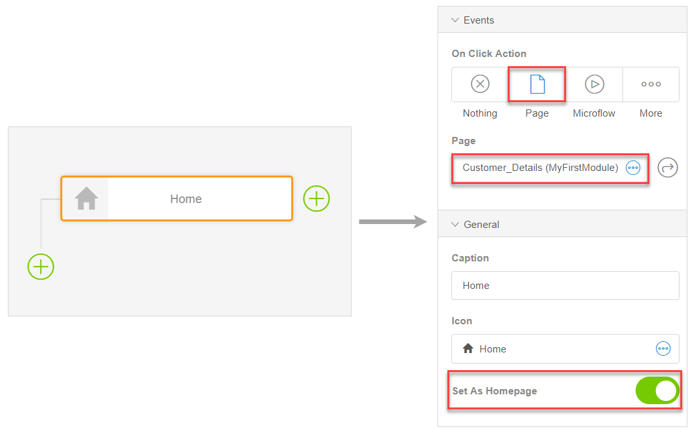
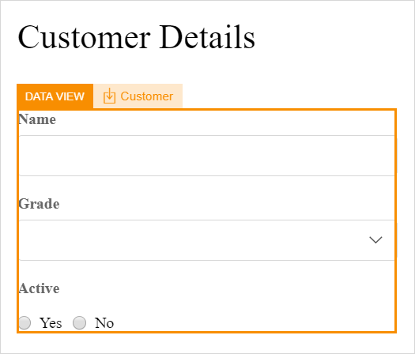
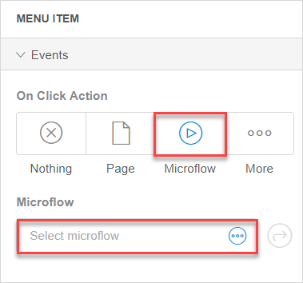
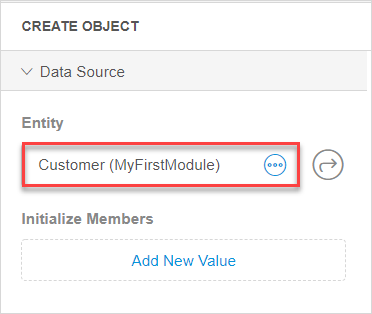
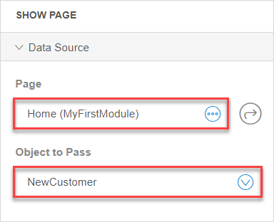
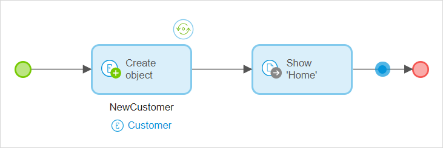

## 1 Introduction 

In this document, we will explain how to solve the most common consistency errors that can occur when configuring navigation in the Web Modeler. For more information on navigation, see [Navigation Document in the Web Modeler](navigation-wm).

An example of a consistency error is when you set a page that has a data view as a menu item. 

## 2 Navigation Consistency Errors 

The most common errors you can come across when configuring a navigation item are described in the table below:

| Text in the Checks Panel                                     | Element Where the Error Occurs                               | Cause of an Error                                            | Way to Fix                                                   |
| ------------------------------------------------------------ | ------------------------------------------------------------ | ------------------------------------------------------------ | ------------------------------------------------------------ |
| The selected page {Name of the page} expects an object of type {type of object}, which is not available here. | Property 'On click' of menu item {name of the menu item}     | You have set a page that expects an object to be passed to it (for example, a page with a data view) as a menu item. | Pass an object to the page by changing the **On click** property  of the menu item from **Show a page** to **Create object**. For more information, see section [2.1 Error Fix When the Selected Page Expects an Object](#page-expects-an-object) |
| The selected {Name of the page} expects an object of type {type of object} and cannot be used as a home page. Change the page or use a microflow to provide the page with an object. | Property 'On click' of menu item 'Home'                      | You have set a page that expects an object to be passed to it (for example, a page with a data view) as the home page. But by default the home page has no object that is passed to it, because it is the starting point for your user. For a more detailed example, see section [2.2 Error Fix When the Home Page Expects an Object](#home-page-expects-an-object) | Set a different  page as the home page. Alternatively, you can use a microflow that will open the home page and pass a specific object to it. For more information, see section [2.2 Error Fix When the Home Page Expects an Object](#home-page-expects-an-object) |
| The selected {Name of the page} expects an object of type {type of object} and cannot be used as a home page. Change the page or use a microflow to provide the page with an object. | Default home page of navigation profile 'Hybrid_tablet_app_online'/ 'Hybrid_phone_app_online' | In the Desktop Modeler you can configure several navigation profiles, while only the responsive navigation profile is shown and can be configured in the Web Modeler. The home page of the responsive profile is by default set as the home page for the Hybrid app navigation profiles, which can be configured in the Desktop Modeler only.  For more information on profiles, see [Navigation Profile](../navigation-profile) in the *Desktop Modeler category*. | [Sync the Web Modeler with the Desktop Modeler](../../howto/web-modeler/syncing-webmodeler-desktop) and change the home page for the navigation profile of **Hybrid tablet app online** or **Hybrid phone app online** in **Navigation**. |
| The selected page {name of the page} no longer exists.       | Property 'Page' of navigation profile 'Responsive'/  'Hybrid_tablet_app_online'/ 'Hybrid_phone_app_online'/ 'Hybrid_tablet_app_offline'/ 'Tablet_browser' /'Phone_browser' | In the Desktop Modeler you can configure several navigation profiles, while only the responsive navigation profile is shown and can be configured in the Web Modeler. You have deleted a page which was indicated as a home page for one of the profiles.  For more information on profiles, see [Navigation Profile](../navigation-profile) in the *Desktop Modeler category*. | To fix this error in the Web Modeler, you need to create a page with the same name as the deleted one. If you want to change a home page for navigation profiles, [sync with the Desktop Modeler](../../howto/web-modeler/syncing-webmodeler-desktop), open **Navigation** there and set another home page in the **Default home page** settings for each profile. |
| The selected page {name of the page} no longer exists.       | Property 'Page' of menu item {name of the item}              | In the Desktop Modeler you can configure several navigation profiles, while only the responsive navigation profile is shown and can be configured in the Web Modeler. You have deleted a page which was indicated as a menu item for one of the profiles.  For more information on profiles, see [Navigation Profile](../navigation-profile) in the *Desktop Modeler category*. | To fix this error in the Web Modeler, you need to create a page with the same name as the deleted one. If you want to change menu items for navigation profiles, [sync with the Desktop Modeler](../../howto/web-modeler/syncing-webmodeler-desktop). |

### 2.1 Error Fix When the Selected Page Expects an Object {#page-expects-an-object}

When you set a page with a data view as a menu item, you get a consistency error, because the page expects an object to be passed to it. 

For example, you have created a menu item called **Program**. This menu item opens the **Program** page. The **Program** page has a data view on it and expects a *ProgramItem* object to be passed to it. As a result, you get a consistency error, as no object is passed to this page from the navigation.

To fix the error, you can create an object and pass it to the page. Do the following:

1. Open the navigation document.

2.  Open properties of the **Program** menu item, and do the following: 

    a. Change the **On Click Action** property from **Page** to **More** > **Create Object**. 

    b. Set **ProgramItem** as **Entity (path)**. 

    c. Set **Program** as **Page**. 

    

Now when a user clicks the navigation item, a new object of type *ProgramItem* will be created and passed to the **Program** page.

### 2.2. Error Fix When the Home Page Expects an Object  {#home-page-expects-an-object}

If you set a page that expects an object to be passed to it as the home page (for example, a page with a data view), you will get a consistency error.

Let us study an example: in your **Navigation**, you have set **Customer Details** page as the home page. 

You have the **Customer Details** page with a data view that expects an object *Customer* to be passed to it. In other words, this page needs to get data first to be able to display it. 

However, the home page is the first page to be opened in your app by default, and the **Customer Details** page cannot function as a home page, as it needs to get data first. 

In this example, the best way to solve the error is to set another page as the home page that does not have a data view on it. For more information on navigation and properties of the menu items, see [Navigation Document in the Web Modeler](navigation-wm). 

However, you can also solve this error by creating a microflow that will create a new *Customer* object and pass it to the page, do the following:

1. Open **Navigation** > properties of the home page menu item.

2.  Change the **On Click Action** from **Page** to **Microflow**. 

    

3. Click **Select Microflow** and click **New Microflow** in the pop-up window.

4. Name the microflow *ACT_Open_HomePage*.

5. The created microflow is opened. In the **Toolbox** > **Object Activities**, select **Create Object**, drag and drop it to the microflow.

6.  Open the **Create object** activity properties, and set **Entity** to **Customer**.

    

7. In the **Toolbox** > **Client Activities**, select **Show Page** activity, drag and drop it to the microflow.

8.  Open the **Show Page** activity properties and do the following: 

    a.  Set **Page** to **Home**. 

    b. Set **Object to pass** to **NewCustomer**. 

    

Now the new object of type *Customer* will be created and passed to the home page.

## 3 Related Content

* [Navigation Document in the Web Modeler](navigation-wm)
* [Microflows in the Web Modeler](microflows-wm)
