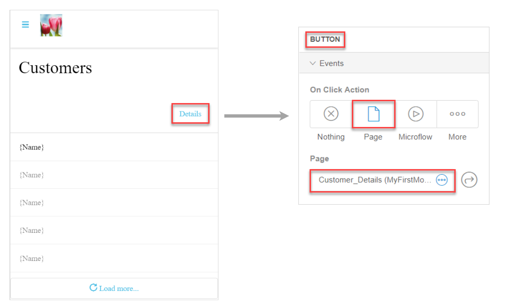
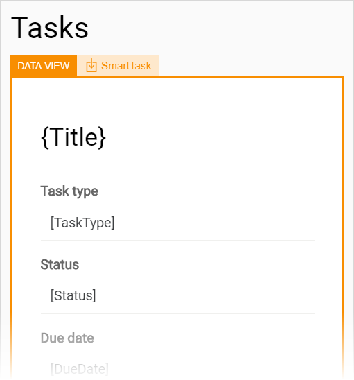

## 1 Introduction 

In this document, we will explain how to solve the most common consistency errors that can occur you  configure pages in the Web Modeler.

An example of a consistency error is when you do not specify the entity property of a data view on a page. 

## 2 List View Consistency Errors 

If you do not configure a data source for a [list view](page-editor-data-view-list-view-wm#list-view-properties) properly, you will get a consistency error. 

The scheme below shows that the data source of the list view has been set to **Database**, but the specific entity that needs to be retrieved from the database has not been set. This results in a consistency error.

The table below describes the most common errors you can come across when configuring a list view,  causes of these errors, and ways to fix them. 

| Text in the Checks Panel                                     | Cause of an Error                                            | Way to Fix                                                   |
| ------------------------------------------------------------ | ------------------------------------------------------------ | ------------------------------------------------------------ |
| No entity configured for the data source of this list view. Select an entity or change the data source. | The **Database** (or **XPath**/**Association**) option is selected as the data source for the list view on the page has been set, but the **Entity** property is not specified. | Open the list view's properties > the **Data Source** section and select an entity in the **Entity** field. |
| No microflow configured for the data source of this list view. Select a microflow or change the data source. | The data source is set to **Microflow**, but no specific microflow is selected. | Open the list view's properties > the **Data Source** section and select a microflow in the **Microflow** field, or change the type of the data source. |
| No nanoflow configured for the data source of this list view. Select a nanoflow or change the data source. | A nanoflow is selected as the data source, but no specific nanoflow is selected. | Open the Desktop Modeler (for details, see [How to Sync the Web Modeler with the Desktop Modeler](../../howto/web-modeler/syncing-webmodeler-desktop)) and select a nanoflow for this list view, or change the type of the data source. |

## 3 Data View Consistency Errors 

Not configuring a data source for a [data view](page-editor-data-view-list-view-wm#data-view-properties) in a proper way results in consistency errors. For example, you selected a list widget as the data source, but you have not selected the specific list you would like the data view to listen to.

The table below describes the most common errors you can come across when configuring a data view,  causes of these errors, and ways to fix them. 

| Text in the Checks Panel                                     | Cause of an Error                                            | Way to Fix                                                   |
| ------------------------------------------------------------ | ------------------------------------------------------------ | ------------------------------------------------------------ |
| No entity configured for the data source of this data view. Select an entity or change the data source. | **Context** is selected as the data source for the data view, but the **Entity** property is not specified. | Open the data view's properties > the **Data Source** section and select an entity in the **Entity** field, or change the type of the data source. |
| No microflow configured for the data source of this data view. Select a microflow or change the data source | The data source is set to **Microflow**, but no specific microflow is selected. | Open the data view's properties > the **Data Source** section and select a microflow in the **Microflow** field, or change the type of the data source. |
| No list widget configured for the data source of this data view. Select a widget or change the data source. | The list widget option is configured as the data source for the data view, but you have not selected the specific list you would like the data view to listen to. | Create a list view on the same page, configure it, and select it as a list widget for the data view; or change the type of the data source. |

## 4 Context Not Available Consistency Errors

Possible errors that you can get when a page is expecting a context that is unavailable are described in the table below. 

| Text in the Checks Panel                                     | Cause of an Error                                            | Way to Fix                                                   |
| ------------------------------------------------------------ | ------------------------------------------------------------ | ------------------------------------------------------------ |
| The selected page {Name of the page} expects an object of type {type of object}, which is not available here. | The page has a data view that expects an object of a particular type to be passed to it. This error occurs when the page is opened from another page, which does not have this object available. For a more detailed example, see section [4.1 Error Fix Example 1](#error-example-1). | Make sure that the object is passed to the page which has a configured data view on it. For more information, see section  [4.1 Error Fix Example 1](#error-example-1). |
| The selected page {Name of page} expects an object of type X, which is not compatible with the object of type Y that is available here. | You have a widget (for example, a button) that opens a page. The page has a data view that expects an object of particular type to be passed to it. However, the widget is placed inside a data container with another type of object. For a detailed example, see section [4.2 Error Fix Example 2](#error-example-2). | Make sure that the button is placed in the correct data container and passes the correct type of object to the page. For more information, see section [4.2 Error Fix Example 2](#error-example-2). |
| The selected {Name of the page} expects an object of type {type of object} and cannot be used as a home page. Change the page or use a microflow to provide the page with an object. | You have set a page that expects an object to be passed to it (for example, a page with a data view) as the home page. But by default the home page has no object that is passed to it, because it is the starting point for your user. For a more detailed example, see section [2.2 Error Fix When the Home Page Expects an Object](consistency-errors-pages-wm#home-page-expects-an-object) in *Consistency Errors When Configuring Navigation in the Web Modeler*. | Set a different  page as the home page. Alternatively, you can use a microflow that will open the home page and pass a specific object to it. For more information, see section [2.2 Error Fix When the Home Page Expects an Object](consistency-errors-pages-wm#home-page-expects-an-object) in *Consistency Errors When Configuring Navigation in the Web Modeler*. |

### 4.1 Error Fix Example 1 {#error-example-1}

When a page expects a context that is not passed to it from another page or a microflow, you will get consistency errors. 

Let us study an example: the **Customers** page contains a list view with a list of all customer names (**Customer** is set as **Entity** in the **Data Source** properties), and a **Details** button outside of the list view (placed in a [container](page-editor-widgets-layouts-wm#container-overview) only). The **Details** button opens a **Customer Details** page when a user clicks it (the **On Click Action** for the button is set to **Page**). 

However, the **Customer Details** page has a data view that expects an object *Customer* to be passed to it. In other words, this page needs to get data first to be able to display it. 

As this object is not passed to it from the **Customers** page, you get a consistency error.

As the **Details** button to the **Customers** page is outside a data container (a data view or a list view) it does not know which Customer (object) it should pass. The way of fixing this error depends on the following:

* You want to pass a specific *Customer* object to the **Customer Details** page, in other words, the details of a particular customer will be displayed on the **Customer Details** page (for more information, see section [4.1.1 Passing a Specific Object to the Page](#passing-specific-object))
* You want to create a new object of the *Customer* type and pass it to the **Customer Details** page, this means that a new customer will be created (for more information, see section [4.1.2 Creating a New Object and Passing it to the Page](#creating-new-object))

#### 4.1.1 Passing a Specific Object to the Page {#passing-specific-object}

If you want the **Customer Details** page to open the details of a specific customer, this means you want to pass a specific object to the page. As we already have a list view with the customers list on the **Customer** page, we can fix this error the following way:

1. Open the **Customers** page.

2. Drag the **Details** button inside the list view.

   

Now the button gets the object of type *Customer* from the list view on the **Customers** page, and it will be passed to the **Customer Details** page. As a result, the details of a particular customer is displayed on the **Customer Details** page. 

#### 4.1.2 Creating a New Object and Passing it to the Page {#creating-new-object}

If you want to create a new customer and fill in the customer's details on the **Customers Details** page, you can do the following:

1. Open the **Customers** page.

2. Open properties for the **Details** button, and set **More** > **Create Object** as an **On Click Action**.

3. Set **Customer** as **Entity**.

4. Set **Customer Details** as **Page**.

   

5. Change the button's caption from **Details** to **Add**, as this button will now create a new customer, and not show details of an existing customer.

Now when a user clicks this button, the **Customer Details** page will open, and the new *Customer* object will be created. 

### 4.2 Error Fix Example 2 {#error-example-2}

If a widget opens a page and this widget is inside a data container of entity X, but the referred page expects entity Y, you will get a consistency error. 

Let us study an example: you have a **New** button on the **Engineers** page that opens the **Tasks** page. 

The button is placed inside a list view; the list view's data source is set to entity *Engineer* in **Properties** > **Data Source**.

The Tasks page has a data view on it, but the data view's data source is set to entity *SmartTask* in **Properties** > **Data Source**. 

This means that data view expects the object of type *SmartTask* passed to it, but the **Engineers** page is passing the object of type *Engineer*. As a result you get a consistency error.

To fix this error you can either place a button within a list view that will pass the correct type of data to the page (place the button inside the list view and set its data source to entity *SmartTask*), or change the data source of the data view on the **Tasks** page to entity *Engineer*. 

## 5 Input Elements Consistency Errors

The most common errors for [input elements](page-editor-widgets-input-elements-wm) (such as, a text box, a drop-down, a check box, etcetera) , their causes, and ways to fix them are described in the table below. 

| Text in the Checks Panel                                     | Cause of an Error                                            | Way to Fix                                                   |
| ------------------------------------------------------------ | ------------------------------------------------------------ | ------------------------------------------------------------ |
| This widget can only function inside a data container. Move it into a data view, list view or template grid. | You have added an input widget to a page, but it is not inside a data view or a list view. | There are two ways to fix the error: <ul><li>When you do not have a specific data view or list view available yet: open widget's properties > the **Data Source** section and click **Wrap with a new data view**, the input widget will be automatically placed inside a new data view.</li><li>When you already have a data view or a list view which this input element relates to: drag and drop the input element inside the data view or the list view</li></ul> |
| Select an attribute for this {name of the input element}.    | You have added an input element and it is inside a data container, but the attribute  which this input element is connected to is not selected. | Open widget's properties > the **Data Source** section and select an attribute in the **Attribute** field. |

## 6 Image Widgets Consistency Errors

The most common consistency errors for [static image widgets](page-editor-widgets-images-wm) can occur when you place an image widget on a page, but do not select an actual image for it. 

[Dynamic images](page-editor-widgets-images-wm) need to be placed inside a data container (a data view or a list view) and an entity should be selected for them. 

Errors for static and dynamic images are described in the table below. 

| Text in the Checks Panel                                     | Cause of an Error                                            | Way to Fix                                                   |
| ------------------------------------------------------------ | ------------------------------------------------------------ | ------------------------------------------------------------ |
| No image selected.                                           | You have added a static image widget on a page, but the image itself is not selected. | Open image properties > the **General** section and click **Select Image**. You can either select a default image or upload your own one. |
| Move this widget into a data container, for example a data view or list view. | You have added a dynamic image to a page, but it is not inside a data view or a list view. | Open image properties > the **General** section and click **Wrap with a new data view**, the image will be automatically placed inside a new data view. You can also add a list view or a data view to the page and drag and drop a dynamic image inside it. |
| Select an entity for the data source of this image viewer.   | You have added a dynamic image to a page, the dynamic image is placed inside a data view or a list view, but an entity for the image is not specified. | Open image properties > the **General** section and select an entity in the **Entity** field. |

## 7 On Click Action Consistency Errors 

You can specify an **On Click Action** for different widgets, for example, for buttons or images. For more details about on click actions, see [Events Section in Widgets of the Web Modeler](page-editor-widgets-events-section-wm).

The most common consistency errors appear when you do not configure the on click action entirely. For example, you select a microflow as an on click action, but do not select the microflow itself. 

To fix the consistency errors, finish configuring the on click action (for example, for an on click action *Page*, select a particular page that should open), or change the on click action to another one. 

##  8 Related Content

* [The Web Modeler Overview](overview-wm)
* [Checks Overview in the Web Modeler](checks-wm)
* [How to Publish and View Your App](../../howto/tutorials/start-with-a-blank-app-3-publish-and-view-your-app)
