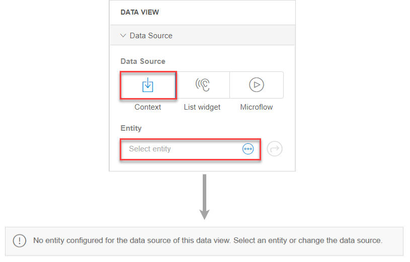

## 1 Introduction 

To make sure that your app is always properly built, the Web Modeler does several consistency [checks](checks-wm) when publishing your app. When a consistency check is not met, the Web Modeler will notify you about this via consistency errors on the **Checks** panel. For more information on how to view the consistency errors, see [Section 2 Viewing Checks for Your App and Interacting with the Checks Panel](checks-wm#viewing-checks) in *Checks Overview in the Web Modeler*. 

Errors need to be solved before your app can be published. An example of a consistency error is when you do not specify the entity property of a data view on a page. 

Consistency errors can occur in the following editors of the modeler:

* Page editor (For information on consistency error in the page editor, see [Page Editor Consistency Errors in the Web Modeler](consistency-errors-pages-wm))
* Navigation document (For information on consistency error in the navigation, see [Navigation Consistency Errors in the Web Modeler](consistency-errors-navigation-wm))
* Microflows editor

##  2 Related Content

* [Page Editor Consistency Errors in the Web Modeler](consistency-errors-pages-wm)
* [Consistency Errors When Configuring Navigation](consistency-errors-navigation-wm)
* [Checks Overview in the Web Modeler](checks-wm)
* [Page Editor Overview in the Web Modeler](page-editor-wm)
* [Navigation Document in the Web Modeler](navigation-wm)
* [Microflows in the Web Modeler](microflows-wm)
