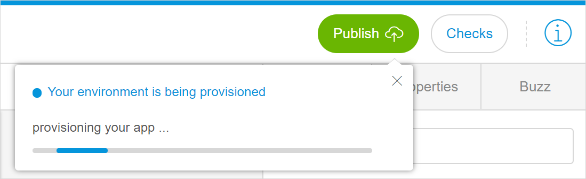

## 1 Introduction

Deployment means getting your app up and running in a cloud environment to make it available for the end-users. The term "publish" is used to describe the same process in the Web Modeler interface. For technical information for app administrators, see [Deploy and Manage](/developerportal/deploy/index) in the *Developer Portal Guide*. 

## 2 Deploying Your App {#deploying-your-app}

When you deploy (publish) your app, you deploy it to a cloud environment. A cloud environment is a location in the cloud that can host your app, and deployment is a process to put the latest version of your app in that location. For more information for app administrators, see [Environments](/developerportal/deploy/environments) in *Developer Portal Guide*.

By default all apps created in the Web Modeler are Free Apps. A Free App is a complete deployment environment in the Mendix Cloud with some limitations. You can upgrade your Free App to a licensed app. The main differences between a Free App and a licensed app are described in the table below: 

|                     | Free App                                                     | Licensed App                                                 |
| ------------------- | ------------------------------------------------------------ | ------------------------------------------------------------ |
| **Number of Users** | Maximum ten users.                                           | Depends on your pricing plan.                                |
| **Storage**         | 100MB of data and 100MB of file storage space.               | Depends on your pricing plan.                                |
| **Environments**    | Single environment in the Mendix Cloud.                      | A node in the cloud which has one or more environments, for example, production, acceptance, and test. |
| **Sleep Mode**      | Goes into Sleep Mode after an hour or so of inactivity and automatically resumes when a user accesses it. All your data is retained while the app is in Sleep Mode. | Does not have a Sleep Mode. |

To deploy your application, follow these steps:

1. Click **Publish** in the top-bar of the Web Modeler (the dialog with your app status will open). 
2.  Once your cloud environment has been set up, you will see the **Update** button. Click it to push the latest changes from the Web Modeler to the published app or to publish the app for the first time. 

    

{}

If the Web Modeler is not able to retrieve the status of your environment yet, you will not see the **Update** button. For more information, see section [5 Retrieving Your App Status](#retrieving-app-status). 

{}

## 3 Viewing Your App

After you have updated your app, you are able to instantly view it in your browser or on a mobile device. 

### 3.1 Viewing Your App in a Browser 

To view your app in a browser in the currently selected view mode (Phone, Tablet, or Responsive), click **View app** in the **Your app is running** dialog window.

To select a different preview mode, click the drop-down menu on the **View app** button.

### 3.2 Viewing your App on a Mobile Device

To view your app on a mobile device, follow these steps:

1.  Click **View on mobile device**.

    

2. Scan the QR-code with your mobile device using the [Mendix Mobile app](https://play.google.com/store/apps/details?id=com.mendix.SprintrMobile&hl=en). Follow the directions to download the Mendix Mobile app in case you do not have it installed.

## 4 Possible Statuses When Deploying Your App

The deployment of your app starts the moment you click the **Update** button. For more information on how to deploy your app, see section [2 Deploying Your App](#deploying-your-app). 

You may see different statuses in dialog box when your app is deploying (when clicking **Publish** > **Update**). The top line of the dialog box shows you the environment status, and the bottom line – the deployment status. 

The following list shows you the examples of the statuses you may see (note that this is not the list of all possible statuses):

*  Your app is running – your application has been deployed

   

*  Provisioning your app (when being shown as a progress bar) – your application is in the process of deployment

   

*  Provisioning your app (when being shown as a separate message) – your app is being deployed by someone else, or you have triggered the deployment from another tab or in another browser

   

*  Updating your app – your application is the process of deployment

   

  {}It is possible that you see "Your app has failed to set up". This can happen during deployment, please wait until the process is completed.

   
  {}

If your project does not have [consistency errors](consistency-errors-wm), your application will be deployed and the dialog box with the information on the last deployment highlighted in green will be opened.  

If your app has [consistency errors](consistency-errors-wm), you need to fix them first and then click the **Update** button again. If you do not click the **Update** button after solving consistency errors and click **View app**, the last successfully deployed version of your app will open without the recent changes. 

For more information on how to view consistency errors and to fix them , see [Checks Overview in the Web Modeler](checks-wm) and [Consistency Errors in the Web Modeler](consistency-errors-wm). 

## 5 Retrieving Your App Status {#retrieving-app-status}

Before the deployment can start, the Web Modeler needs to get the environment status from the cloud. Thus, when you click the **Publish** button, you may see the dialog box "Retrieving app environment status", meaning that the Web Modeler is getting the status of the deployed application from the cloud. 

Once the status is retrieved, you will normally see **Your app is running** dialog box upon clicking **Publish**.

However, the Web Modeler may fail to get your environment status. This can happen when there is no deployment environment; technically it means that the app has been unlinked from one environment and is not linked to another environment yet. In this case you will not be able to publish. 

Web Modeler can fail to get your environment status in the following cases:

*  Your app was a Free App, was unlinked from the Free App environment by an app administrator, but was not upgraded to the licensed app (for more information on Free Apps and licensed apps, see section [2 Deploying Your App](#deploying-your-app)) 

	

*  Your app is a licensed app, and no environment has been set for the Web Modeler deployment by an app administrator

	

For technical information for app administrators, see [Web Modeler Deployment Settings](/developerportal/deploy/web-modeler-deployment-settings) in *Developer Portal Guide*. 

## 6 Related Content

* [Checks Overview in the Web Modeler](checks-wm)
* [Consistency Errors in the Web Modeler](consistency-errors-wm)
