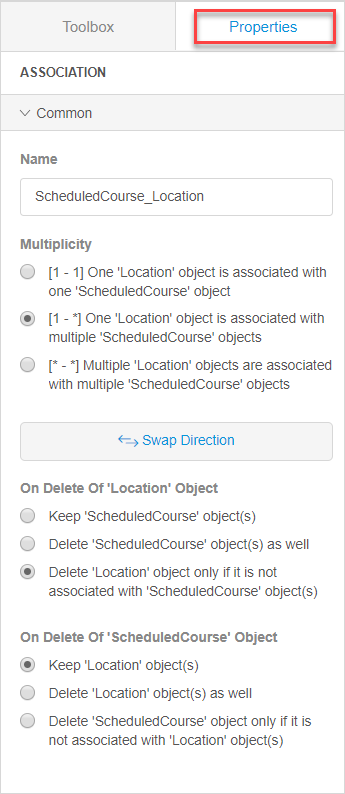
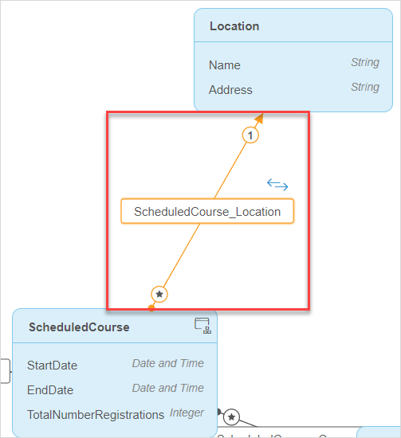
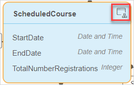
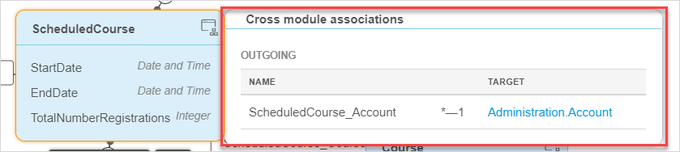

## 1 Introduction 

An association describes a relation between entities. In the domain model, an association is represented by a line or arrow between two entities.

In the Web Modeler, associations have the following properties:

* [Name](#name)

* [Multiplicity](#multiplicity)

* [Delete behavior](#delete-behavior)

  

In relation to the module the associations can be of two types:

* Associations within one module
* [Cross module associations](#cross-module-association)

## 2 Name {#name}

The name of the association is used to refer to it from forms, microflows, etc.

## 3 Multiplicity {#multiplicity}

Multiplicity  defines the number of possible referred objects. The cardinality (or number of referred objects) of an association is indicated by the number one (`1`) or a star (`*`) at either side of the association.

Multiplicity can be of the following types:

* one-to-one – one X object is associated with one Y object
* one-to-many – one X object is associated with multiple Y object
* many-to-many – multiple X objects are associated with multiple Y objects

Multiplicity shows the owner and the direction of association if the association is of the one-to-many or many-to-many type. In the domain model it is displayed as an arrow pointing the direction. The owner is located at the start of an arrow.

You can swap the direction of the multiplicity if its type is one-to-many or many-to-many. 

## 4 Delete Behavior {#delete-behavior}

Delete behavior defines what should happen to the associated object when an object is deleted. The following options can be configured for each end of the association. 

| Value                                                        | Description                                                  |
| ------------------------------------------------------------ | ------------------------------------------------------------ |
| Keep {name of entity} object(s)                              | When an object is deleted, the associated object(s) are not deleted. |
| Delete {name of entity} object(s) as well                    | When an object is deleted, the associated object(s) are also deleted. |
| Delete {name of entity} object only if it is not associated with {name of other entity} object(s) | An object can only be deleted if it is not associated with any other object(s). |

For examples of delete behavior configuring, see [Creating Basic Layer>Delete Behavior](../../howto/data-models/create-a-basic-data-layer#6-delete-behavior).

## 5 Cross-Module Associations {#cross-module-associations}

Cross-module association makes an association between entities of different modules.

{}

 You cannot create separate modules in the Web Modeler. But if you have different modules in the Desktop Modeler, you can see the list of different domain models and make cross-module associations in the Web Modeler. 

{}

In the Web Modeler cross-module association is indicated with the following:

*  An icon next to the entity that has such association: 

  

*  A pop-up window, which displays when you click the icon:

  

Cross module associations have the following properties:

| Property                      | Description                                                  |
| ----------------------------- | ------------------------------------------------------------ |
| Type                          | Defines the direction of the association and can be of two types: **Outgoing** and **Incoming** |
| Name                          | Defines the name of the association                          |
| [Multiplicity](#multiplicity) | Defines the type of multiplicity                             |
| Target                        | Defines the module (name before the dot) and second entity of the association (goes after the dot). |

## 6 Related Content

* [Domain Models Overview in the Web Modeler](domain-models-wm)