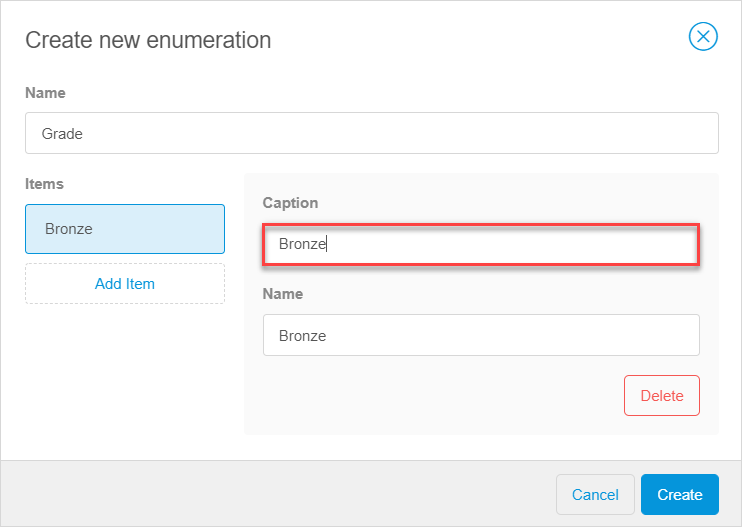

## 1 Introduction 

An enumeration is a type of an attribute that has a list of predefined options. The enumeration has one or more items (values). Each item represents one option. For example, the status of a customer grade can be Bronze, Silver, and Gold. So, the enumeration for the customer grade will consist of three items: *Bronze*, *Silver*, *Gold*.  For more information, see [Enumeration Items](#enumeration-items). 

## 2 Enumeration Items {#enumeration-items}

An enumeration consists of enumeration items or values. Each item represents one of the options. 

An attribute of the enumeration type can also represent an uninitialized state. For example, if you do not assign any grade to a customer, the grade status is *empty*.  

## 3 Basic Actions

An enumeration is configured when you add an attribute of the enumeration type to your domain model. You can either [create a new one](#create-new-enumeration) or [select an existing enumeration](#select-existing-enumeration). 

### 3.1 Creating a New Enumeration {#create-new-enumeration}

To create a new enumeration, do the following: 

1. Open your [domain model](domain-models-wm).

2. Select an entity you want to create the attribute for. For more information on how to create the entity, see section [3 Adding New Entities](domain-models-wm#adding-new-entities) in *Domain Models Overview in the Web Modeler*.

3. To create a new attribute of the enumeration type, click **New attribute** and do the following: 
   a. Set the attribute **Name**. In our example, the name of the attribute is *Grade*. 
   b. Set the [**Type**](domain-models-attributes-wm) to **Enumeration**. 
   c. Click **Select enumeration** to create a new enumeration. d. In the **Select enumeration** dialog window, click **New**. 
   e. In the **Create new enumeration** dialog window, click **Add Item** to add possible options of the enumeration (**Name** is filled out automatically and is the same as the attribute name). 

    

   f. Fill out the name for the **Caption** (**Name** is filled out automatically). In our example, we first fill out  *Bronze*, as one of three possible items of the enumeration: Bronze, Silver, and Gold.  

    

   g. Click **Add Item** and repeat the step above to create other enumeration items. 
   h. Click **Create** to close the dialog windows and create the new attribute.

   

The attribute and the enumeration items are created.

### 3.2 Selecting an Existing Enumeration {#select-existing-enumeration}

You can also set an existing enumeration for attributes of the enumeration type. Do the following:

1. Open your [domain model](domain-models-wm).

2. Select an entity you want to create the attribute for. For more information on how to create the entity, see section [3 Adding New Entities](domain-models-wm#adding-new-entities) in *Domain Models Overview in the Web Modeler*.

3. To create a new attribute of the enumeration type, click **New attribute** and do the following: 

   a. Set the attribute **Name**. In our example, the name of the attribute is *Grade*. 
   b. Set the [**Type**](domain-models-attributes-wm) to **Enumeration**. 
   c. Click **Select enumeration** to create a new enumeration. 

     

   d. In the **Select enumeration** dialog window, the existing enumerations are displayed in the list. Click the one you want to use, then click **Select**. 

   

The existing enumeration is selected for the attribute of the enumeration type. 

## 4 Properties

For details on properties of attributes of the enumeration type, see section [3 Attribute Properties](domain-models-attributes-wm#attribute-properties) in *Attribute Types in the Web Modeler*. 

## 5 Related Content

* [Domain Models Overview in the Web Modeler](domain-models-wm)
* [Attribute Types in the Web Modeler](domain-models-attributes-wm) 
