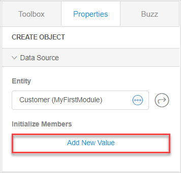
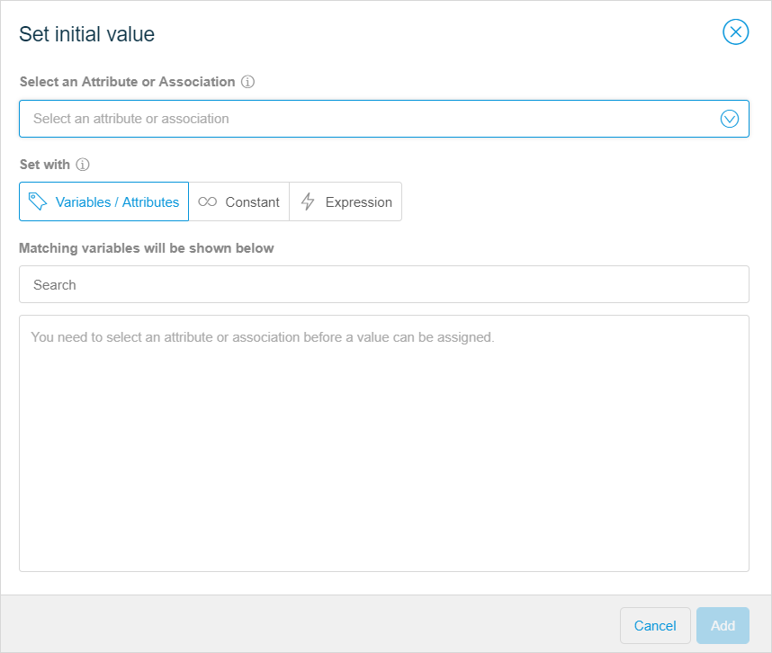
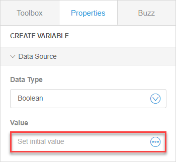
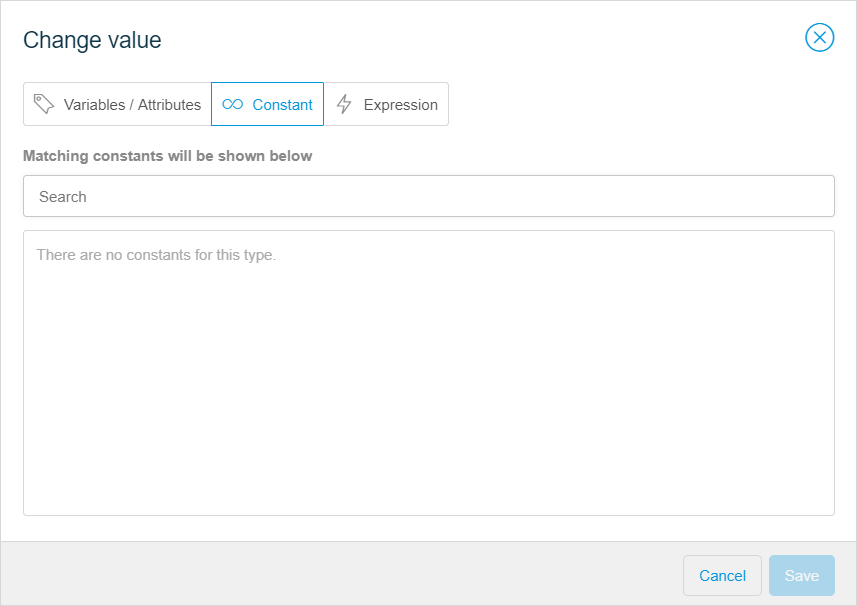
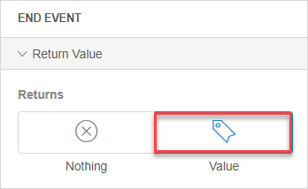
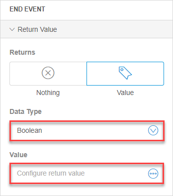
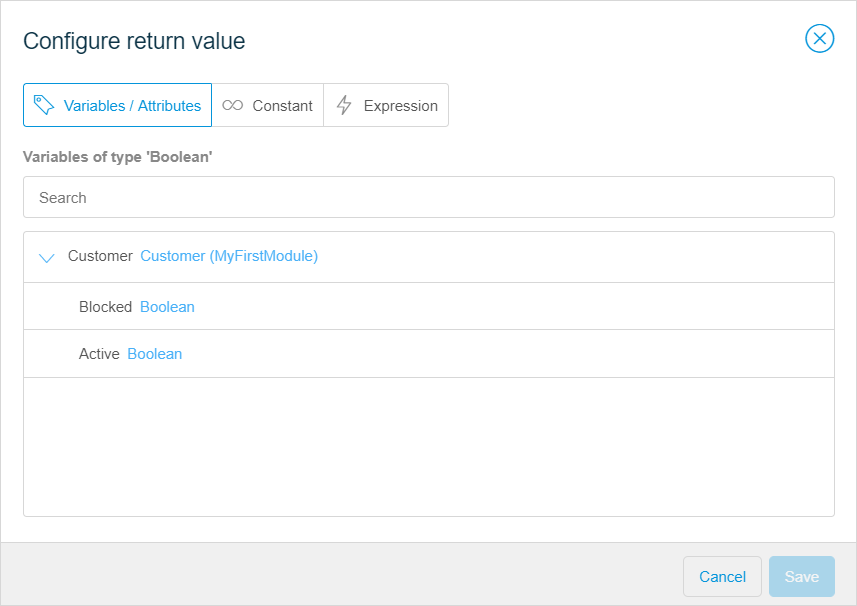

## 1 Introduction 

You need to assign a value to an object/variable, when you configure the properties of the following activities:

* **Create Object** -  you can create an object with this activity and provide initial values for properties of the object 
* **Create Variable** - you can create a variable and assign a value to it with this activity 

You can also change the value when you configure the following activities:

* **Change Object** - can be used to change an existing object or properties of this object
* **Change Variable** - change the value of an existing variable in the current microflow. 

You can also configure a return value for the **End Event** - the location where the microflow will stop.

For more information on the functions of these activities, see [Microflows in the Web Modeler](microflows-wm). 

## 2 Setting the Initial Value for Create Object and Changing the Value for Change Object

 To set the initial value or change the value of an object, do the following:

1. Add the **Create Object**/**Change Object** activity to a microflow. For more information, see [Adding New Event or Activity](microflows-wm#adding-activity-to-microflow).

2. Click the activity to view its properties.

3. Select the data source (an entity) for the activity, then click **Add New Value**

   

4. In the **Set initial value**/**Change value dialog**, select an attribute or association 

5. Set the initial value (for **Create Object**) or assign a new value (for **Change Object**) in **Variables/Attributes**, **Constant** or **Expression** tabs.  For more information on these tabs, see section [5 Common Elements](#set-value-common-elements).

   

## 3 Setting the Initial Value for Create Variable and Changing the Value for Change Variable

To set the initial value or change the value of a variable, do the following:

1. Add the **Create Variable**/**Change Variable** activity to a microflow. For more information, see [Adding New Event or Activity](microflows-wm#adding-activity-to-microflow)

2. Click the activity to view its properties.

3. Select the data type for the activity, then click **Set initial value** / **Change value**

   

4. Set the initial value (for **Create Variable**) or assign a new value (for **Change Variable**) in **Variables / Attributes**, **Constant** or **Expression** tabs.  For more information on these tabs, see section [5 Common Elements](#set-value-common-elements).

   

## 4 Configuring the Return Value for the End Event 

The return value is the value that is returned to the flow or a widget that called the current flow. To configure the return value, do the following:

1. Add the **End Event** to a microflow or select the existing end event. For more information, see [Adding New Event or Activity](microflows-wm#adding-activity-to-microflow).

2. Click the event to view its properties.

3. Set the **Returns** option to **Value**.

   

4. Select the data type, then click **Value** to configure it.

   

5. Set the return value in **Variables/Attributes**, **Constant** or **Expression** tabs. For more information, see section [5 Common Elements](#set-value-common-elements).

   

## 5 Common Elements {#set-value-common-elements}

You can see the following common elements when configuring the value:

* **Variables/Attributes** tab
* **Constant** tab
* **Expression** tab

The functions of these tabs are described in the table below:

| Tab                  | Description                                                  |
| -------------------- | ------------------------------------------------------------ |
| Variables/Attributes | Shows variables and attributes that match the type of the attribute, association or variable that you want to create or change.  For example, when you select  an attribute of the type Decimal, variables of types Decimal and Integer will be shown in the tab. This happens because decimal can include whole numbers (integer). However, if you pick an attribute of the type Integer, variables of the type Decimal will not be shown, because the whole numbers (integer) cannot contain decimals.  For more information on attribute types, see [Attribute Types in the Web Modeler](domain-models-attributes-wm). **Note** The attribute of the type Long will be shown as Integer in the microflows. |
| Constant             | With this tab you can assign a new value selecting  from the values of an attribute of Enumeration type. |
| Expression           | With this tab you can assign the attribute, association or variable different values, depending on what you write in the expression. For more information, see [Microflow Expressions in the Web Modeler](microflows-expressions-wm). |

## 6 Related Content

* [Microflows in the Web Modeler](microflows-wm)
* [Microflow Expressions in the Web Modeler](microflows-expressions-wm)