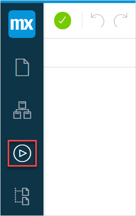
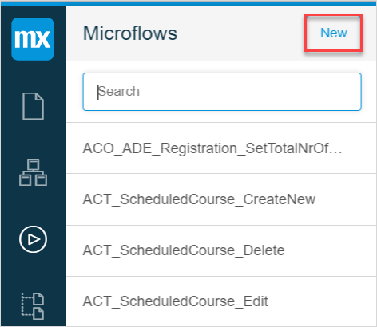
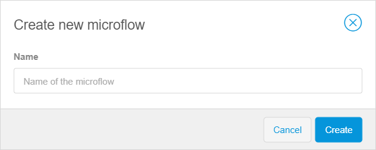
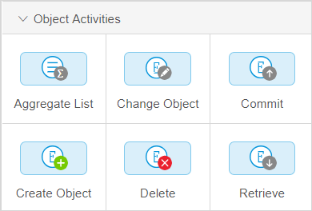
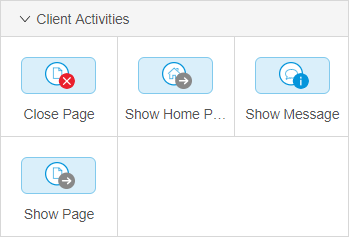
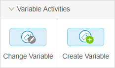
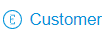
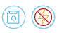

## 1 Introduction 

The Web Modeler has a lot of built-in logic that works out of the box (for example, buttons). But if you want to add custom logic, you need to create microflows.

Microflows is a visual way of expressing what traditionally ends up in textual program code.  A microflow can perform actions such as creating and changing objects, showing pages, and making choices. 

You need to use microflows for the following cases:

*  To change/extend the standard behavior of buttons
* To add custom logic to your application
* To integrate with other systems, databases, web services, etc.

Examples of using microflows can be the following:

*  You need to use a microflow if you create a list of objects, and you add a Delete button to let users delete objects
* You're creating a to-do list and you want to use custom logic when the status of the item on the list has changed

To view the **Microflows** of your app in the Web Modeler, click the **Microflows** icon in the left menu bar:

## 2 Concepts and Definitions 

A microflow is a flow chart. On the new microflow the start event (a starting point of the microflow represented by a green dot) and the end event (an end point of the microflow represented by a red dot) exist by default. They are also connected by a sequence flow (a line with an arrow), where you can add new events and activities. For more information, see [Creating a New Microflow](#creating-new-microflow).

Before you start configuring microflows, familiarize yourself with the concepts and notions that the microflow editor uses:

| Concept    | Description                                                  |
| ---------- | ------------------------------------------------------------ |
| Activities | Blue boxes performing different functions. For example, with the help of an activity you can show users a home page. For more information, see [Toolbox](#microflows-toolbox). |
| Flows      | Arrows that connect microflow events and activities. For more information, see [Flows](#flows). |
| Events     | Other things placed in a flow not in a shape of a blue box are events. Exclusive split is a an example of the event. For more information, see [General Section](#microflow-general-section). |
| Variable   | A variable is a temporary storage for data. Variables are used to store information and refer to it when needed. For this purpose variables should have a unique name.  In a microflow you can add a variable, assign a value to it and then use it in microflow activities. You can then change this value later if necessary. For example, you can create variable **$Discount** and assign it a value 0.5, and use it to calculate a price for a customer.  You can use the variable only in the microflow where it was created. |
| Parameter  | Parameters contain global variables, which means that you can use one and the same parameter in different microflows. |

## 3 Creating a New Microflow {#creating-new-microflow} 

To create a new microflow and to start building a microflow, do the following:

1. Click the **Microflow** icon in the left menu bar. 

2. Click **New** on the **Microflows** side panel.

   

3. Fill out the name of the microflow in the pop-up dialog and click **Create**.

   

The new microflow is created, you can now start adding logic to it by adding events or activities. 

## 4 Adding New Event or Activity {#adding-activity-to-microflow}

To add a new activity or event to the microflow, do the following:

1. Open the microflow you want to add the event or activity to.
2. Open the **Toolbox** tab.
3. Select the event or activity in the **General**, **Object Activities** or **Client Activities** section.
4. Drag and drop the event or activity in the microflow. 

## 5 Toolbox {#microflows-toolbox}

In the **Toolbox** tab, you can see that the microflow contains three sections with different elements and activities:

* [General Section](#microflow-general-section)
* [Object Activities](#microflow-object-activities)
* [Client Activities](#microflow-client-activities)

### 5.1 General Section {#microflow-general-section}

Elements available in the **General** section are described in the table below.

| Element                      | Description                                                  |
| ---------------------------- | ------------------------------------------------------------ |
| [Annotation]( ../annotation) | An annotation is an element that can be used to put comments in a microflow. |
| [End Event](../end-event)    | An end event defines the location where the microflow will stop. There can be more than one end event, for example when an exclusive split is used in the microflow. So, the number of end events depends on the number of possible outcomes of the microflow. |
| Exclusive Split              | An exclusive split splits the microflow flow. Use an exclusive split when you want to add conditions to one and the same action. For example, you want to show different order forms for the customers with different grades. Thus, an exclusive split creates different flows. With the help of an exclusive split the app makes a decision based on a condition and follows one and only one of the outgoing flows. |
| [Merge](../merge)            | A merge can be used to combine flows into one.  If previously you split the microflow flow and now one and the same action needs to be executed for these separated flows, you can combine the two (or more) paths using a merge. |
| [Parameter](../parameter)    | A parameter is an input data for the microflow and can be used in any activity in the microflow. |

### 5.2 Object Activities Section {#microflow-object-activities}

The **Object Activities** are described in the table below.

| Activity                            | Description                                                  |
| ----------------------------------- | ------------------------------------------------------------ |
| [Aggregate List](../aggregate-list) | Aggregate List can be used to calculate aggregated values such as the maximum, minimum, sum, average, and total amount of objects over a list of objects. |
| [Change Object](../change-object)   | Can be used to change an existing object or properties of this object. This can be done with or without committing and with or without events. |
| [Commit](../committing-objects)     | **Commit** saves changes you have not saved in the database yet. |
| [Create Object](../create-object)   | The **Create Object** action can be used to create an object. |
| [Delete](../deleting-objects)       | **Delete Object** can be used to delete one object or the list of objects. |
| [Retrieve](../retrieve)             | **Retrieve** can be used to get one or more objects, either by directly traversing an association of another object, or by retrieving objects from the database. The **Retrieve** to get one or more objects of a certain entity either from database or by association (work memory). |

### 5.3 Client Activities Section {#microflow-client-activities}

The **Client Activities** are described in the table below.

| Activity                            | Description                                                  |
| ----------------------------------- | ------------------------------------------------------------ |
| [Close Page](../close-page)         | This activity closes the currently open page.                |
| [Show Home Page](../show-home-page) | The **Show Home Page** action navigates to the home page for the current user. It goes to the same page as the user goes to after signing in and respects role-based home pages. |
| [Show Message](../show-message)     | With the **Show Message** action you can show a blocking or non-blocking message to the user. (Non-blocking message lets users continue their work in the app with the pop-up open, which the blocking message doesn't let the user continue work until the pop-up window is closed. ) |
| [Show Page](../show-page)           | With this action you can show a page to the end user.        |

### 5.4 Variable Activities

The **Variable Activities** are described in the table below:

| Activity                              | Description                                                  |
| ------------------------------------- | ------------------------------------------------------------ |
| [Change Variable](../change-variable) | This activity is used to change the value of an existing variable in the current microflow. |
| [Create Variable](../create-variable) | With this activity you can create a variable and assign a value to it. The variable can be used to store, change, and reuse a value in activities of the microflow. |

For example, you can first create a variable named *Discount* to a microflow, and then change the variable Discount depending on the type of the customer's grade. You can give a discount for customers with Gold and Silver grades. 

## 6 Flows {#flows} 

Flows are lines connecting the elements. You can find the description of flows in the table below:

| Flow                                  | Image                                                 | Description                                                  |
| ------------------------------------- | ----------------------------------------------------- | ------------------------------------------------------------ |
| Sequence Flow                         |    | A sequence flow is an arrow that links events, activities, splits and merges with each other. Hereby it defines the order of execution. Flows always flow in one direction where elements follow each other up one by one. Splits always lead to one direction so it is not possible that multiple flows take place simultaneously. |
| [Annotation Flow](../annotation-flow) |  | An annotation flow is a connection that can be used to link an annotation to a flow object(s). |

## 7 Activity Icons 

When configuring the activities of the microflows you will notice icons above or underneath activities. You can find the description of icons in the table below:

| Name                  | Image Example                                                | Description                                                  |
| --------------------- | ------------------------------------------------------------ | ------------------------------------------------------------ |
| Entity                |             | Indicates that the data source for the activity is an entity. |
| Simple Value          |       | Indicates that the data source for the activity is a simple value, such as decimal, boolean, date and time, etc. |
| Commit                |             | Indicates that the object will be committed. Committing means that the changes will be saved in the database.  This can be useful, for example, when you want an object *NewCustomer* to be saved and updated in the tables that contain information about new customers. |
| Commit without events |  | Indicates that the object will be committed but without events. This means that the object will be saved in the database, but the special event handlers will not be triggered. For example, the information about a new customer will be saved, but the tables containing information about new customers will not be updated. |
| Refresh in Client     |  | Indicates that the result of the activity will be displayed to the end-user. |

## 8 Related Content

* [The Web Modeler Overview](overview-wm)