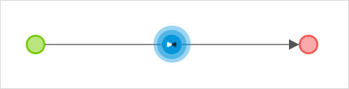
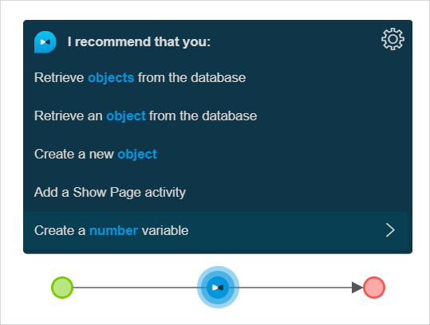
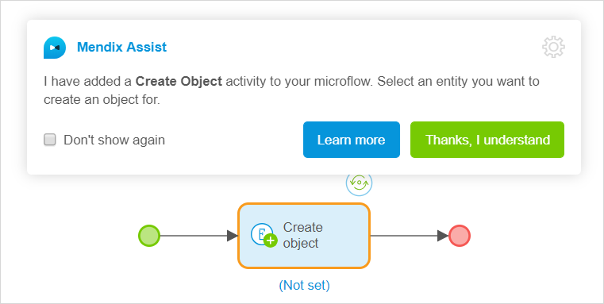
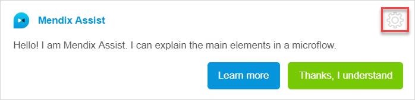
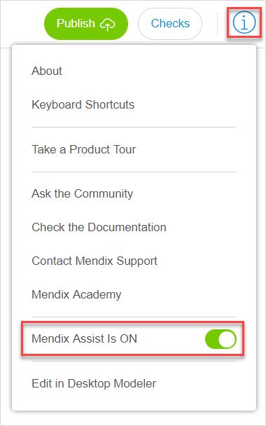
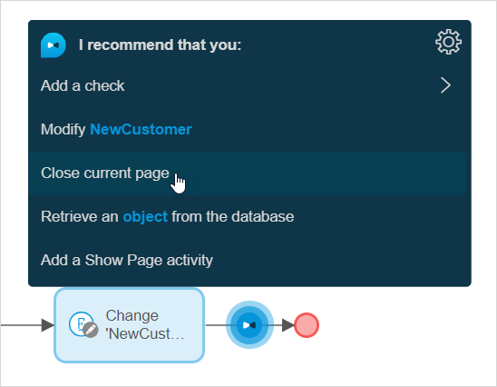
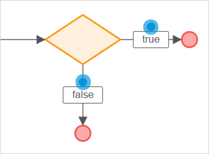
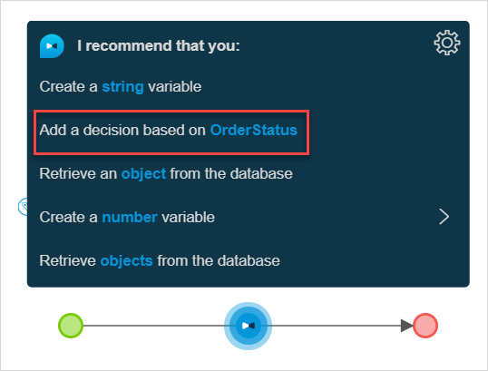

## 1 Introduction 

Mendix Assist is an Artificially Intelligence powered agent that helps you configure microflows in the Web Modeler. It gives unexperienced users recommendations on configuring the next step of the microflow based on activities, parameters, and events that already exist in the microflow.

Mendix Assist was built using Machine Learning analysis of over twelve million anonymized application flows built with Mendix. Mendix uses Deep Learning to detect best practice patterns in microflows. Based on these patterns Mendix Assist predicts the best options for the next activity in a microflow. Moreover, Mendix Assist keeps learning by analyzing new microflows being built.  

## 2 Mendix Assist Overview

Mendix Assist is enabled by default and is displayed as a blue dot in the flow of a [microflow](microflows-wm). A bow-tie appears on the dot when you hover over it.  

{}

It is possible to add activities in a regular way without using Mendix Assist. 

{}

Click the bow-tie to see Mendix Assist recommendations. 

Mendix Assist lists the top 5 recommendations from the most probable to less probable ones for the particular microflow. Click the suggestion to proceed with it and insert it into a microflow. For more information, see section [4 Adding Activities and Elements with Mendix Assist](#add-activities).

{}

Some activities still need to be configured in **Properties** to function correctly. This concerns activities such as **Create Object**, when you need to set entity and attribute values manually.  

{}

Once you have selected an activity or an event to insert to the microflow using Mendix Assist, the
information dialog with brief description of this activity/event is displayed above the flow.

The following options are available in the information dialog window:

* **Don't show again** – disables the information dialog window (it will not be shown again when you insert other activities) 
* **Lean More** – opens documentation on microflow activities
* **Thanks, I understand** – dismisses the current information dialog window 

## 3 Settings

To open settings of Mendix Assist, click the gear icon in the top right corner of the information dialog.

Settings available for Mendix Assist are described in the table below:

| Setting                      | Description                                                  |
| ---------------------------- | ------------------------------------------------------------ |
| Mendix Assist Is ON/OFF      | Click a slider to enable/disable the tool.                   |
| Information Dialog Is ON/OFF | Click a slider to enable/disable the information dialog window. **Note** The information dialog window is disabled if Mendix Assist is OFF. |

You can also enable/disable Mendix Assist by clicking the information icon in the top bar of the Web Modeler. 

{}
If you disable Mendix Assist, the information dialog will be disabled as well. Once you re-enable Mendix Assist, the information dialog is also re-enabled. 
{}    

## 4 Adding Activities and Elements with Mendix Assist {#add-activities}

You can add various activities using Mendix Assist. Depending on the complexity of the microflow and on the element/activity, it can be inserted right away, or you will need to provide Mendix Assist with additional information. For example, if you are adding a check, you need to specify what object or variable will be checked, and what condition exactly will be checked: for example, if the object exists, or if the object is true. For more information, see section [4.2 Adding a Check](#add-check).

### 4.1 Adding an Activity

To add an activity (such as **Change Object**, **Show Page**, **Create Object**, etcetera), do the following:

1. Click a blue Mendix Assist dot in a microflow.

2. Browse the suggestions and select the activity you need.

3.  Click the selected activity to add it to the flow.

    

The activity is added to the flow.

### 4.2 Adding a Check {#add-check}

Adding a check means that you will add an exclusive split with Boolean attribute type: your flow will be split into one flow labeled *true* and another one labeled *false*. For more information, see [Exclusive Split in the Web Modeler](microflows-exclusive-split-wm).   

{}

If you do not have a variable or/and the attributes of the Boolean type, this option will not be
listed in the suggestions.

{}

To add the check, do the following:

1. Click a blue Mendix Assist dot in a microflow.

2.  Find **Add a check** in the suggestions.

    

3. The number of options for the check will be opened, select the check that you want to add and click it. 

The exclusive split is added to the microflow. 

{}

The number of options for the check depend on the number of variables of Boolean type in your microflow and on the number of attributes of Boolean type in your domain model. For more information, see [Domain Models Overview in the Web Modeler](domain-models-wm) and [Attribute Types in the Web Modeler](domain-models-attributes-wm). You can also add a check if an object exists microflow.

{}

### 4.3 Adding a Decision

When you add a decision via Mendix Assist that means you add an exclusive split with attribute of enumeration type to your microflow. For more information, see [Exclusive Split in the Web Modeler](microflows-exclusive-split-wm) and [Attribute Types in the Web Modeler](domain-models-attributes-wm). This means, if you do not have parameters with enumeration data type, **Add decision** will not appear in the suggestions.

To add the decision, do the following:

1. Click a blue Mendix Assist dot in a microflow.

2. Find **Add a decision** in the suggestions and select it.

   

The exclusive split is added to the microflow.

{}

The number of options for **Add a decision** depend on the number of parameters with enumeration data type in your microflow. For more information, see [Domain Models Overview in the Web Modeler](domain-models-wm) and [Attribute Types in the Web Modeler](domain-models-attributes-wm).

{}

## 5 Related Content

* [Web Modeler Overview](overview-wm)
* [Microflows in the Web Modeler](microflows-wm)
* [Exclusive Split in the Web Modeler](microflows-exclusive-split-wm)
