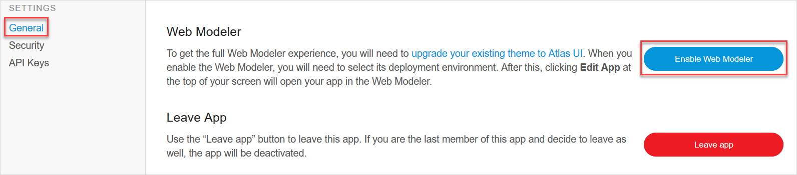
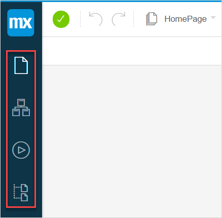

## 1 Introduction {#web-modeler-overview}

The Mendix Web Modeler is the place where you can create, view and edit your Mendix applications without going into technical details. For this purpose you can use the [Desktop Modeler](../refguide/desktop-modeler-overview) and [do a sync with Desktop Modeler](../../howto/web-modeler/syncing-webmodeler-desktop) anytime. 

With the Web Modeler you can create and edit applications in your browser without installing software on your PC.   

The picture below shows the components of the Web Modeler interface:

## 2 Opening the Web Modeler

### 2.1 Opening the Web Modeler via the Developer Portal

You can edit an app in the **Web Modeler** by opening your app in the [Developer Portal](https://home.mendix.com) and clicking **Edit App** or choosing the **Edit in Web Modeler** option in the drop-down menu of the **Edit App** button. 

{}

The drop-down menu on the **Edit App** button is only available for **Free Apps**.

Some apps are not suitable for the Web Modeler. The following ones are not suitable to run in the Web Modeler:

* Apps below **Mendix 7.5** version
* Apps that are not based on the Atlas UI framework

{}

When the Web Modeler is not enabled, you can click **Edit App** > **Settings**. For more information, see [Developer Portal Settings](../../developerportal/settings/).

{}
Only Scrum Masters or custom **App Team roles** with the **App Settings** permission are allowed to enable the Web Modeler.
{}    

On the **Settings** page, the Web Modeler can be enabled by upgrading the existing theme of the app to the [Atlas UI](../../howto/atlasui) theme.

### 2.2 Opening the Web Modeler via the Desktop Modeler

You can also open your app in the Web Modeler via the Desktop Modeler. Do the following:

1. Open the project in Desktop Modeler that you want to view in the Web Modeler.

2. Click the globe icon in the top right corner (only available if the Web Modeler is enabled).

   

3. [Do the sync](https://docs.mendix.com/refguide/desktop-webmodeler) to see the latest changes made in the Desktop Modeler reflected in the Web Modeler. 

The app opens in the Web Modeler.

## 3 Upgrading the Web Modeler

After clicking **Edit in Web Modeler** you may need to upgrade your app to the latest version.

{}
When you upgrade your app in the Web Modeler to the latest  Mendix version, you will need to upgrade your app in the **Desktop Modeler** to the same version as well. 

If you are working in a team with others, it is wise to check with your team members if everyone is OK to upgrade the app to the latest Mendix version. The reason for this is that once you update the Web Modeler, you need to update the Desktop Modeler as well.

{}

## 4 Switching App Modes

After opening the Web Modeler,  the home page of the app opens. 

You can change the view of your page to different views by clicking the corresponding icons:

*   Mobile
*   Tablet
*   Responsive (Desktop)    

## 5 Left Menu Bar

The menu on the left side of the Web Modeler has a top and a bottom menu.

The top menu provides the following options:

| Top menu item | Shortcut | Description |
|------|------|------|
| Mx Logo | None | The Mx logo is the return button to return to the [Developer Portal](https://home.mendix.com) of the app. |
| [Pages](page-editor-wm) | 1 | Shows a list of all pages in the app. After you select a page, it opens in the Web Modeler. |
| [Domain Models](domain-models-wm) | 2 | Shows the domain models of the app. |
| [Microflows](microflows-wm) | 3 | Shows a list of all microflows in the app.  After clicking a microflow, it will open in the Web Modeler. |
| [Navigation Document](navigation-wm) | 4 | Shows a configured menu in the form of a navigation tree. You can expand the menu structure of the navigation tree up to two levels with an unlimited amount of pages. |

The bottom menu bar provides the following options:

| Bottom menu item | Description |
|------|------|
| Search (magnifying glass) icon | Helps you search through microflows, entities, and pages. Start typing the name of the item you are looking for and the search feature will return any matches it finds, using exact matches as well as fuzzy matches based on the characters entered.  You can also use "/" shortcut to search through your app. |
| [App Settings](app-settings-wm) | Shows an overview of all widgets and their status. Widgets are user interface elements (alerts, buttons, charts, etc.) contained in the building blocks. They are used to build pages from. |
| [Theme Customizer](theme-customizer-wm) | Here you can style your app with custom branding, colors, and typography. |
| Feedback | Allows you to provide feedback on the Mendix Web Modeler. The purpose of the feedback on Mendix is to provide low priority issues, questions, and ideas on how to improve the Web Modeler.  The Feedback button is not a support option. If there are any platform problems, contact **Mendix Support**. For more information, see [Mendix Support](../../howtogeneral/support/). |

## 6 Toolbox, Properties and Buzz

The top right menu of the Web Modeler consists of the **Toolbox**, **Properties** , and **Buzz** tabs. 

| Tab        | Description                                                  |
| ---------- | ------------------------------------------------------------ |
| Toolbox    | Shows tools available for the current editor.                |
| Properties | Shows the properties of the selected item.                   |
| Buzz       | Allows an app development team to make comments to different pages, microflows, domain models, and navigation layouts of the Web Modeler, and interact with each other. |

## 7 Top Bar

The top bar provides the following options:

| Top bar item | Description |
|------|------|
| Status icon | Shows the internet connection status of the Web Modeler. If  status is green, the Web Modeler is connected. When grey, the Web Modeler is offline. |
| Undo/Redo actions | Undo or redo the last action. You can also use Ctrl+Z and Ctrl+Y shortcuts correspondingly. |
| Recent documents drop-down menu | A document that you are currently viewing is displayed in this option. When you click the drop-down menu, documents that you have recently viewed are displayed in the list. You can click the document to open it. |
| Publish button | Deploy and run the app. Update your app to deploy the latest changes you made in the Web Modeler. Once deployed, click **View** to view your app in action. |
| [Checks button](checks-wm) | Shows the errors and warnings currently in your app. If there are any errors in the app, you will not be able to publish your app, until you have solved them. You can also use C shortcut to view the **Checks** panel. |
| Information icon | Here you can find following information:<ul><li>**About** - shows the information on the Web Modeler version and Mendix version </li><li>**Keyboard Shortcuts** - opens the list of shortcuts in the Web Modeler</li><li>**Take a Product Tour** - starts a  the guided product introduction tour and shows you around the Web Modeler</li><li>**Mendix Academy** - a link to the [Mendix Academy](https://gettingstarted.mendixcloud.com)</li><li>**Mendix Documentation** - a link to the [Mendix Documentation](https://docs.mendix.com/)</li><li>**Mendix Atlas UI** - a link to to the [Mendix Atlas UI documentation](https://atlas.mendix.com)</li><li>**Edit in Desktop Modeler** - opens your app in the Desktop Modeler</li></ul> |

## 8 Related Content

* [How to Sync the Web Modeler with the Desktop Modeler](../../howto/web-modeler/syncing-webmodeler-desktop)