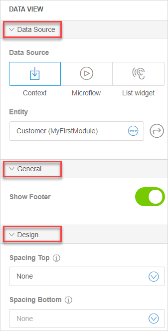
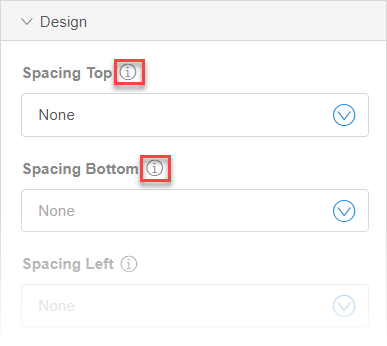

## 1 Introduction 

The data view is a starting point for showing the contents of one object on a page.  The data view typically contains input widgets like text boxes . 

For example, if you want to fill out the information on each customer, data view is the best way to do that.

In more complex templates, a data view can contain other data views for related objects, for example, showing customer details and showing customer payment status, if these are modeled as two different entities. 

## 2 Data View Properties  

Data view consists of the following properties:

* [Data Source](#data-source-data-view)
* [General](#general-section-data-view)
* [Design](#design-section-data-view)

### 2.1 Data Source {#data-source-data-view} 

The data source determines which object will be shown in the data view. For general information on data sources, see [Data Sources](../data-sources). 

| Data Source Property | Description                                                  |
| -------------------- | ------------------------------------------------------------ |
| Context              | A data source determining that wherever you are opening the page from, you are passing the selected object. For example, when you add the **Show Page** activity in the microflow, you select the page and the object to pass. (For more information on the microflows, see [Microflows in the Web Modeler](microflows-wm).) That means that when the page is opened in the microflow, the object of this type is provided and will be shown in the data view on the page. For more technical information on the context source, see [Context Source](../entity-path-source). |
| Microflow            | A data source that runs a selected microflow and displays a return value. For more technical information, see [Microflow Source](../microflow-source). |
| List widget          | A data source that allows a data view to display detailed information on an object in the list widget (list view) on the same page. For more technical information, see [Listen To Widget Source](../microflow-source). |

### 2.2 General {#general-section-data-view}

In the **General** section, you can enable/disable the **Show Footer** option (enabled by default). A footer is an area at the bottom of the document, usually containing information common for all pages, such as copyrights.  

### 2.3 Design {#design-section-data-view}

The **Design** section of the data view properties allows you to change spacing and aligning of the data view on the page. Hover over the information icon to get more details on each option:

## 3 List View Properties

List view consists of the following properties:

* [Data Source](#data-source-list-view)
* [General](#general-section-list-view)
* [Design](#design-section-list-view)

### 3.1 Data Source {#data-source-list-view}

The data source determines which objects will be shown in the list view. For general information about data sources, see [Data Sources](../data-sources). 

| Data Source Property | Description                                                  |
| -------------------- | ------------------------------------------------------------ |
| Database             | A data source that determines that the object or objects shown are retrieved directly from the database. You need to select **Entity** (that you have in the domain model), or create a new entity, if you set database as the data source. For more technical information, see [Database Source](../database-source). |
| Microflow            | A data source that runs a selected microflow and displays a return value (i.e. list of objects). For more technical information, see [Microflow Source](../microflow-source). |
| XPath                | Currently, this data source can only be configured in the Desktop Modeler. For more information, see [XPath Source](../xpath-source). |
| Association          | Currently, this data source can only be configured in the Desktop Modeler. For more information, see [Association Source](../association-source). |

### 3.2 Events

 You can choose the **On Click Action** in the **Events** section. The **On Click Action** defines what action is performed when the user clicks a row of the list view. 

For more information on the **Events** section and on click actions, see [Events Section in Widgets of the Web Modeler](page-editor-widgets-events-section-wm). 

### 3.3 General {#general-section-list-view}

In the **General** section, you can select the number of rows to be displayed on the page. After the indicated limit is reached, the **Load more...** button is displayed on the page.

### 3.4 Design Section {#design-section-list-view}

For information on the **Design** section and its properties, see [Design Section in Widgets of the Web Modeler](page-editor-widgets-design-section-wm).

## 4 Related Content

* [Page Editor Overview in the Web Modeler](page-editor-wm)
