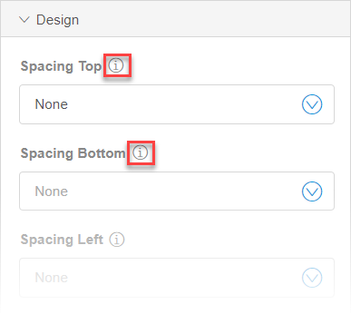
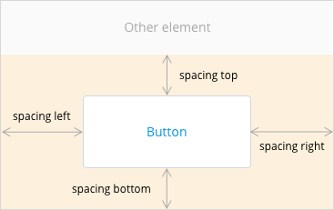

## 1 Introduction 

The **Design** section in **Properties** allows you to change spacing and alignment of a widget on a page, but is not limited to these functions. For some elements you can, for example, change their color. Hover over the information icon to get more details on each option.

## 2 Common Properties {#design-common-properties}

The **Design** section has the following properties common to all widgets:

| Property       | Description                                    | Possible Values                                              |
| -------------- | ---------------------------------------------- | ------------------------------------------------------------ |
| Spacing Top    | Adds margin above the widget.                  | Possible values for *spacing top* are the following:<ul><li>None – no extra spacing is applied</li><li>Small – applies small spacing</li><li>Medium – applies medium spacing</li><li>Large – applies large spacing</li><li>Layout – applies the same spacing as the current layout (large and layout spacings are the same by default) </li></ul> |
| Spacing Bottom | Adds margin below the widget.                  | Possible values of this property are the following:<ul><li>None – no extra spacing is applied</li><li>Small – small spacing is applied</li><li>Medium – medium spacing is applied</li><li>Large – large spacing is applied</li><li>Layout – the same spacing as the current layout has is applied (if you do not change the layout spacing, large and layout spacings are the same by default) </li></ul> |
| Spacing Left   | Adds margin to the left of the widget.         | Possible values of this property are the following:<ul><li>None – no extra spacing is applied</li><li>Small – small spacing is applied</li><li>Medium – medium spacing is applied</li><li>Large – large spacing is applied</li><li>Layout – the same spacing as the current layout has is applied (if you do not change the layout spacing, large and layout spacings are the same by default) </li></ul> |
| Spacing Right  | Adds margin to the right of the widget.        | Possible values of this property are the following:<ul><li>None – no extra spacing is applied</li><li>Small – small spacing is applied</li><li>Medium – medium spacing is applied</li><li>Large – large spacing is applied</li><li>Layout – the same spacing as the current layout has is applied (if you do not change the layout spacing, large and layout spacings are the same by default) </li></ul> |
| Align Self     | Aligns the widget within its layout element. | Possible values for *align self* are the following:<ul><li>{none} – places the element next to the previous element</li><li>Left – places the element to the left of its layout element, equivalent to *float: left*</li><li>Right – places the element to the right of its layout element, equivalent to *float: right*</li></ul> |

The example of how spacing works on a button is schematically shown on an image below:

## 2 Specific Properties

The following widgets have specific properties:

* [List view](#list-view-design-properties) (a Data Container widget)
* [Container](#container-design-properties) (a Layout widget)
* [Buttons](#button-design-properties) (all Button widgets)
* [Text](#text-design-properties) (a Typography widget)

### 2.1 List View Specific Properties {#list-view-design-properties}

Specific properties for **List View** are described in the table below:

| Property    | Description                                                  | Possible Values                                              |
| ----------- | ------------------------------------------------------------ | ------------------------------------------------------------ |
| Style       | Changes the appearance of lines in the list view.            | Possible values for *sytle* are the following:<ul><li>{blank}</li><li>Striped</li><li>Bordered</li><li>Lined</li><li>No Styling</li></ul> |
| Hover Style | Highlights a row when hovering over it. Only useful if the row is clickable. | True/False                                                   |
| Row Size    | Changes the size of the row.                                 | Possible values for *row size* are the following:<ul><li>{blank}</li><li>Small</li><li>Large</li></ul> |

### 2.2 Container Specific Properties {#container-design-properties}

Specific properties for the **Container** widget are described in the table below:

| Property         | Description                        | Possible Values                                              |
| ---------------- | ---------------------------------- | ------------------------------------------------------------ |
| Align Content    | Aligns content inside a container. | Possible values of this property are the following:<ul><li>{blank} no alignment</li><li>Left align as a row</li><li>Center align as row</li><li>Right align as row</li><li>Left align as column</li><li>Center align as column</li><li>Right align as column</li></ul> When aligning content as a column, elements inside a container will be aligned one under another; when aligning content as a row, elements inside a container will be aligned next to each other. |
| Background color | Applies a background color.        | Possible values of this property are the following:<ul><li>{blank} Color defined in **Backgrounds > Default** of the UI Customization section of the Theme Customizer</li><li>One of the **Brand Colors**</li><ul><li>Default</li><li>Primary</li><li>Inverse</li><li>Success</li><li>Warning</li><li>Danger</li></ul></ul> The color for each value depends on your settings in the **Theme Customizer**. For details, see [Theme Customizer in the Web Modeler](theme-customizer-wm). |

### 2.3 Button Specific Properties {#button-design-properties}

Specific properties for **Buttons** are described in the table below:

| Property   | Description                                                  | Possible Values                                              |
| ---------- | ------------------------------------------------------------ | ------------------------------------------------------------ |
| Size       | Changes the size of the button.                              | You can change the size from the *preset* size by selecting one of the following:<ul><li>Small – the button is smaller than the preset</li><li>Large - the button is larger than the preset</li></ul> |
| Full Width | The button takes the whole width of a container it is placed in. | On/Off                                                   |
| Bordered   | Changes the style of the button to a button with a transparent background, a colored border, and a colored text. Color of the border and the text are inverted from the background color, that means, if the button background is red, the background will become transparent, but the border and text will become red. | True/False                                                   |
| Align Icon | Places an icon (if any) to the right of the text or on top of it. | Possible values of this property are the following:<ul><li>Right</li><li>Top</li></ul> |

### 2.4 Text Specific Properties {#text-design-properties}

Specific properties for the **Text** widget are described in the table below:

| Property     | Description                          | Possible Values                                              |
| ------------ | ------------------------------------ | ------------------------------------------------------------ |
| Weight       | Changes the weight of the font       | Possible values of this property are the following:<ul><li>Light</li><li>Normal</li><li>Semibold</li><li>Bold</li></ul> |
| Color        | Changes the color of the text        | Possible values of this property are the following:<ul><li>Header color</li><li>Detail color</li><li>Default</li><li>Primary</li><li>Inverse</li><li>Success</li><li>Warning</li><li>Danger</li></ul> The color for each value depends on your settings in the **Theme Customizer**. For details, see [Theme Customizer in the Web Modeler](theme-customizer-wm). |
| Alignment    | Aligns the text                      | Possible values of this property are the following:<ul><li>Left</li><li>Center</li><li>Right</li></ul> |
| Transform    | Changes letter case of the text      | Possible values of this property are the following:<ul><li>Lowercase</li><li>Uppercase</li><li>Capitalize</li></ul> |
| Wrap Options | Wrap a long text into multiple lines | Possible values of this property are the following:<ul><li>Wrap</li><li>No Wrap</li></ul> |

## 3 Related Content

* [Widgets in the Web Modeler](page-editor-widgets-wm)
