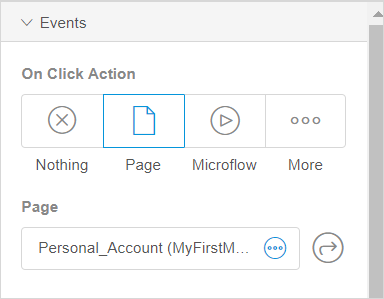
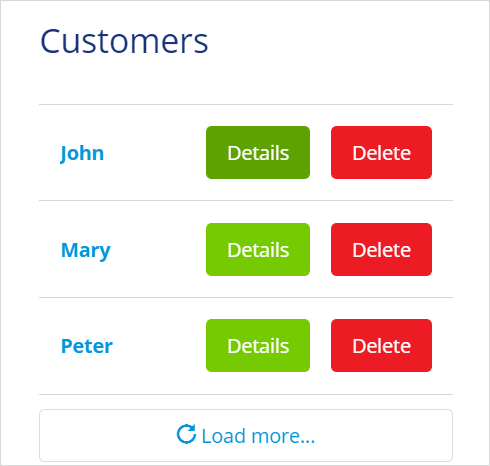
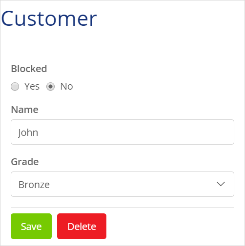

## 1 Introduction 

The **Events** section is a section in the **Properties** tab that is common for different widgets in the Web Modeler, for example, for a static image, buttons, list view, and data view. 

In the **Events** section, you can set the **On Click Action** for widgets and specify what action will be performed when users click the widget. For example, you can specify that when a user clicks a profile image, the page with the user's personal account will open. 

## 2 On Click Action {#on-click-action}  

You can find the description of possible on click actions below:

* **Nothing** – no action is taken when the user clicks a widget

* **Page** –  the specified page is opened

* **Microflow** – the selected microflow is executed 

* **More** – contains the following type of actions:
  * **Create Object** – creates a new object (for more information, see section [2.1 Create Object Action](#create-object-action))
  * **Save Changes** – saves (commits) all changes made on the page
  * **Cancel Changes** – rolls back all changes made on the page 
  * **Close Page** – closes the pop-up window (for pop-up pages) or navigates to the previously visited page  
  * **Sign Out** – the current user is signed out of the app 
  * **Open Link** – triggers an action based on the link type (for more information, see section [2.2 Open Link Action](#open-link-action)
  * **Delete Object** – deletes an object (for more information, see section [2.3 Delete Object Action](#delete-object-action))

{}

The list of available on click actions may differ depending on the widget. For example, **Delete Object** on-click action is unavailable for the list view. 

{}

### 2.1 Create Object Action {#create-object-action}

When you set the **On Click Action** to **Create Object**, several properties are available. See the description in the table below:

| Action Property | Description                                                  |
| --------------- | ------------------------------------------------------------ |
| Entity          | Specifies which entity to create.                            |
| Page            | Specifies which page should be shown with the new created object. The page should contain a data view that accepts the object you have specified. |

### 2.2 Open Link Action {#open-link-action}

When you set the **On Click Action** to **Open Link**, several properties are available. See the description in the table below:

| Action Property | Description                                                  |
| --------------- | ------------------------------------------------------------ |
| Link Type       | For this property, the following options are available: <ul><li>**Web** – navigates to a website</li><li>**Email** – composes an email</li><li>**Phone Call** – starts a phone call</li><li>**Text Message** – sends a text message</li></ul> |
| Source          | For this property, the following options are available: <ul><li>**Use literal value** – you can fill a value out (Specify **Url** for **Web**, **Recipient** for **Email**, and **Phone Number** for **Phone Cal**l and **Message**) </li><li>**Use attribute** – if you select **Database**>**Entity** as a data source for the list view,  you can choose the attribute of a string type that belongs to the entity or create a new one (when the **Use attribute** option is configured, you do not need to fill out any information manually, it will be updated dynamically)</li></ul>**Note** When you configure **Email**, **Phone Call** or **Message** options, the corresponding default app will be opened on the device when the action is triggered, for example, the default email client will be opened to compose a message. |

### 2.3 Delete Object Action {#delete-object-action}

Behavior of the **Delete Object** action depends on a data container it is placed in: a [list view](page-editor-data-view-list-view-wm#list-view-properties) or a [data view](page-editor-data-view-list-view-wm#data-view-properties). 

#### 2.3.1 Delete Object Action in a List View

If you place the **Delete Object** in a list view, the corresponding list view item will be deleted, when a user clicks a button.

For example, you have a page with a list view showing customer names. A **Delete** button is placed inside the list next to each name. Thus, if you click **Delete** in a line that says "Peter", this customer and all customer's details will be deleted. 

#### 2.3.2 Delete Object Action in a Data View

When placed on a data view, **Delete Object** will delete the connected object. For example, you opened a page with customer's details. The details are placed in a data view. You have **Save** and **Delete** buttons at the bottom of the page. When you press **Delete**, the customer "John" and customer's details will be deleted and the page will be closed. 

## 3 Related Content

* [Widgets in the Web Modeler](page-editor-widgets-wm)
