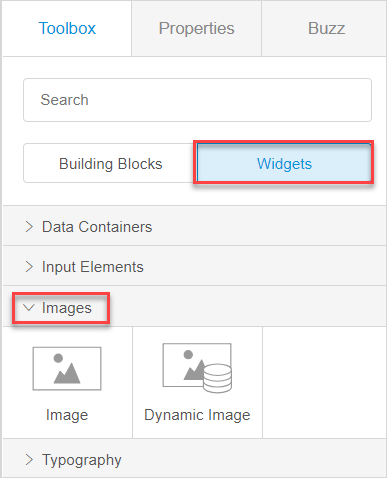
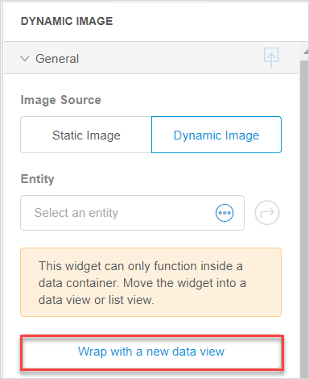

## 1 Introduction 

Image [widgets](page-editor-widgets-wm) are used to show images to the users. 

There are two image widgets in the Web Modeler:

* Image – allows you to show a static (non-changing) image in your app
* Dynamic image – allows you to show a dynamic image (for example, a relevant profile picture that is different for each customer) in your app

{}

You can switch between static and dynamic image in widget's properties. For more information, see the [General Section](#image-general). 

{} 

## 2 General Section {#image-general}

You can switch between static and dynamic image in the **General** section, as well as set the image itself, configure its width and height, etcetera. 

Before configuring settings in the **General** section for the **Dynamic Image**, keep in mind that it can only function inside a data container (a list view or a data view). You can either place widget in an existing data container; or click **Wrap with a new data view** in **Properties** to create a data view automatically and place an input element inside it. 

Settings available for **Static Image** and **Dynamic Image** are described in the table below:

| Property      | The property applies to   | Description                                                  |
| ------------- | ------------------------- | ------------------------------------------------------------ |
| Image Source  | Static and Dynamic Images | Switches between static and dynamic image.                   |
| Entity        | Dynamic Image             | Specifies which entity will be shown in the dynamic image. You can only set an entity for the dynamic image if the entity has been configured as image in the Desktop Modeler. For more information, see section [General Properties](../entities#entities-general-properties) in *Entities* in the *Desktop Modeler* category and [Dynamic Image (document template)](../dynamic-image-document-template) in the *Desktop Modeler* category. |
| Image         | Static Image              | Sets an image that will be shown to the end-user.            |
| Default Image | Dynamic Image             | This is the image that is displayed if no image is uploaded. |
| Width Unit    | Static and Dynamic Images | The width of an image can be specified in the following ways:   <ul><li>**Auto** – the width of the given image is used.</li><li>**Pixels** – the width is specified in a number of pixels. If you specify both width and height, the image will be scaled automatically: the proportions will be kept, the picture will not be stretched.</li><li>**Percentage** –  the width is specified in a percentage of the original width. It can be larger than its original width in which case the image is stretched.</li></ul> *Default value for **Width Unit***: Auto |
| Width         | Static and Dynamic Images | The **Width** option is only displayed when **Pixels** or **Percentage** are selected for the **Width Unit**. It specifies the width of the image in pixels or percentage. |
| Height  Unit  | Static and Dynamic Images | The height of an image can be specified in the following ways:   <ul><li>**Auto** – the height of the given image is used.</li><li>**Pixels** – the height is specified in a number of pixels. If you specify both width and height, the image will be scaled automatically: the proportions will be kept, the picture will not be stretched.</li><li>**Percentage** –  the height is specified in a percentage of the original height. It can be larger than its original height in which case the image is stretched.</li></ul> *Default value for **Height Unit***: Auto |
| Height        | Static and Dynamic Images | The **Height** option is only displayed when **Pixels** or **Percentage** are selected for the **Height Unit**. It specifies the height of the image in pixels or percentage. |

## 3 Events Section

You can choose the **On Click Action** in the **Events** section. The **On Click Action** defines what action is performed when the user clicks a [static image](#events-static-image) or a [dynamic image](#events-dynamic-image).

### 3.1 Events Section for the Static Image {#events-static-image}

For more information on the **Events** section for the static image, see [Events Section in Widgets of the Web Modeler](page-editor-widgets-events-section-wm).

### 3.2 Events Section for the Dynamic Image {#events-dynamic-image}

The following actions are available for the dynamic image:

* **Nothing** – no action is taken when the user clicks an image
* **Microflow** – the selected microflow is executed 
* **Enlarge** –  the image is shown full screen 

## 4 Design Section

For information on the **Design** section and its properties, see [Design Section in Widgets of the Web Modeler](page-editor-widgets-design-section-wm).

## 5 Related Content

* [Page Editor Overview in the Web Modeler](page-editor-wm) 
* [Widgets in the Web Modeler](page-editor-widgets-wm)
