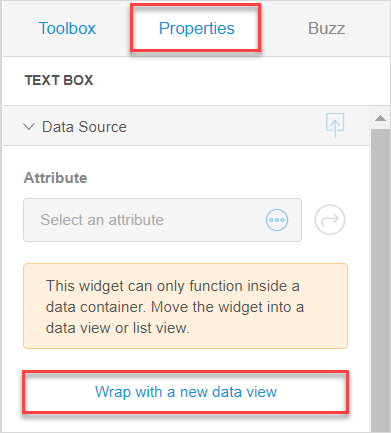

## 1 Introduction 

**Input Elements** are [widgets](page-editor-widgets-wm) in the Web Modeler that are typically used to allow end-users enter or edit data.  

**Input Elements** can only function inside a data container (a list view or a data view). You can either place widget in an existing data container; or click **Wrap with a new data view** in **Properties** to create a data view automatically and place an input element inside it. 

## 2 Input Elements Overview

You can find the description of input elements available in the Web Modeler in the table below:

| Input Element      | Description                                                  |
| ------------------ | ------------------------------------------------------------ |
| Text Box           | A text box is used to allow end-users to enter, edit, and display a text. For example, end-users will be able to enter their names. |
| Text Area          | A text area is used to enter, edit, and display a long text that can take several lines, for example, the description of a product. |
| Date Picker        | A date picker is used to allow end-users select a date in a calendar, for example, when selecting a day for a delivery. |
| Drop Down          | A drop-down widget is used to allow end-users pick an option from the preset list of options. For example, users can select a color of a product. |
| Reference Selector | A reference selector is used to select and display associations. To use the reference selector you need a many-to-one association in the domain model. For more information, see [Association Properties in the Web Modeler](domain-models-association-properties-wm). For example, if a customer has several addresses, the user can select a delivery address from them. In this example, several addresses can be associated with one customer (many-to-one association). The reference selector is displayed as a drop-down. |
| Check Box          | A check box widget is used to allow users to mark a value as true or false. For example, users can tick a box to sign up for the newsletter. |
| Radio Buttons      | Radio buttons are used to allow users select the option from a number of preset ones. For example, users can select from several possible locations for picking an order up. |

{}

Apart from the standard input widgets, you can also [download widgets from the Mendix App Store](https://appstore.home.mendix.com/index3.html) to your app. For more information, see section [4 Widgets by Origin](page-editor-widgets-wm#widgets-by-origin) in *Widgets in the Web Modeler*.

{}

## 3 Properties

Input elements properties consist of the following sections:

* [Data source](#input-elements-design)
* [General](#input-elements-general)
* [Design](#input-elements-design)

### 3.1 Data Source {#input-elements-design}

**Input Elements** need to be linked to an attribute to show data and to allow end-users to edit it. Different input elements require different [types of attributes](domain-models-attributes-wm). You can find the correspondence between the input elements and attribute types in the table below:

| Input Element      | Allowed Attribute Type                                       |
| ------------------ | ------------------------------------------------------------ |
| Text Box           | String, Autonumber, Decimal, Hashed String, Integer, Long    |
| Text Area          | String                                                       |
| Date Picker        | Date and Time                                                |
| Drop Down          | Enumeration                                                  |
| Reference Selector | Autonumber, Date and Time, Decimal, Enumeration, Integer, Long, String |
| Check Box          | Boolean                                                      |
| Radio Buttons      | Boolean, Enumeration                                         |

### 3.2 General Section {#input-elements-general}

The **General** section has common properties for every input element, but may also contain specific ones. 

#### 3.2.1 Common Properties

Common properties of input elements are described in the table below:

| Property    | Description                                                  |
| ----------- | ------------------------------------------------------------ |
| Show Label  | Enable this property if you want to show a label (name) of a widget to the end-user.  *This property is enabled by default.* |
| Label       | This property only appears if **Show Label** is enabled. Specify the name that will be displayed to the end-users. When you select an attribute, the name of the attribute is filled out as a label. |
| Editability | Editability indicates whether the end-user will be able to change the value displayed by the widget. Possible values are the following: <ul><li>Editable – the value displayed by the widget is editable</li><li>Read-only – the value is in read-only mode</li><li>Conditional – the widget is editable only if specified conditions are met (this option can be configured in the Desktop Modeler only)</li></ul>{}If an attribute set for the widget's data source is of the AutoNumber type, the widget is set into read-only mode by default and the **Editability** setting itself is disabled, because attributes of this type are generated automatically. {} |

#### 3.2.2 Specific Properties

Specific properties of the input elements are described in the table below:

| Input Element | Property           | Description                                                  |
| ------------- | ------------------ | ------------------------------------------------------------ |
| Text Area     | Grow Automatically | When enabled, the text area grows automatically depending on the amount if text filled out in it.  *This property is disabled by default.* |
| Text Area     | Number of Lines    | This property is only displayed when the **Grow Automatically** option is disabled.  The number of lines determine how many lines the text area shows at the same time. If the text in the text area contains more lines you will have to use a scrollbar to see it all.  Default value for the **Number of Lines** option: 5 |
| Radio Buttons | Orientation        | This property defines whether the radio buttons are displayed in your app horizontally or vertically.  Default value for **Orientation**: Horizontal. |

## 4 Design Section {#input-elements-design}

For information on the **Design** section and its properties, see [Design Section in Widgets of the Web Modeler](page-editor-widgets-design-section-wm).

## 5 Related Content

* [Page Editor Overview in the Web Modeler](page-editor-wm) 
* [Widgets in the Web Modeler](page-editor-widgets-wm)
