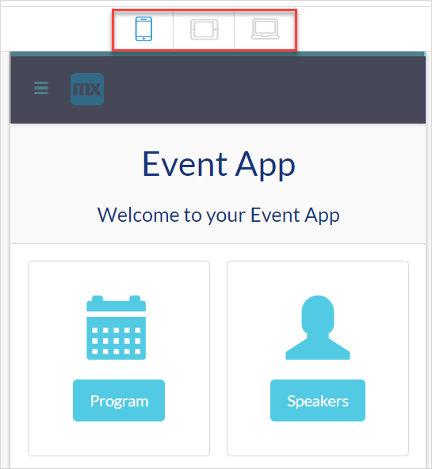
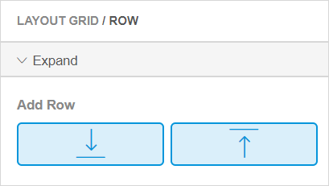
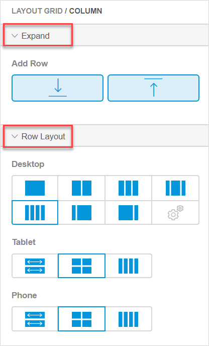

---

title: "Layout Widgets in the Web Modeler"
parent: "page-editor-widgets-wm"
description: "Describes layout widgets in the Mendix Web Modeler."
menu_order: 60
tags: ["web modeler", "page editor", "layout", "layout widgets", "widgets"]
---

## 1 Introduction 

Layout widgets are widgets that allow you to provide structure to your page. 

There are three layout widgets:

* [Layout Grid](#layout-grid)
* [Container](#container-overview)
* [Group Box](#group-box-overview)

## 2 Layout Grid Overview {#layout-grid}

The **Layout Grid** is a widget that helps you to configure a page and make it responsive immediately. This means that a layout grid has a built-in behavior to show how a page will look like on different devices. Switch **Device** modes in the top bar to see how a page will be displayed on a phone, tablet or desktop.

Layout grid contains [columns and rows](#columns-and-rows). 

A row consists of items that are placed next to each other in a responsive (desktop) view. 

A column is a cell inside a row. You can place one or several elements inside a column, for example, you can place two buttons inside it.

Use a column to align items in a row.  For more information on rows and columns, see section [2.2 Row and Column Properties](#columns-and-rows). 

### 2.1 Layout Grid Properties

Layout grid properties consist of the following sections:

* [Expand](#expand-section) 
* [General](#general-section)
* [Design](page-editor-widgets-design-section-wm)

#### 2.1.1 Expand Section {#expand-section}

The **Expand** section > **Add Row** allows you to add a row above or below the selected one to create more space to place widgets in. 

To add a row, select a row in the layout grid and click one of the buttons in **Add Row**. A row identical to the selected one will be inserted.

{}

**Row** and **Column** also have the **Expand** section with the same properties.  

{}

#### 2.1.2 General Section {#general-section}

The **General** section of the layout grid contains the **Full Width** property. When this property is enabled, the layout grid takes the whole width of a container it is placed in. When disabled, the layout  grid will have a fixed size in the center of your page, adjusted automatically according to your device.

#### 2.1.3 Design Section

For information on the **Design** section and its properties, see [Design Section in Widgets of the Web Modeler](page-editor-widgets-design-section-wm).

### 2.2 Row and Column Properties {#columns-and-rows}

**Row** and **Column** properties consist of the following sections:

* [Expand](#expand-section) 
* [Row Layout](#row-layout)

#### 2.2.1 Expand Section

The **Expand** section for **Column** and **Row** has the same properties and functions as the **Expand** section of a layout grid. For details, see the [Expand Section](#expand-section) in the *Layout Grid Overview*.

#### 2.2.2 Row Layout Section {#row-layout}

In the **Row Layout** section you can change the way columns in a row are arranged, for example, change the number of columns and select the way they will be displayed on a desktop, a tablet, and a phone.  

| Property | Description                                                  |
| -------- | ------------------------------------------------------------ |
| Desktop  | Changes the number and width of columns for a desktop.       |
| Tablet   | Changes the number and width of columns for a tablet. Options available for the **Tablet** layout depend on the option selected for the **Desktop**. |
| Phone    | Changes the number and width of columns for a phone. Options available for the **Phone** layout depend on the option selected for the **Desktop**. |

In the example below, you can see that you can select different row layouts for different types of devices and check the way the layout is shown in your app. 

## 3 Container Overview {#container-overview}

A **Container** is used as a layout element where you can place a widget or a group of widgets and simultaneously style, drag or delete them. For example, you can place a section title and input widgets for filling out customer's details in one container, and subsequently reposition the whole container at once to a different location on the page. 

Container properties consist of the **Design** section. For information, see [Design Section in Widgets of the Web Modeler](page-editor-widgets-design-section-wm).

## 4 Group Box Overview {#group-box-overview}

A group box is used to group widgets together. The group box can be configured to collapse or expand dynamically with all the elements inside it. 

### 4.1 Group Box Properties

Group box properties consist of the **General** section and the **Design** section. For information on the **Design** section and its properties, see [Design Section in Widgets of the Web Modeler](page-editor-widgets-design-section-wm).

Properties available in the **General** section are described in the table below.

| Property    | Description                                                  |
| ----------- | ------------------------------------------------------------ |
| Show Header | **Show Header** defines whether a header is shown above the group box.  *This property is enabled by default.* |
| Caption     | This property is only displayed when the **Show Header** option is enabled. It defines the caption that is shown in the header. |
| Collapsible | This property is only displayed when the **Show Header** option is enabled. It defines whether the group box and its elements can be collapsed or expanded. Possible values of this property are the following:<ul><li>**Yes (start expanded)** – the elements inside the group box will be initially expanded and can be collapsed when a user clicks a minus icon in the header</li><li>**Yes (start collapsed)** – the elements inside the group box will be initially collapsed and can be expanded when a user clicks a plus icon in the header </li><li>**No** – group box elements cannot be expanded or collapsed</li></ul> |

## 5 Related Content

* [Page Editor Overview in the Web Modeler](page-editor-wm) 
* [Widgets in the Web Modeler](page-editor-widgets-wm)
