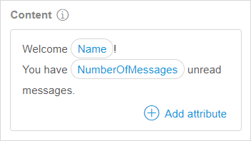
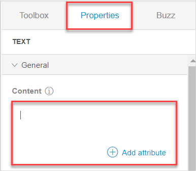
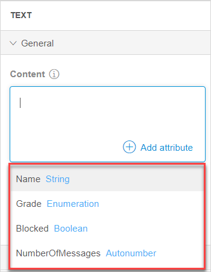
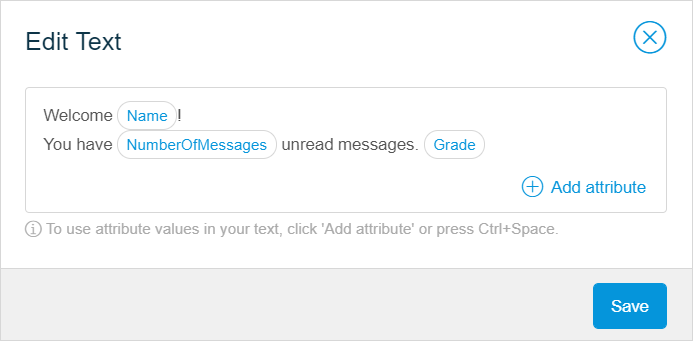
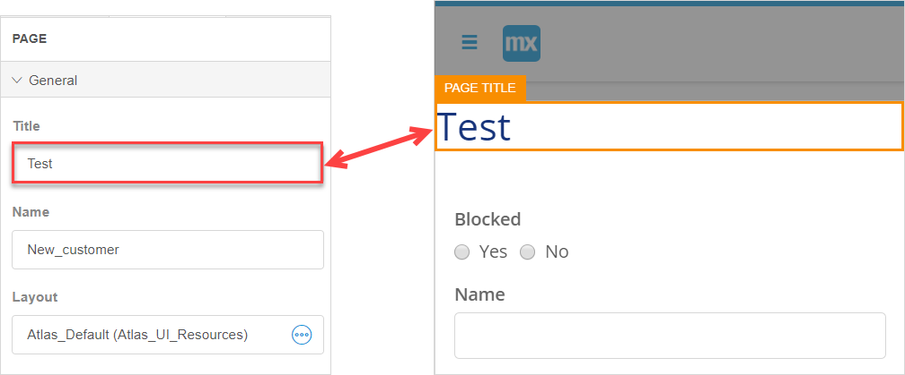

## 1 Introduction 

Typography is a group of [widgets](page-editor-widgets-wm) that consists of [**Text**](#text-widget) and [**Page Title**](#page-title-widget). They are used to display textual information to the end-user. 

## 2 Text Widget General Properties {#text-widget}

You can use the text widget to display messages to the end-user. In **Properties** > **General**, you can type the text that will be displayed, include text from attribute values, and set the [render mode](#render-mode). 

### 2.1 Content

In **Content**, you define the text that will be shown. You can also add attributes, and the attribute value will be displayed to the user. For example, when the user logs in to the account, a greeting message can be shown, where *Name* and *NumberOfMessages* are attribute values: 

#### 2.1.1 Configuring Content Without Adding Attributes

To configure **Content** without adding attributes, you can do one of the following:

* Double-click the widget on the page and start typing the text you want to show to the end-user; press <kbd>Enter</kbd> to save changes
* Open **Properties** of the **Text**, delete the default *Text* in **General** > **Content**, and type the message you want to show to the end-user

#### 2.1.2 Configuring Content and Adding Attributes

To configure **Content** and add attributes to it, do the following:

1. Place **Text** inside a data container (a list view or a data view) and set an entity for the list view/data view. For more information, see [Data View and List View Properties in the Web Modeler](page-editor-data-view-list-view-wm). This is necessary to allow attributes of the selected entity to be inserted into the text. 

2.  Open **Properties** of the **Text**, delete the default *Text* in **General**  > **Content** and start typing the message you want to show to the end-user.  

    

3. To insert attribute values into your message, click **Add attribute** or press <kbd>Ctrl</kbd> + <kbd>Space</kbd>. The list of attributes which can be inserted will be shown. 

4.  Scroll through the list of attributes (you can also use <kbd>Up</kbd> and <kbd>Down</kbd> arrows for that) and select the attribute you want to add to the **Text**. 

    

5. Type the rest of the text, and insert more attributes if required, to finish your message.

You have configured the **Content** of your widget. If you want to edit it, you can double click the widget in the page; the **Edit Text** pop-up dialog will be shown.

### 2.2 Render Mode {#render-mode}

The render mode defines the way a text will be shown to the end-user. Possible values of the render mode are described in the table below. 

| Value       | Description                                                  |
| ----------- | ------------------------------------------------------------ |
| Text        | The text will be rendered inline with the previous/next widgets on a page |
| Paragraph   | The text will be rendered as a separate paragraph            |
| H1-H6 | The text will be rendered as a heading. H1 is the largest type of the heading, H6 is the smallest one. |

## 3 Page Title General Properties {#page-title-widget}

The page title widget shows the title of the current page.  

If you want to change the name of the page, do the following:

1. Open **Properties** of the widget > the **General** section.
2. Change a name in the **Title** field. 

The page title is changed. 

The **Title** that you see in the page properties and in widget is one and the same. This means, if you make changes to the title in page properties, this change will be displayed in the widget, and vice versa.  

## 4 Design Section {#input-elements-design}

For information on the **Design** section and its properties, see [Design Section in Widgets of the Web Modeler](page-editor-widgets-design-section-wm).

## 5 Related Content

* [Page Editor Overview in the Web Modeler](page-editor-wm) 
* [Widgets in the Web Modeler](page-editor-widgets-wm)
