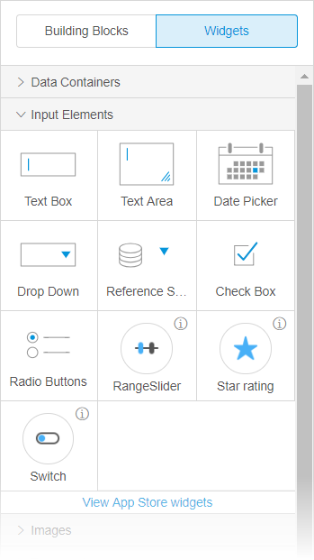
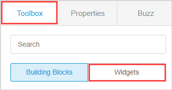
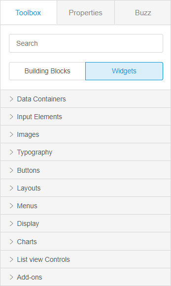
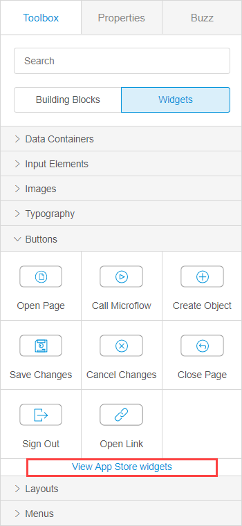
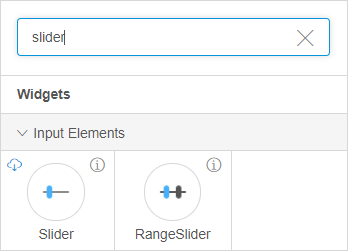
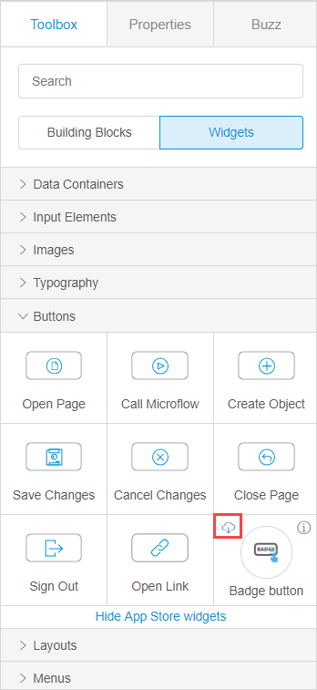

## 1 Introduction 

Widgets are single user-interface elements that can be configured, for example, a drop-down menu or different kind of buttons. 

Widgets in the Web Modeler differ by categories and by the origin. 

## 2 Viewing Widgets in the Web Modeler

To view widgets in the Web Modeler, do the following:

1. Click the **Pages** icon in the left menu bar.

2. In the displayed list of app pages, select the page you want to open and click it.

3. In the **Toolbox** tab, click **Widgets**.

   

## 3 Widgets by Category {#widget-categories}

Widgets of the Web Modeler are divided into categories that you can see when you open the **Widgets** tab.

Widget categories are described in the table below:

| Widget Category    | Description                                                  |
| ------------------ | ------------------------------------------------------------ |
| Data Containers    | Contains data view (the starting point for showing the contents of one object ), and list view (the starting point for showing the contents of list of objects). For more information, see [Data View and List View Properties in the Web Modeler](page-editor-data-view-list-view-wm). |
| Input Elements     | Contains different elements that can be used for inputting data. |
| Images             | Contains widgets that are used to display for images.        |
| Typography         | Contains widgets that can used for placing a text on a page. |
| Buttons            | Contains a variety of buttons for placing on a page.         |
| Layouts            | Contains layouts used for placing the elements.              |
| Menus              | Contains widgets used for creating a menu.                   |
| Display            | Contains widgets suitable for displaying changing elements on a page, e.g. a map, or a progress bar. |
| Charts             | Contains different charts.                                   |
| List view Controls | Contains controls for the list view.                         |
| Add-ons            | Contains all custom widgets previously installed in the app. If widgets cannot be matched to the App Store profile they will be shown in the add-ones. |

## 4 Widgets by Origin

Widgets in the Web Modeler can be divided by origin described in the table below:

| Type              | Description                                                  | Origin                                                       |
| ----------------- | ------------------------------------------------------------ | ------------------------------------------------------------ |
| Default widgets   | Widgets that are included into your app by default and don't have the info icon in the top-right corner. | Apps created in the Developer Portal. For more information on the Developer Portal, see [Developer Portal](https://docs.mendix.com/developerportal/). |
| App Store widgets | Widgets that are you can download to your project directly from the Web Modeler. Some App Store widgets are already in your project as a part of the app. Such widgets have the information icon in the top-right corner of widgets in the **Toolbox**.  For more information on the App Store, see [App Store Overview](../../community/app-store/app-store-overview). | [App Store](https://docs.mendix.com/community/app-store/)    |
| Local widgets     | Either widgets that are a part of a starter app, or widgets created by your or your team locally via the Desktop Modeler. For more information on developing widgets, see the [Custom Widget Development](../../howto/custom-widget-development/) how-to's. As a rule local widgets will be listed in the **Add-ons** category. For more information on categories, see section [3 Widgets by Category](#widget-categories). | Apps created in the  Developer Portal/Desktop Modeler        |

## 5 Adding the App Store Widgets

You can add App Store widgets to your app by downloading them directly in the **Widgets** tab in the Web Modeler. These widgets are a subset of all widgets available in the app store: only the ones that are approved for use in the Web Modeler can be downloaded by the user. You can also update them once the update is available. For more information on the widgets updating, see [App Settings in the Web Modeler](app-settings-wm). 

To add an App Store widget, do the following:

1. Open the **Widgets** tab.

2. Do one of the following: 

   a. Find the category with the **View App Store widgets** option and click it.   

     

   b.  Start typing the name of the category or of a specific widget in the **Search** field.  

     

3.  Click the cloud icon to download the widget and add it to your project.

    

The widget is now added to your project, you can simply drag and drop it to the page to use it. You can also view settings of this widget in the **App Settings**.  For more information, see [App Settings Overview in the Web Modeler](app-settings-wm). 

{}

Some App Store widgets are downloaded as a package consisting of several widgets, for example, when you download one chart widget, the whole package of charts is downloaded. 

{}

## 6 Related Content

* [Page Editor Overview in the Web Modeler](page-editor-wm) 
* [App Settings Overview in the Web Modeler](app-settings-wm)
* [App Store Overview](../../community/app-store/app-store-overview)
