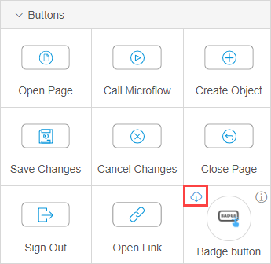

## 1 Introduction 

Widgets are single user-interface elements that can be configured: for example, a drop-down menu or different kinds of buttons. 

Widgets in the Web Modeler are grouped by category and can be classified by their origin. 

## 2 Viewing Widgets in the Web Modeler

To view widgets in the Web Modeler, do the following:

1. Click the **Pages** icon in the left menu bar.

2. In the displayed list of app pages, select the page you want to open and click it.

3. In the **Toolbox** tab, click **Widgets**.

   

## 3 Widgets by Category {#widget-categories}

Widgets of the Web Modeler are divided into categories that you can see when you open the **Widgets** tab.

Widget categories are described in the table below:

| Widget Category                                         | Description                                                  |
| ------------------------------------------------------- | ------------------------------------------------------------ |
| [Data Containers](page-editor-data-view-list-view-wm)   | Contains data view (the starting point for showing the contents of one object ), and list view (the starting point for showing the contents of list of objects). For more information, see [Data View and List View Properties in the Web Modeler](page-editor-data-view-list-view-wm). |
| [Input Elements](page-editor-widgets-input-elements-wm) | Contains different elements that can be used for inputting data. For more information, see [Input Element Widgets in the Web Modeler](page-editor-widgets-input-elements-wm). |
| [Images](page-editor-widgets-images-wm)                 | Contains widgets that are used to display for images. For more information, see [Image Widgets in the Web Modeler](page-editor-widgets-images-wm). |
| [Typography](page-editor-widgets-typography-wm)         | Contains widgets that can used for placing a text on a page. For more information, see [Typography Widgets in the Web Modeler](page-editor-widgets-typography-wm). |
| [Buttons](page-editor-widgets-buttons-wm)               | Contains a variety of buttons for placing on a page. For more information, see [Button Widgets in the Web Modeler](page-editor-widgets-buttons-wm). |
| [Layouts](page-editor-widgets-layouts-wm)               | Contains layouts used for placing the elements. For more information, see [Layout Widgets in the Web Modeler](page-editor-widgets-layouts-wm). |
| [Menus](../menu-widgets)                                | Contains widgets used for creating a menu. These widgets can be currently configured only in the Desktop Modeler. For more information, see [Menu Widgets](../menu-widgets) in the *Desktop Modeler* category. |
| Display                                                 | Contains widgets suitable for displaying changing elements on a page, e.g. a map, or a progress bar. This category consist of the App Store widgets. For more information, see section [4 Widgets by Origin](#widgets-by-origin). |
| Charts                                                  | Contains different charts. This category consist of the App Store widgets. For more information, see section [4 Widgets by Origin](#widgets-by-origin). |
| List view Controls                                      | Contains controls for the list view. This category consist of the App Store widgets. For more information, see section [4 Widgets by Origin](#widgets-by-origin). |
| Add-ons                                                 | Contains all custom widgets previously installed in the app. If widgets cannot be matched to the App Store profile they will be shown in the add-ones. |

## 4 Widgets by Origin {#widgets-by-origin}

Widgets in the Web Modeler can be divided by origin as shown in the table below:

| Type              | Description                                                  | Origin                                                       |
| ----------------- | ------------------------------------------------------------ | ------------------------------------------------------------ |
| Default widgets   | Widgets that are included into your app by default and don't have the info icon in the top-right corner. | Apps created in the Developer Portal. For more information on the Developer Portal, see [Developer Portal](https://docs.mendix.com/developerportal/). |
| App Store widgets | Widgets that are you can download to your project directly from the Web Modeler. Some App Store widgets are already in your project as a part of the app. Such widgets have the information icon in the top-right corner of widgets in the **Toolbox**.  For more information on the App Store, see [App Store Overview](../../community/app-store/app-store-overview). | [App Store](../../community/app-store/index)                 |
| Local widgets     | Either widgets that are a part of a starter app, or widgets created by your or your team locally via the Desktop Modeler. For more information on developing widgets, see the [Custom Widget Development](../../howto/custom-widget-development/) how-to's. As a rule local widgets will be listed in the **Add-ons** category. For more information on categories, see section [3 Widgets by Category](#widget-categories). | Apps created in the  Developer Portal/Desktop Modeler        |

## 5 Adding the App Store Widgets

You can add App Store widgets to your app by downloading them directly in the **Widgets** tab in the Web Modeler. These widgets are a subset of all widgets available in the app store: you can only download the ones that are approved for use in the Web Modeler. You can also update them if an update is available. 

To add an App Store widget, do the following:

1. Open the **Widgets** tab.

2. Do one of the following: 

   a. Find a category with the **View App Store widgets** option and click it.   

   

   b.  Start typing the name of the category or of a specific widget in the **Search** field. 

    

3.  Click the cloud icon to download the widget and add it to your project.

    

The widget is now added to your project, you can simply drag and drop it to the page to use it. You can also view settings of this widget in the **App Settings**.  For more information, see [App Settings Overview in the Web Modeler](app-settings-wm). 

For more information on managing widgets in your app, see [App Settings in the Web Modeler](app-settings-wm). 

## 6 Related Content

* [Page Editor Overview in the Web Modeler](page-editor-wm) 
* [App Settings Overview in the Web Modeler](app-settings-wm)
* [App Store Overview](../../community/app-store/app-store-overview)
