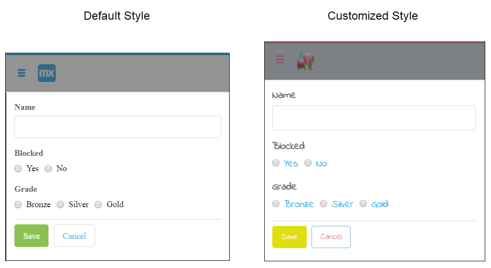
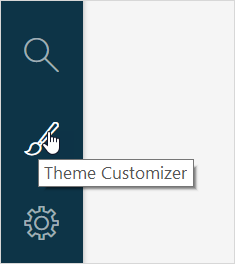
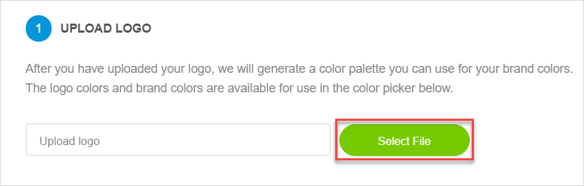
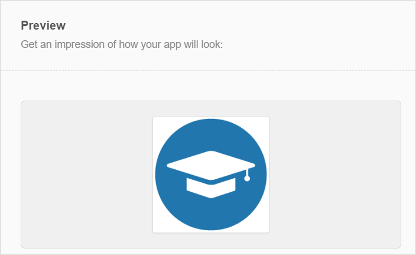
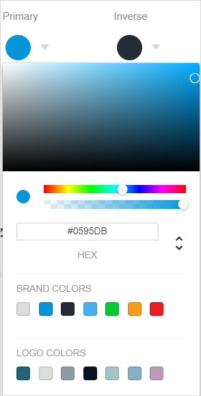

## 1 Introduction 

The **Theme Customizer** is a tool that helps you customize your app. For example, you can adjust colors, upload logo, change text style, thus making your app look the way you want.

To open the **Theme Customizer**, click the paintbrush icon at the left menu bar. 

The **Theme Customizer** is divided into two panes:

* [Settings](#theme-customizer-settings) 
* [Preview](#theme-customizer-preview)

At the bottom of the **Theme Customizer** you can see two buttons with following functions: 

* **Reset Style** – click it to reset changes and restore the values that were there when you opened the **Theme Customizer** (but you can't reset changes once you have clicked **Apply Style**)
* **Apply Style** – click it to save changes

## 2 Settings Pane {#theme-customizer-settings}

In **Settings** you can change the way your app looks. The changes that you can make using the **Settings** pane are described in the table below. 

| Section          | Description                                                  |
| ---------------- | ------------------------------------------------------------ |
| Upload Logo      | You can upload a picture that will be used as a logo in your app. You can upload  images with extensions png, jpg, jpeg, and gif.  Once the logo is uploaded, its colors will appear in the drop-down window for adjusting colors of such elements as buttons, text, top and side bars in the **Theme Customizer**. Thus, you can select colors from **Logo Colors** to make your app the same style as your logo. For more information, see [**Adjusting Colors**](#adjusting-colors). |
| Brand Colors     | In this section you can choose the main colors of your app (mostly used for buttons). |
| UI Customization | In this section, you can adjust the style and color of the main UI elements: <ul><li>Topbar</li><li>Sidebar</li><li>Backgrounds</li></ul> |
| Typography       | Use this section to override the text styles and text colors for your app. |

## 3 Preview Pane {#theme-customizer-preview}

**Preview** allows you to get an impression of how your changes will look like in the app. 

## 4 Performing Basic Functions in the Theme Customizer

### 4.1 Uploading a Logo {#uploading-logo}

To upload the logo, do the following: 

1. Open the **Theme Customizer**.
2.  In the **Upload Logo** section, click **Select File**.  

   

3. In the dialog window, select the picture you want to use as logo.
4.  The selected picture is uploaded and shown in the **Preview**. 

   

5. Click **Apply Style** to save changes.

### 4.2 Adjusting Colors {#adjusting-colors}

You can override the default colors of different elements in your app. You can change the colors of the elements that have a color palette in the drop-down window. 

To change the color, do the following:

1. In **Brand Colors**, **UI Customization** or **Typography** sections, select the element you want to change.
2.  Click this element and select color by clicking on the palette, filling out the code of the color, or selecting the color from **Brand Colors** and **Logo Colors** (only available when you upload a logo, for more information, see [Uploading a Logo](#uploading-logo)).

   

3. See the result in the **Preview**.
4. Click **Apply Style** to save changes. 

## 5 Related Content

* [Atlas UI](../../howto/atlasui/)
