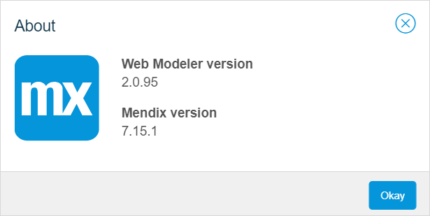

## 1 Introduction 

In the Web Modeler you will be prompted to upgrade to the latest **Mendix version** whenever a new Mendix version becomes available. Next to that, the Web Modeler has its own version and will be upgraded automatically (for example, on a daily basis). This document explains how these two versions relate to each other and what you can do to make use of the latest greatest features of the Mendix platform including the Web Modeler.

The **Web Modeler version** is the version of the Web Modeler user interface. 

The **Mendix Desktop Modeler** version is the version of the project (app) you are editing. A new **Mendix version** contains a new version of the Desktop Modeler.

The **Web Modeler version** and the **Mendix version** (**Mendix Desktop Modeler version**) can be viewed by clicking the info icon>**About** in the top-right corner of the Web Modeler.

## 2  Upgrading to the Next Version

The **Web Modeler versions** is updated continuously (for example, daily), and you will have the latest user interface features available for editing your app. However, when there is a new **Mendix Desktop Modeler** **version**, an orange top bar is displayed informing you that you can upgrade your app to the next version.   

This means that when you upgrade, you upgrade your app to a new **Mendix Desktop Modeler** **version**. When you see the upgrade notification you can either stay on the current version and continue working (but you might not have the newest Mendix platform features and improvements), or you can upgrade to the newest version. 

 {} 

Once you have upgraded to the newest version, you cannot revert the upgrade. Also, anyone working on the app using the Desktop Modeler must use the new version of the Desktop Modeler from that moment on. 

{}    

## 3 Postponing the Immediate Upgrade to the Next Version 

Users on the business side and in IT who want to leverage both the Web Modeler and the Desktop Modeler to collaborate on the same application, may not want to upgrade right away, for example, because upgrading the Desktop Modeler may not be desired until later in time. 

Also, specific company policies may be in place for approving software upgrades.

The latest **Web Modeler version** supports a range of recent **Mendix Desktop Modeler versions**. While we encourage users to upgrade to new **Mendix Desktop Modeler versions** as soon as possible, in many cases it is possible to postpone the upgrade and still make use of the latest Web Modeler features.

Even when you are editing an app that does not have recent **Mendix Desktop Modeler versions**, the Web Modeler in many cases will still be available for use. An older version of the Web Modeler will automatically be loaded when you open this project in the Web Modeler. This Web Modeler version will not contain the latest Web Modeler features, but still allows you to edit the app. For more information on the Web Modeler latest changes, see the [Web Modeler Release Notes](https://docs.mendix.com/releasenotes/web-modeler/).

{} 

The Web Modeler has a minimum supported version of the **Mendix Desktop Modeler version**. This means that if the version of your project is lower than the minimum supported version, the upgrade is obligatory, otherwise, you cannot work on your app in the Web Modeler any longer.  

{}

## 4 Related Content

* [Web Modeler Release Notes](https://docs.mendix.com/releasenotes/web-modeler/)