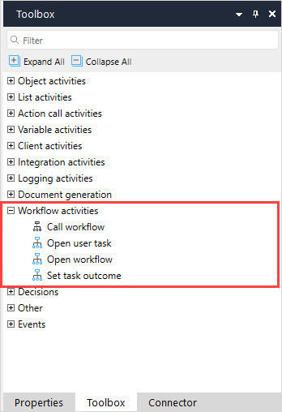

## 1 Introduction

The activities described in this document are in the **Workflow Activities** section of the **Toolbox**:

The following are the workflow activities you can use in your microflow:

* **Call workflow** – call a workflow
* **Open user task** – opens a user task page specified in [user task properties](user-task) 
* **Open workflow page** – opens an overview page specified in [workflow properties](workflow-properties)
* **Set task outcome** – sets which outcome the [user task](user-task) should follow

## 2 Read More

* [Activities](activities)