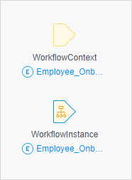

## 1 Introduction

A parameter is a special kind of variable that is used as input for the workflow. When a workflow is triggered, the parameters are filled with the current values.

In the workflow editor, you can see two parameters in the top-left corner: **WorkflowContext** and **WorkflowInstance**. In the picture below, the object is shown in *blue* and the parameter name is shown in *black*.

The **WorkflowInstance** parameter stores data on the workflow process. 

The **WorkflowContext** parameter is a business-related data that travels through the workflow. 

## 2 Properties

The workflow parameters properties consists the **Output** section. 

### 2.1 Entity

The entity used by the workflow parameter. 

For **WorkflowInstance** parameter uses an entity that stores data on the workflow process. This entity should be a specialization of the **Workflow** entity in the System module. For more information, see the [Workflow Entities in the System Module](workflows#workflow-entities) section in *Workflows*.

The **WorkflowContext** parameter uses a business-related entity that travels through the workflow. 

{}

The **WorkflowInstance** entity should have a one-to-one or a one-to-many association to the **WorkflowContext** entity. 

{}

### 2.2 Name

**Name** is the name of the parameter and cannot be changed. 

