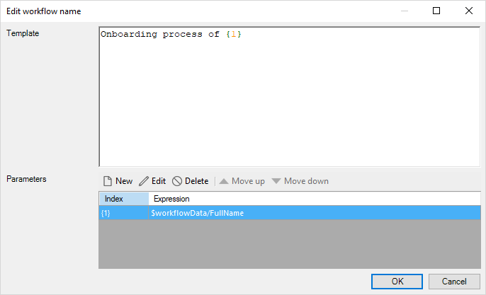

## 1 Introduction

This document describes workflow properties. For details on what workflows are for and what kind of elements they can contain, see [Workflows](workflows).

## 2 Workflow Properties

An example of workflow properties is represented in the image below:

Workflow properties consist of the following sections:

* [Common](#common)
* [Data](#data)
* [Display information](#display-info)
* [Due date](#due-date)
* [General](#general)
* [Workflow page](#workflow-page)

### 2.1 Common Section {#common}

#### 2.1.1 Name {#name}

**Name** is the internal name of the workflow document. When referring to the workflow in the app project you will use this name. It must be unique within the module, but you can have two workflows with the same name in different modules. When referring to the workflow, you will normally prepend the name of the module to ensure uniqueness and allow you to use workflows in other modules. 

You cannot change the **Name** of the workflow but you can change the [Caption](#general).

#### 2.1.2 Documentation

**Documentation** allows you to describe your workflow to make it easier for people to use and modify it.

#### 2.1.3 Allowed Roles

**Allowed roles** defines which [module role](module-security#module-role) the user must have to be able to execute the workflow.

{}
These roles are only checked when the workflow is executed from the client. 
{}

For more information, see [Module Security](module-security).

### 2.2 Data Section {#data}

**Workflow entity** is an entity that is used as a workflow context. It should be a **Workflow Context** entity from the **System** module or its **specialization**. 

For more information on specializations and generalizations, see [Generalization vs One-to-One Associations](generalization-and-association).

### 2.3 Display Information Section {#display-info}

#### 2.3.1 Workflow Name

**Workflow name** is displayed in the running app. The **Workflow name** can contain parameters that are written between braces, e.g. {1}.

For more information on using parameters, see the [Parameters](#parameters) section below.

#### 2.3.2 Workflow Description

**Workflow Description** is a description of the workflow displayed in the running app. The description can contain parameters that are written between braces, e.g. {1}.

#### 2.3.3 Parameters

Parameters are attributes the value of which will be displayed. To view **Parameters**, click the ellipsis icon next to the **Workflow name** or **Workflow description** in properties depending on where you would like to display these parameters. 

Parameters have the following settings:

* **Index** – an identification number of a parameter
* **Expression** – an XPath expression that will be displayed

##### 2.3.3.1 Adding New Parameters

To add a parameter to the **Workflow name** or the **Workflow description**, do the following:

1. Click the ellipsis icon next to the **Workflow name** or the **Workflow description**.

2. In the **Edit workflow name** dialog box > **Parameters** section, click the **New** button. 

3. In the **Template Parameter (String)** dialog box, specify the expression, and confirm your choice. 

    

    {}Make sure that the attribute you use in the expression is of string type.{}

4. In the **Template** setting, write the text you would like to display and type **Index** of the parameter you would like to include. In the example below, to include a full name of the new hire being onboarded, you need to use {1} index:

    

##### 2.3.3.2 Performing Other Actions on Parameters

In addition to adding new parameters, you can perform the following actions on parameters:

* **Delete** – to delete a parameter click **Delete** or press <kbd>Delete</kbd> on your keyboard
* **Edit** – double-click a parameter to edit it or click **Edit**
* **Move up** – to move a parameter up in the list of parameters and also to change its index, click **Move up**
* **Move down** – to move a parameter down in the list of parameters and also to change its index, click **Move down**

### 2.4 Due Date Section {#due-date}

**Due in** allows you to set a deadline for the workflow and keep track of it. However, this is not an automatic reminder but rather a deadline you reference when keeping track of the workflow. 

### 2.5 General Section {#general}

**Caption** defines a title of the workflow. You cannot change the [Name](#name) of the workflow but you can change the **Caption**.

### 2.6 Workflow Page Section {#workflow-page}

**Workflow page** is an overview page where the allowed roles can track the progress of the workflow and its tasks. 

## 3 Read More

* [Workflows](workflows)