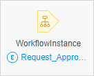
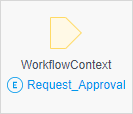
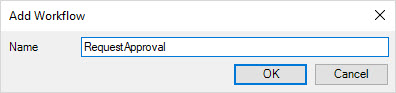

{}
This functionality is in Beta. For more information on Beta products, see [Beta Versions](/releasenotes/beta-features/).
{}

## 1 Introduction

Workflow is a visual language in Mendix Studio and Studio Pro that allows you to build extendable processes. It is fully integrated with other visual languages, such as the microflow editor and page editor. 

## 2 Workflow Elements

A workflow is composed of elements that you can drag and drop on a path. Below is a categorized overview of all elements. The following categories are used:

* [Parameters](#parameters)
* [General](#general)
* [User tasks](#user-tasks)
* [System actions](#system)

### 2.1 Workflow Parameters {#parameters}

[Workflow parameters](workflow-parameters) are input data for your workflow.

In the workflow editor, there are the following parameters:

* The **WorkflowInstance** parameter stores data on the workflow process:

    
    
    The entity of this parameter is automatically generated when you create a new workflow.

* The **WorkflowContext** parameter is a business-related data that travels through the workflow:

    

### 2.2 General {#general}

Elements in the general category help you control the workflow path, for example, add parallel paths or end them. 

The elements of this category are described in the table below:

| Graphic                                                     | Element                           | Description                                                  |
| ----------------------------------------------------------- | --------------------------------- | ------------------------------------------------------------ |
|     | Start event                    | The starting point of a workflow. Workflows are triggered either by the [Call workflow](on-click-event#call-workflow) on-click event on pages or by the [Workflow call](workflow-call) action in microflows.  Click the start event to open [workflow properties](workflow-properties). |
|              | [Decision](decision-in-workflows) | Makes a choice based on a condition and follows one and only one of the outgoing paths. |
|  | [Parallel split](parallel-split)  | Adds two parallel paths to your workflow.                    |
|             | [Jump](jump-activity)             | Allows you to jump to other activities in the workflow.      |
|         | End event                      | Ends the path of the workflow                                |

{}
You can add customized activities to this section if you use the **Expose as a workflow action** setting in microflows. For more information see the [Expose as Workflow Action](microflow#expose-as-workflow-action) section in *Microflow Properties*.
{}

### 2.3 User Tasks {#user-tasks}

[User task](user-task) – a central element in a workflow that allows you to assign a task to a certain user or a group of users using filters or microflows. 

### 2.4 System Actions {#system}

[Call microflow](call-microflow) activity calls a selected microflow. 

## 3 Performing Basic Functions

You can perform the following basic functions when working on workflows:

* Open a workflow
* Create a workflow
* Delete a workflow
* Add elements to a workflow
* View element properties 

### 3.1 Opening a Workflow

To open a workflow in Studio Pro, do the following:

1. In the [App Explorer](project-explorer), open a module where this workflow is located.
2. Navigate to the workflow’s location inside the module and double-click the workflow.

The selected workflow is opened.

### 3.2 Adding a Workflow

To add a workflow to your app, do the following:

1. In the [App Explorer](project-explorer), right-click the module or a folder you want to create a page in and select **Add workflow**.

2. In the **Add workflow** dialog box, fill in Name and click **OK**:

    

The workflow is created and the **WorkflowInstance** entity is added to the domain model. For more information on the **WorkflowInstance** entity, see [Workflow Parameters](workflow-parameters).

### 3.3 Deleting a Workflow

To delete a workflow, do the following:

1. In the [App Explorer](project-explorer), select a workflow you would like to delete and right-click it.
2. In the displayed list, select **Delete** and confirm your choice by clicking **Delete** in the pop-up dialog.

The selected workflow is deleted. 

{}

The **WorkflowInstance** entity that was generated when the workflow was created remains in the domain model, you have to delete it manually.

{}

### 3.4 Adding Elements to a Workflow 

To add an element to a workflow, do the following:

1. Open the **Toolbox**.
2. Select an element you would like to add and drag and drop this element in the working area.

The selected element is added.

### 3.5 Viewing Element Properties 

To view properties of an element, do one of the following:

1. Select an element and open **Properties** pane to view its properties.
2. Right-click an element and select **Properties** from the list of options that opens.
3. Double-click an element.

### 3.6 Triggering a Workflow

You can trigger a workflow [from a page](#trigger-page) or [via a microflow](#trigger-microflow). 

#### 3.6.1 Triggering a Workflow from a Page {#trigger-page}

To start the workflow, you can add a widget with a specific on-click event on a page. For more information on on-click events, see [On Click Event & Events Section](on-click-event).

Do the following:

1. Open a page from where you would like to trigger a workflow.
2. Make sure you have a data container with the workflow context on your page. 
3. Drag and drop a widget that has on-click event in its properties (for example, a button) inside the data container with the workflow context. 
4. Open button's properties > **Events** section. 
5. Set **On-click** property to **Call workflow**. 
6. Set **Workflow** to the workflow you would like to trigger.

You have configured the button to trigger the workflow.

#### 3.6.2 Triggering a Workflow via a Microflow {#trigger-microflow}

To trigger a workflow via a microflow, you can add a **Call workflow** activity to the microflow. For more information on this activity, see [Workflow Call](workflow-call).  

Do the following:

1. Open a microflow that will trigger a workflow.

2. Make sure the microflow has a necessary parameter with the workflow context.

3. In the **Toolbox**, find **Call workflow** activity and drag and drop it to the microflow.

4. Double-click the activity to open its properties.

5. Set **Workflow** to to the workflow you would like to trigger.

6. Set **Context object** to the workflow context:

    

7. Click **OK**.

Now when you run this microflow, it will trigger the selected workflow. 

## 4 Workflow Entities in the System Module {#workflow-entities}

There are several workflow-related entities in the System module of your app, some of which can be used in in an XPath and expressions, and some are there as basic entities that are internally only (for example, by the Runtime). 

You can find the following workflow-related entities in the System module: 

* **WorkflowDefinition** – Represents your workflow in the database. It contains two attributes, where **Name** and **Title** are **Name** and **Title** properties of the workflow and **Obsolete** is a Boolean that is marked as true when you delete your workflow. In this case, the workflow still stays in the database (and you will still be able to create reports with it), but Mendix marks that it does not exist anymore. For more information on properties, see [Workflow Properties](workflow-properties). 
* **WorkflowTaskDefinition** – Represents your [user tasks](user-task) and [system activities](call-microflow) in the database. It contains two attributes, where **Name** is a **Name** property of the user task or a system activity, and **Obsolete** is a Boolean that is marked as true when you delete a user task/system activity from your workflow. They still stay in the database (and you will still be able to create reports with them), but Mendix marks that they do not exist anymore. 
* **Workflow** – A representation of a running workflow, so every time when the new workflow is started, the Runtime creates a new instance.
* **WorkflowUserTask** – This entity is created when the Runtime executes the user task and an end-user chooses an action (for example, clicks an **Approve** button to approve a request). This entity can be used for workflow overview pages and in an application logic.

## 5 Workflow Variables

Workflows have dedicated variables that can be used in an XPath and Expressions inside the Workflow editor. 

The list of variables is described below: 

* `$WorkflowContext` – an instance of the business-related entity that travels through the workflow
* `$WorkflowInstance` – an instance of a currently running workflow (**System.Workflow**)

For more information on workflow-related entities in the System module, see the [Workflow Entities in the System Module](#workflow-entities) section above. 

For example, you can use these variables as parameters in the **Task name** and **Task description** properties of a user task. For more information, see [User Task](user-task). 

## 6 Workflow-Specific Activities in Microflows

You can add workflow-related activities to your microflows. For more information on these activities, see [Workflow Activities](workflow-activities). 

## 7 Workflow-Specific On-Click Events on Pages

You can trigger workflows or user tasks from pages via specific on-click events configured on widgets. For more details, see [On Click Event & Events Section](on-click-event).

## 8 Workflow Commons Module

The **Workflow Commons** module is a workflow specific module that has preconfigured page templates, pages, dashboards, etc. It can save you a lot of time during development. You can either download it from the Marketplace or use one of the app templates when creating a new app in the Developer Portal. These templates already contain the **Workflows Commons** module.

For more information on how to configure the **Workflow Commons** in an existing app, see [Adding a Workflow to an Existing App: Setting Up the Basics](/refguide/workflow-setting-up-app).

## 9 Read More

* [Adding a Workflow to an Existing App: Setting Up the Basics](/refguide/workflow-setting-up-app)