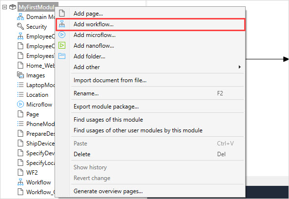

{}
This functionality is in Beta. For more information on Beta products, see [Mendix Beta Features](/releasenotes/beta-features/).
{}

## 1 Introduction

Workflow is a visual language in Mendix Studios that allows you to build extendable processes. It is fully integrated with other visual languages, such as the microflow editor and page editor. 

## 2 Workflow Elements

A workflow is composed of elements that you can drag and drop on a path. Below is a categorized overview of all elements. The following categories are used:

* [General](#general)
* [User tasks](#user-tasks)
* [System actions](#system)

### 2.1 General {#general}

Elements in the general category help you control the workflow path, for example, add parallel paths or end them. 

The elements of this category are described in the table below:

| Graphic                                                     | Element                           | Description                                                  |
| ----------------------------------------------------------- | --------------------------------- | ------------------------------------------------------------ |
|              | [Decision](decision-in-workflows) | Makes a choice based on a condition and follows one and only one of the outgoing paths. |
|  | [Parallel split](parallel-split)  | Adds two parallel paths to your workflow.                    |
|             | [Jump](jump-activity)             | Allows you to jump to other activities in the workflow.      |
|         | End activity                      | Ends the path of the workflow                                |

### 2.2 User Tasks {#user-tasks}

[User task](user-task) – a central element in a workflow that allows you to assign a task to a certain user using filters or microflows. 

### 2.3 System Actions {#system}

[Call microflow](call-microflow) activity calls a selected microflow. 

## 3 Performing Basic Functions

{}[Do we need to describe actions that are so simple or shall I leave them for Studio only?]{}

You can perform the following basic functions when working on workflows:

* Open a workflow
* Create a workflow
* Delete a workflow
* Add elements to a workflow
* View element properties 

### 3.1 Opening a Workflow

To open a workflow in Studio Pro, do the following:

1. In the [Project Explorer](project-explorer), open a module where this workflow is located.
2. Navigate to the workflow’s location inside the module and double-click the workflow.

The selected workflow is opened.

### 3.2 Adding a Workflow

To add a workflow to your app project, do the following:

1. In the [Project Explorer](project-explorer), right-click the module or a folder you want to create a page in and select **Add workflow**:

   

2. In the **Add workflow** dialog box, fill in Name and click **OK**:

   

The workflow is created.

### 3.3 Deleting a Workflow

To delete a workflow, do the following:

1. In the [Project Explorer](project-explorer), select a workflow you would like to delete and right-click it.
2. In the displayed list, select **Delete** and confirm your choice by clicking **Delete** in the pop-up dialog.

The selected workflow is deleted. 

### 3.4 Adding Elements to a Workflow 

To add an element to a workflow, do the following:

1. Open the **Toolbox**.
2. Select an element you would like to add and drag and drop this element in the working area.

The selected element is added.

### 3.5 Viewing Element Properties 

To view properties of an element, do one of the following:

1. Select an element and open **Properties** pane to view its properties.
2. Right-click an element and select **Properties** from the list of options that opens.
3. Double-click an element.

## 4 Workflow Entities in the System Module {#workflow-entities}

There are several workflow-related entities in the System module of your app project, some of which can be used in in an XPath and expressions, and some are there as basic entities that are internally only (for example, by the Runtime). 

You can find the following workflow-related entities in the System module:

* **WorkflowDefinition** – Represents your workflow in the database. It contains two attributes, where **Name** and **Title** are **Name** and **Title** properties of the workflow and **Obsolete** is a Boolean that is marked as true when you delete your workflow. In this case, the workflow still stays in the database (and you will still be able to create reports with it), but Mendix marks that it does not exist anymore. For more information on properties, see [Workflow Properties](workflow-properties). 
* **WorkflowTaskDefinition** – Represents your [user tasks](user-task) and [system activities](call-microflow) in the database. It contains two attributes, where **Name** is a **Name** property of the user task or a system activity, and **Obsolete** is a Boolean that is marked as true when you delete a user task/system activity from your workflow. They still stay in the database (and you will still be able to create reports with them), but Mendix marks that they do not exist anymore. 
* **WorkflowVersion** – This System entity is used for versioning and for the internal administration in the Runtime. When you add an activity and run your workflow, a new version will be created.
* **WorkflowInstance** – A representation of a running workflow, so every time when the new workflow is started, the Runtime creates a new instance.
* **WorkflowTaskInstance** –  A representation of a running user task or a system activity, so every time when the new user task/system activity is started, the Runtime creates a new instance.
* **WorkflowUserTask** - a specialization of **WorkflowTaskInstance**. This entity is created when the Runtime executes the user task and an end-user chooses an action (for example, clicks an **Approve** button to approve a request). This entity can be used for workflow overview pages and in an application logic.
* **WorkflowSystemTask** – a specialization of **WorkflowTaskInstance**. This entity is created when the Runtime executes the system activity (**Call microflow**) and is used to show that the microflow has been executed. 
* **WorkflowContext** – a basic entity for the objects that will be used as context for the workflow. The specialization of this entity is used as a **Workflow entity** in its properties. For more information on properties, see [Workflow Properties](workflow-properties). 

## 5 Workflow Variables

Workflows have dedicated variables that can be used in an XPath and Expressions inside the Workflow editor. 

The list of variables is described below: 

* `$workflowData` – an instance of a Workflow entity (usually a specialization of **System.WorkflowContext**)
* `$workflow` – an instance of a currently running workflow (**System.WorkflowInstance**)

For more information on workflow-related entities in the System module, see the [Workflow Entities in the System Module](#workflow-entities) section above. 

For example, you can use these variables as parameters in the **Task name** and **Task description** properties of a user task. For more information, see [User Task](user-task). 

## 6 Workflow-Specific Activities in Microflows

{}[Do we need this info? Might be better when searching for the relevant info but we didn't include such info in other visual editor documents]{}

You can add workflow-related activities to your microflows. For more information on these activities, see [Workflow Activities](workflow-activities). 

## 7 Workflow-Specific On-Click Events

You can trigger workflows or user tasks from pages via specific on-click events configured on widgets. For more details, see [On Click Event & Events Section](on-click-event).

## 8 Read More

* [How to Configure a Workflow for the Employee Onboarding Process](/howto/logic-business-rules/workflow-how-to-configure)