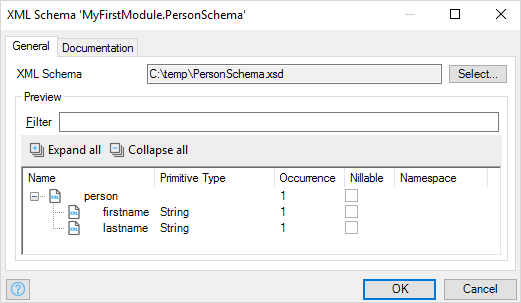

## 1 Introduction

An XML schema is defined in an XML Schema Definition (XSD) file and can be imported in your model. It describes what a certain XML document should look like. An example is shown in **Figure 1**. The schema can then be used in [Import Mappings](import-mappings) and [Export Mappings](export-mappings).

**Figure 1: example of an XML schema**

## 2 General

### 2.1 XML Schema

The file path to the XSD file.

### 2.2 Preview

The elements of which the XML file is comprised.

## 3 Documentation

Documentation that describes the schema.
