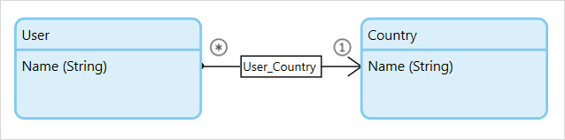
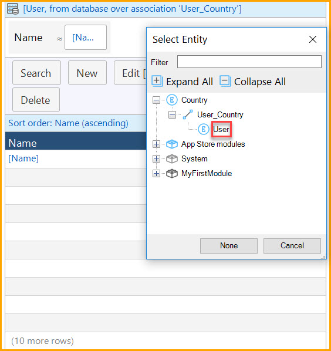

If database is selected as the data source for a widget then the object or objects shown are retrieved directly from the database with a query. As such, the data supplied is limited by the following factor:

1.  The access rules defined in the security section of the project.
2.  The XPath constraint supplied in the widgets settings.
3.  An association, if the widget is nested in another data widget and the data path described runs over an association.

{}

Use access rules whenever possible to limit data in data grids. This way you know that the objects will always be constrained by these rules (as opposed to an XPath constraint on a single data grid). The access rules will also be applied when executing microflows which saves you from repeating XPath constraints.

{}

## Components

### Search Bar

See [Search Bar](search-bar).

### Sort Bar

See [Sort Bar](sort-bar).

## Properties

### Entity (Path)

The entity (path) property specifies the target of the database query. A top-level data grid is always connected to an entity.

A nested data grid can either be connected to an entity or to an entity path starting in the entity of the containing data view. The entity path follows one association of type reference in the opposite direction in which the association's arrow is pointing (from * to 1).

Please note that this differs from the [association data source](association-source) in that the objects are not retrieved from the client cache but directly from the database. The association is simply parsed as an extra constraint in the database query.

{}

The [domain model](domain-model) above describes a database in which an indeterminate number of users can be linked to a single country.

The data view shown contains a single country. The data grid nested inside will display only those users that are linked to that particular country.

{}

### Show Search Bar

With this property you can influence if and when a search bar is shown.

| Value | Description |
| --- | --- |
| Never | No search bar or search button are ever shown. Effectively disables search. |
| With button (initially open) | The user can open and close the search bar using the search button; the search bar is initially open. |
| With button (initially closed) | The user can open and close the search bar using the search button; the search bar is initially closed. |
| Always | The search bar is always visible and cannot be close, nor is there a search button. |

_Default value:_ With button (initially closed)

### Wait for Search

If set to true, the grid will remain empty of contents until a search has been performed. This can be useful if the target entity contains an extremely large set of objects but most mutations only require a subset of the data. Waiting for search will ensure that no database query is performed until the desired subset is specified, thus skipping the initial loading period associated with major data retrievals.

_Default value:_ false

### XPath Constraint

The [XPath constraint](xpath-constraints) allows for custom, hard-coded limitations on the data displayed. This constraint will be appended to the constraints (if any) already applied through security and context.

{}

XPath constraints are applied equally to all users and only apply to the data displayed in a single data widget. If the goal is to shield a particular subset of the data from users then [entity access rules](access-rules) are superior in that they can be tailored to each individual user role and that they apply system-wide.

{}
