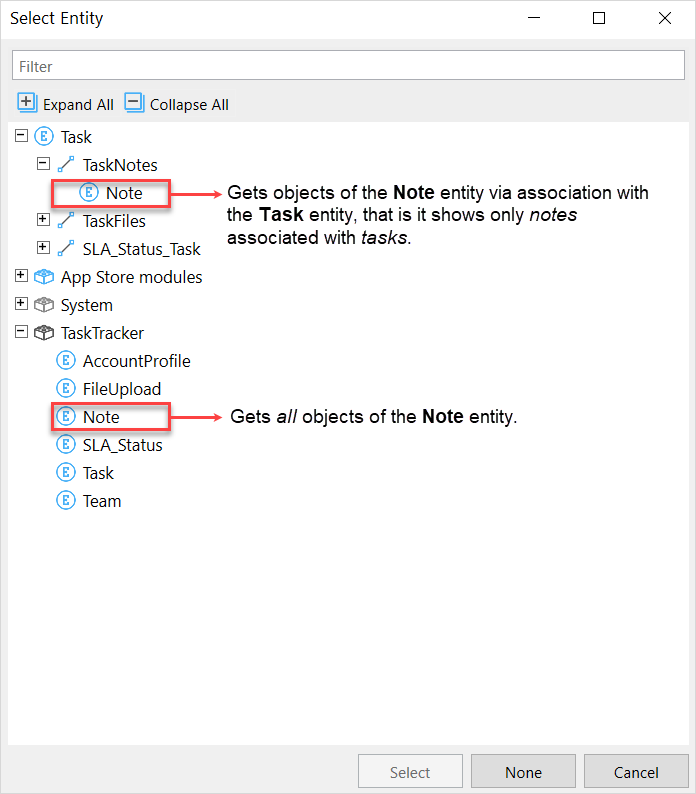

## 1 Introduction

If **XPath** is selected as the data source for a widget then the object or objects shown are retrieved directly from the database with a query. You can filter data with an [XPath constraint](#xpath-constraints).  

The **XPath** data source is very similar to the [**Database** data source](database-source), except that XPath constraints are more flexible than the database ones. 

The data retrieved can also be limited by the following factors:

1. The access rules defined in the **Security** section of the app.
2. An association, if the widget is nested in another data widget and the data path described runs over an association.

If you want to restrict data not for a single widget, but for several, you may want to apply [access rules](access-rules) for entities instead of XPath constraints. This way you know that the objects will always be constrained by these rules. Access rules will also be applied when executing microflows which saves you from repeating constraints.

## 2 Properties

### 2.1 Entity (Path) {#entity-path}

The **Entity (path)** property specifies the target of the database query. If you have a top-level data widget, **Entity (path)** will get objects of the selected entity directly. If you have a nested data widget, you can also select an entity of a parent data container. In this case objects are retrieved following the association path and the association is parsed as an extra constraint in the database query. 

{}
{}

{}
This differs from the [association data source](association-source) when objects are retrieved from the memory, not database.
{}

### 2.2 Show Search Bar {#show-search-bar}

**Show search bar** is only available for data grids. You can select if and when the **[Search bar](search-bar)** of the data grid is shown.

| Value                          | Description                                                  |
| ------------------------------ | ------------------------------------------------------------ |
| Never                          | No search bar or search button are ever shown. Effectively disables search. |
| With button (initially open)   | An end-user can open and close the search bar using the [**Search** button](control-bar#search-button); the search bar is initially open. |
| With button (initially closed)  *(default)* | The user can open and close the search bar using the search button; the search bar is initially closed. |
| Always                         | The search bar is always visible and cannot be close, nor is there a search button. |

### 2.3 Wait for Search

The **Wait for search** property is available if **[Show search bar](#show-search-bar)** is set to *With button (initially open)* or to *Always*. 

When **Wait for search** is set to *Yes*, the grid will remain empty of contents the end-user initiates a search. This can be useful if the target entity contains an extremely large set of objects but most mutations only require a subset of the data. Waiting for search will ensure that no database query is performed until the desired subset is specified, thus skipping the initial loading period associated with major data retrievals.

Default: *false*

### 2.4 XPath Constraint {#xpath-constraints}

The [XPath constraint](xpath-constraints) allows for custom, hard-coded limitations on the data displayed. This constraint will be appended to the constraints (if any) already applied through security and context.

{}
XPath constraints are applied equally to all users and only apply to the data displayed in a single data widget. If the goal is to restrict access to a particular subset of the data for users then [access rules](access-rules) for entities should be used as they can be applied to an individual user role and they apply system-wide.
{}

XPath constraints for data sources have access to objects and attributes from all surrounding data containers. To refer to the immediately surrounding data widget, use `$currentObject`. You can refer to other surrounding data containers by adding a `$` to their name:

{}{}

For example `$customer/Name` would refer to the `Name` attribute of the surrounding data widget with the name `customer`.

The data source will automatically update when an object or attribute used in an XPath constraint changes.

{}
The feature to use objects and attributes from surrounding data containers was introduced in [9.10.0](/releasenotes/studio-pro/9.10).
{}

{}
The feature to use objects and attributes can be used for [List view](list-view) widgets, [Data Grid 2](/appstore/modules/data-grid-2) modules, and many other widgets. However, it **cannot be used** for [Data Grid](/refguide/data-grid) and [Template Grid](/refguide/template-grid) containers.
{}

## 3 Read More

* [Data Containers](data-widgets)
* [Data Grid](data-grid)

