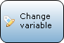
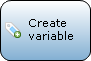
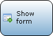
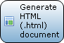
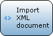

Activities are the actions that are executed in a microflow.

## Object Activitities

| Graphic | Name | Description |
| --- | --- | --- |
|  | [Cast Object](cast-object) | Cast Object can be used in combination with an [inheritance split](inheritance-split) to use the [specialized](entities) members of the object. |
|  | [Change Object](change-object) | Change Object can be used to change the members of an object. This can be done with or without commiting and with or without events. |
|  | [Create Object](create-object) | Create Object can be used to create an object. |
|  | [Delete Object(s)](delete-objects) | Delete Object can be used to delete an object. |
|  | [Rollback Object](rollback-object) | Rollback Object can be used to undo changes (that have not been committed) that were made to the object in the part of the microflow preceding the activity. Furthermore it deletes objects that have been created but have never been committed. |
|  | [Retrieve](retrieve) | Retrieve can be used to get one (or more) associated objects of another object. Furthermore the activity can also get one (or more) objects directly from the database. |

## List Activitities

| Graphic | Name | Description |
| --- | --- | --- |
|  | [Aggregate List](aggregate-list) | Aggregate List can be used to calculate aggregated values such as the maximum, minimum, sum, average and total amount of objects over a list of objects. |
|  | [Change List](change-list) | Change List can be used to change the content of a list variable. |
|  | [Create List](create-list) | Create List can be used to create a (empty) list variable. |
|  | [List Operation](list-operation) | List operation can be used to combine or compare two list with objects of the same entity. |

## Action Call Activities

| Graphic | Name | Description |
| --- | --- | --- |
|  | [Microflow Call](microflow-call) | Microflow call can be used to call another microflow. Arguments can be passed to the microflow and the result can be stored in a variable. |
|  | [Java Action Call](java-action-call) | Java action call can be used to call a Java action. Arguments can be passed to the action and the result can be stored in a variable. |

## Variable Activitities

| Graphic | Name | Description |
| --- | --- | --- |
|  | [Change Variable](change-variable) | Change Variable can be used to change a Boolean, DateTime, Enumeration, Float/Currency, Integer/Long or String variable. |
|  | [Create Variable](create-variable) | Create Variable can be used to create a Boolean, DateTime, Enumeration, Float/Currency, Integer/Long or String variable. |

## Client Activitities

| Graphic | Name | Description |
| --- | --- | --- |
|  | [Close Form](close-form) | Close Form closes the form that is opened last by the user that calls the microflow where this activity is used in. |
|  | [Download File](download-file) | Download File can be used to enable the browser to download a specific file. The user, that calls the microflow where this activity is used in, gets a download popup or the file is shown directly in the browser. |
|  | [Show Message](show-message) | Show Message can be used to show a blocking or non-blocking message to the user that calls the microflow where this activity is used in. |
|  | [Show Form](show-form) | Show Form can be used to show a form to the user that calls the microflow where this activity is used in. |
|  | [Validation Feedback](validation-feedback) | Validation feedback can be used to display a red text below a widget that displays an attribute or association. |

## Integration Activitities

| Graphic | Name | Description |
| --- | --- | --- |
|  | [Call Web Service](call-web-service) | Call Web Service can be used to call one of the [imported web services](imported-web-services). The content of the request can be edited. Furthermore the response of the webservice can be mapped to entities, stored in a variable or be ignored. |
|  | [Generate Document](generate-document) | Generate Document can be used to create a document of a certain type based on a [template](document-templates). |
|  | [Import XML](import-xml) | Import XML can be used to save the data stored in a XML document in the structure defined in the [domain model](domain-model) of the database. |
