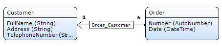
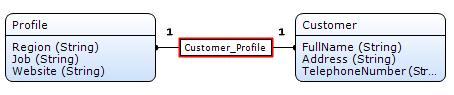
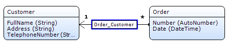
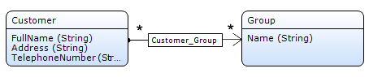
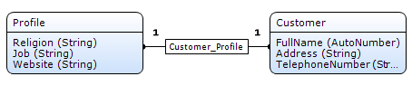
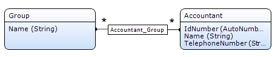

An association describes a relation between entities. In a domain model diagram an association is represented by a line or an arrow between two entities.

The value of the association can only be viewed or edited from objects of the entity that is the _owner_ of the association. Either one entity or both entities can be the owner of the association. If one entity is the owner, there is an arrow that points from the owner to the other entity. If both entities are owner, there is a line between the two entities.

The cardinality (or number of referred objects) of an association is indicated by the number one (`1`) or a star (`*`) at either side of the association.



The arrow indicates that Order is the owner of the association. The number one (`1`) and the start (`*`) indicate that one customer is associated with many orders.

An association between a persistable entity and a non-persistable entity must start in the non-persistable entity and have owner "Default".

See below for more examples.

## Behavior Properties

### Delete behavior

Delete behavior defines what should happen to the associated object when an object is deleted. The following options can be configured for each end of the association.

| Value | Description |
| --- | --- |
| delete <name of entity> object but keep <name of other entity> object(s) | When an object is deleted, the associated object(s) are not deleted. |
| delete <name of entity> object and <name of other entity> object(s) as well | When an object is deleted, the associated object(s) are also deleted. |
| delete <name of entity> object only if it has no <name of other entity> object(s) | An object can only be deleted if it is not associated with any other object(s). |

_Default value_: delete <name of entity> object but keep <name of other entity> object(s)

This delete behavior is used if you want to delete any associated 'Profile' when a 'Customer' is deleted:



This delete behavior is used if you want to be able to delete a 'Customer' only if it is not associated with any 'Order':


## Common Properties

### Name

The name of the association is used to refer to it from forms, microflows, XPath constraints etc.

## Type Properties

### Type

Type defines whether an association is a reference (single) or a reference set (plural).

| Value | Description |
| --- | --- |
| Reference | Single: an object of the owning entity refers to zero or one objects of the other entity. |
| Reference set | Plural: an object of the owning entity refers to zero or more objects of the other entity. |

_Default value:_ Reference

{}

The examples for this property are combined with the example of the owner property below.

{}

### Owner

This property defines whether an association has one or two owners. If there is one owner, the owner is located at the start of the arrow.

| Value | Description |
| --- | --- |
| Default | Only one entity is owner, namely the one where the arrow starts. |
| Both | Both entities are owner. |

_Default value:_ Default

Drawing an association from entity Order to entity Customer results in the following:


The type property has its default value 'Reference'. In this example a customer can have multiple orders, and an order can only have one customer.

In XML instances of these entities and their association look as follows. Note that the association is only stored in the Order element.

```xml
<Order id="101">
	<number>1</number>
	<date>9/30/2008</date>
	<Order_Customer>id_201</Order_Customer>
</Order>

<Customer id="201">
	<fullname>Apple Inc.</fullname>
	<address>1 Infinite Loop</address>
	<telephonenumber>1-800-MY-APPLE</telephonenumber>
</Customer>

```

A many-to-many association with default ownership is created by drawing an association and then setting the 'Type' property to 'Reference set'.

In this example a customer can have multiple groups and a group can have multiple customers:


In XML instances of these entities and their association look as follows. Note that the association is only stored in the Customer element.

```xml
<Customer id="201">
	<fullname>Apple Inc.</name>
	<address>1 Infinite Loop</address>
	<telephonenumber>1-800-MY-APPLE</telephonenumber>
	<Customer_Group>id_301 id_302</Customer_Group>
</Customer>

<Group id="301">
	<name>Multinational corporations</name>
</Group>

<Group id="302">
	<name>Hardware suppliers</name>
</Group>

```

A one-to-one association is created by setting the owner property to both (while leaving the type property at its default value 'Reference').

In this example a customer can have one profile and a profile can have one customer:


In XML instances of these entities and their association look as follows. Note that the association is stored both in the Profile element and the Customer element.

```xml
<Profile id="401">
	<religion>Buddhism</religion>
	<job>Chief Executive Officer</job>
	<website>http://www.apple.com/ </website>
	<Customer_Profile>id_201</Customer_Profile>
</Profile>

<Customer id="201">
	<fullname>Steve Jobs</fullname>
	<address>1 Infinite Loop</address>
	<telephonenumber>1-800-MY-APPLE</telephonenumber>
	<Customer_Profile>id_401</Customer_Profile>
</Customer>

```

A many-to-many association where both entities are owners is created by setting the owner property to both and the type property to 'Reference set'.

In this example an accountant can have multiple groups and a group can have multiple accountants:

In XML instances of these entities and their association look as follows. Note that the association is stored both in the Accountant element and the Group element.

```xml
<Accountant id="501">
	<idnumber>1</idnumber>
	<name>Earl Grey</name>
	<telephonenumber>1-800-EARL-GREY</telephonenumber>
	<Accountant_Group>id_301 id_302</Accountant_Group>
</Accountant>

<Accountant id="502">
	<idnumber>2</idnumber>
	<name>Scrooge McDuck</name>
	<telephonenumber>1-800-SCROOGE-MCDUCK</telephonenumber>
	<Accountant_Group>id_301 id_302</Accountant_Group>
</Accountant>

<Group id="301">
	<name>Multinational corporations</name>
	<Accountant_Group>id_501 id_502</Accountant_Group>
</Group>

<Group id="302">
	<name>Hardware suppliers</name>
	<Accountant_Group>id_501 id_502</Accountant_Group>
</Group>

```

