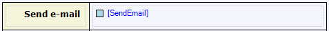

A check box shows a box that is either ticked or empty. You can use it to display and/or edit a truth value.

This check box allows the end-user to choose whether to send an e-mail or not.

A check box must be placed in a table cell within a data view, or within a template grid, and must be connected to an attribute of type Boolean. The connected attribute is shown in blue, and between brackets, behind the check box. At run-time, a ticked check box corresponds to true and an empty check box to false.

## Common Properties

### Tab index (only in web forms)

See [Widget Properties](widget-properties).

### Name

See [Widget Properties](widget-properties).

### Class

See [Widget Properties](widget-properties).

### Style

See [Widget Properties](widget-properties).

## Data Source Properties

### Attribute (path)

See [Widget Properties](widget-properties).

## Editability Properties

### Editable

See [Widget Properties](widget-properties).

### Condition

See [Widget Properties](widget-properties).

## Events

### On change

See [Widget Events](widget-events).

### On change settings

See [Widget Events](widget-events).

### On enter (only in web forms)

See [Widget Events](widget-events).

### On enter settings (only in web forms)

See [Widget Events](widget-events).

### On leave (only in web forms)

See [Widget Events](widget-events).

### On leave settings (only in web forms)

See [Widget Events](widget-events).

## See also

*   [Data Views](data-view)
*   [Attributes](attributes)
