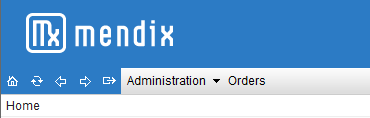

The Client creates the interface of your Mendix application. It shows pages served by the Mendix Runtime and handles user interaction.

## Custom Widgets

The Client supports custom widgets that are distributed through the AppStore. The API that custom widgets can use to interact with the rest of the Client is described in the [API documentation pages](http://apidocs.mendix.com/4/client/). There is also a [tutorial](/howto40/custom-widgets) on creating custom widgets.

Mobile applications can be wrapped in a native app for iOS and Android. This allows custom mobile widgets to access native device functionality, e.g. the camera and GPS. This is described in the [Cordova documentation](#).

## Interface

Even though you have a lot of freedom in the look and feel of your application, some aspects will be common to all Mendix applications. In this section we discuss these aspects of the end-user experience.

Please note that the images displayed here are all presented in the modeler's 'Default' theme. As such their styling may differ from your own application.

### Sign in

Security is an important issue in many Mendix applications. Therefore it is likely that either when you initially attempt to access the application or when you attempt to perform a restricted action (such as accessing a secure form) you will be prompted to enter your user name and password.

If you do not have a user name and password and there is no registration option please contact your system administrator.

Please note that if you were prompted for sign-in information while performing an action you will have to _repeat_ the action after sign-in for it to take effect.

### Toolbar

The toolbar is found at the top of your browser window and contains five icons arranged in the following order:

*   Home - Returns you to the application's homepage

*   Refresh - Refreshes the application to account for changes without having to refresh the entire browser

*   Back - Returns you to the previous page

*   Forward - Returns you to the page you were on before using the 'Back' button

*   Sign out - Signs you out of your current profile

Next to this toolbar one can find the menu bar if the application was designed to include menu items. These can be used to navigate through the application.

The example below allows you to navigate to the pages 'Product' or 'Order'. Alternatively, the bar can guide you to the Administration related pages listed in the dropdown.

Beneath the menu bar is the address bar. This bar tells you exactly where you are in the application.

### Data Grid Overview

The data grid is the backbone of any Mendix application. Any time you see some sort of list or table you will probably be dealing with a data grid. Although the options for data grid customization are nearly infinite there are still several core features that one will find in nearly all data grids. It is those features that are briefly discussed below.

#### Layout

The data grid consists of two distinct sections; a control bar and below that a table or list containing data.

#### Data Grid Control bar

The control bar allows the end-user to manipulate the data displayed in various ways. Examples include searching for specific objects, editing objects or deleting objects.

If you wish to interact with a certain object simply select that object by clicking on it and then click on the menu button that describes your desired action. In some cases it may be possible to interact directly with the grid, allowing the end-user to manipulate the data without the use of pop-ups.

Aside from buttons that allow you to edit data there are also usually navigation buttons.

The search button allows end users to fill in specific values for fields and constrain the data displayed to objects that include those values.

The paging buttons allow the end user to page between different pages of data if there are too many entries to be displayed on a single page.

#### Data Grid table

The table below the menu bar shows you a set of objects and the attributes of those objects. These attributes are arranged in columns, each with its own header.

Clicking the header allows you to sort on a specific attribute, clicking it again changes the sort order from ascending to descending and back again. Shift+clicking on a second header sorts the data on the initial attribute first and on the second attribute secondarily.

Column widths can be manipulated by the simple expedient of clicking and dragging the border between headers.

Hovering the cursor over a table cell presents the end user with a (default or customized) tooltip containing information on the cell contents. If a text is too long for a cell, the tooltip will show the full text.

### Template Grid

The template grid serves the same purpose as a data grid but displays its data in a different fashion. Instead of simple rows, the template grid contains small templates in a grid, each template containing the data of a single object.

The template grid is most often used when the designer wishes to include pictures of the objects in question as the template grid is far more versatile in its display options.

Aside from the cosmetic differences template grids operate in the same fashion and with the same basic layout as data grids.

### Data view

Whenever you are prompted to enter data or wish to view the attributes of a single object you will be presented with a data view. Data views are often presented as a popup but can just as easily be designed as a fullscreen form.

Even more so than data grids data views come in endless variety and can deal with anything from a simple order form with one or two textboxes to a tabbed, multi-paged user information page with popups of its own and a plethora of nested grids and tables.

What they all have in common is that they contain 'widgets', which is a term that applies to a variety of input mechanisms (such as text boxes, check boxes and drop-down menus), which in turn contain values. These widgets may allow (or even require) the end user to enter data or can be read-only, depending on the nature of the data view.

Aside from widgets a data view will nearly always have several buttons situated at the bottom of the form. Most commonly these are the 'Save' and 'Cancel' buttons.

The example above displays a relatively simple data view to edit a user. It contains text-box, date-picker and check-box widgets. There is also a second tab for address information and the customary 'Save' and 'Cancel' buttons.

### Keyboard shortcuts

As in most applications the Mendix Platform allows the end user to use not only the mouse but also the keyboard to navigate the application.

The most widely used keyboard implementation is the tab function. Pressing the tab key allows the end user to jump from item to item. Usually this is from top to bottom but the designer can choose to vary the tab order to suit the needs of the application.

It is possible to tab to nearly all items in the mendix application. This includes buttons, text boxes, menu items, tables and search fields. Several of these items allow interaction by keyboard:

*   Buttons - Tab to a button and hit Enter to press it.
*   Data/template grid tables - Once the table is selected the arrow keys allow you to jump from object to object. The Spacebar selects the highlighted object(s).
*   Selected Object - If an object in a data or template grid is selected, hitting the Enter key will perform the default action on that object.
