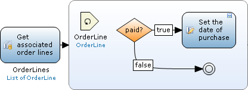

A continue event is used to stop the current iteration and start the iteration of the next object. Please note that continue events can only be used inside [loops](loop).

{}

If the last activity of the flow inside the loop does not end with a break event the loop always continues. So, in theory, a continue event is only necessary to indicate you want to continue looping after a split. However, for clarity you can choose to always include one.

{}

Let us say you have a list of objects of the entity 'OrderLine' and you want to set the purchase date for only the paid order lines. This can be done using a loop with an exclusive split, a continue event and a change activity. The exclusive split determines whether the order line is paid or not. If the order line is paid the purchase date is set by a change activity and the looped activity starts with the next order line. If the order line is not paid the loop starts with the next order line because of the continue event.

