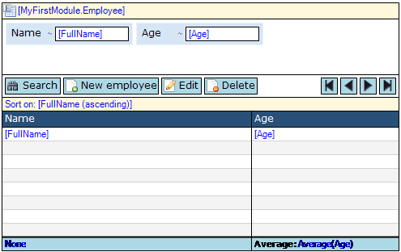

The data grid shows a list of objects in a grid. For example, a data grid can show all the orders a customer has placed. Using controls provided by the data grid you can browse, search and edit those objects.

A data grid showing names and ages of employees.

## Components

### Control bar

See [Control Bar](control-bar).

### Columns

See [Columns](columns).

### Search bar (for data source type "Database")

See [Search Bar](search-bar).

### Sort bar (for data source type "Database")

See [Sort Bar](sort-bar).

## General Properties

### Show control bar

This property indicates whether the control bar will be visible in the end user interface. The control bar also includes the paging buttons.

{}

Even if the control bar is invisible there can still be a default button that is triggered by (double) clicking a row. See the property 'Default button trigger' and [data grid buttons](control-bar) for more information.

{}

_Default value:_ True

### Show paging buttons

This property indicates with the buttons to page through the information in the grid are visible. Only hide these buttons if you are sure that there will never be more objects than the number of rows of the grid. Note that hiding the control bar also hides the paging buttons.

_Default value:_ True

### Column weights

The column weights are percentages separated by semi-colons that determine the widths of the columns. The weights have to add up to 100\. An alternative way of changing the widths of columns is by dragging the separating line between columns.

{}

In the screenshot above the column weights are 63;37.

{}

### Number of rows

With this property you can change the number of rows that will be shown in one page. See also the property 'Show empty rows'.

_Default value:_ 20

### Show empty rows

If you choose to show empty rows there will always be the grid will always show the same number of rows (see 'Number of rows') even if there are less objects to show on the page.

_Default value:_ False

### Selection mode

The selection mode determines whether and how the user can select items in the grid.

| Value | Description |
| --- | --- |
| No selection | The user cannot select items. |
| Single selection | The user can select a single item by clicking on it. Clicking another item will make that item the selection. |
| Multi-selection | The user can select multiple items by clicking the first one and holding the 'Ctrl' key while clicking on other items. Simply clicking an item will deselect all items and make the clicked item the selection. |
| Simple multi-selection | The user can select multiple items by simply clicking on them. This was the default multi-selection behavior prior to version 3.1.0\. |

_Default value:_ Single selection

### Select first

This property indicates whether the first item will be selected initially. This is especially useful if there is a data view listening to this grid.

_Default value:_ False

### Default button trigger

The default button can be triggered by a single or a double click on a row.

| Value | Description |
| --- | --- |
| Single click | A single click triggers the default button. This cannot be used in combination with allowing the user to select rows. |
| Double click | A double click triggers the default button. |

_Default value:_ Double click

### Refresh time (in seconds)

If the refresh time is non-zero, the data grid will refresh its contents every given number of seconds. For example, a task list could be refreshed every minute so that you know when new tasks arrive. By default the refresh time is zero and this means that the grid will not automatically refresh itself.

_Default value:_ 0

### Tooltip form

A tooltip form is a form that appears when you hover your mouse over a row. The tooltip form should consist of a data view on the same entity as the data grid. Besides creating and connecting a tooltip form you also have to specify on which columns the tooltip will appear. See the property 'Show tooltip' of [data grid columns](columns).

## Data Source Properties

The data source determines which objects will be shown in the data grid. For general information about data sources, see [Data Sources](data-sources).

### Type

The data grid supports the following types of data sources: Database Source, Association Source, Microflow Source. The database source retrieves objects from the database and supports searching and sorting. The association source follows an association from the enclosing data view to get to the objects. Finally, the microflow source calculates the list of objects by executing a microflow.

### Entity (Path) (for data source types "Database" and "Association")

The entity (path) property specifies of which entity instances will be shown in the grid. A top-level grid is always connected to an entity. A nested grid can either be connected to an entity or to an entity path starting in the entity of the containing data view.

{}

Let us say the domain model contains entities Order and OrderLine with a reference from OrderLine to Order. You can then create a data view on Order and inside it a grid on OrderLine that is connected to the entity path OrderLine_Order/OrderLine. This will ensure that the grid will only show order lines of the order in the data view.

{}

### Show search bar (for data source type "Database")

See [Database Source](database-source).

### Wait for search (for data source type "Database")

See [Database Source](database-source).

### XPath constraint (for data source type "Database")

See [Database Source](database-source).

### Apply context (for data source type "Database")

See [Database Source](database-source).

### Remove from context (for data source type "Database")

See [Database Source](database-source).

### Microflow (for data source type "Microflow")

The microflow property specifies a microflow is executed when the grid is opened. The microflow returns the objects that will be shown in the data grid.

### Microflow settings (for data source type "Microflow")

The microflow settings specify which parameters to pass to the microflow. See [Starting Microflows](starting-microflows).

## Common Properties

### Tab index

See [Widget Properties](widget-properties).

### Name

See [Widget Properties](widget-properties).

### Class

See [Widget Properties](widget-properties).

### Style

See [Widget Properties](widget-properties).
