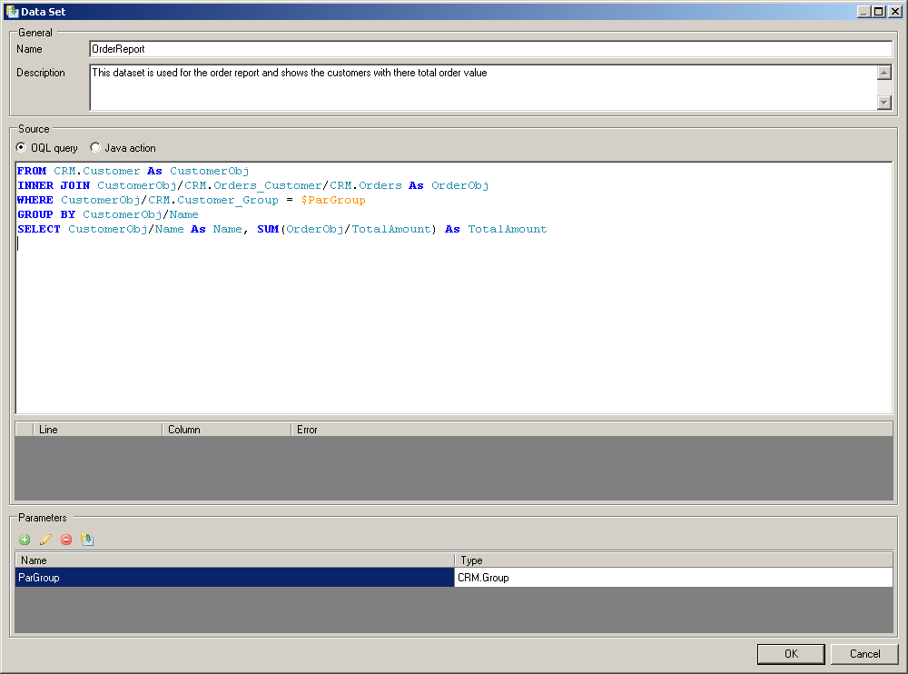
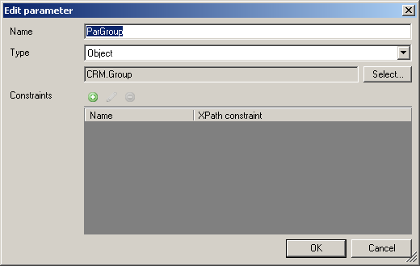
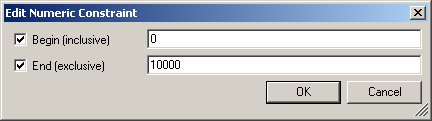
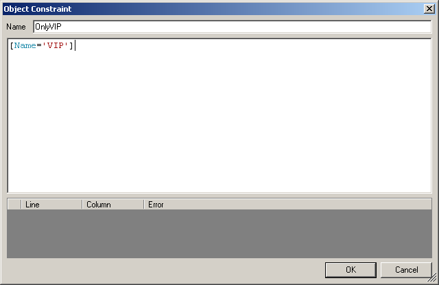

A data set can be used for [reporting](reporting).

A data set is defined using either an OQL query or a custom Java action. To constrain datasets parameters can be defined which can be used in the OQL queries or Java Actions.

Example of a data set using OQL:

**General**

*   _Name_: The name of the data set, this is the designation the data set will carry in the rest of the modeler.
*   _Description_: The description of the data set, this is only relevant as documentation.

**Source**

*   _OQL query_: The [OQL query](oql) which defines the data set.
*   _Java action_: The interface of the Java action which returns a data set. The columns and data types of the columns needs to be specified in the modeler. Based on this specification the modeler will create a template for this action.

**Parameters**
A dataset can have multiple parameters. Parameters are used to filter / manipulate data sets. [Security](security) on data sets is configured based on the parameters. In a Java action the parameters are used in the generated template.

{}

In OQL parameters can be called using a **$** symbol, for example: **$Month**.

{}

*   _Name_: The name of the parameter
*   _Type_: The type of the parameter: object, enumeration or a primitive (e.g. datetime, float, integer, boolean, etc).
*   _Constraints_: The constraints on a parameter. These constraints influence which values can be selected for parameter input values by the end user. Constraints can be associated with user roles in the [data set security](security). There are two type of constraints: ranges which apply to numeric and date parameters and XPath constraints which apply to object parameters.

_Ranges_

When a parameter is defined as a range the dropdown box in the report shows each range instead of all values within the ranges. Currency and float parameters are always ranges. The following table shows an example for the parameter 'amount', how a range and could be applied:

| **Range** | **Allowed to be viewed by** |
| --- | --- |
| 0.00 - 1,000.00 | Employees, Management, Board members |
| 1,000.00 - 10,000.00 | Management, Board members |
| 10,000.00 - Infinity | Board members |

_XPath constraints_

An XPath constraint can be defined using [XPath](xpath). Multiple constraints can be defined on a parameter and each constraint can be associated with a user role.

