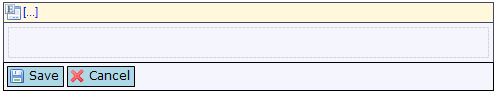
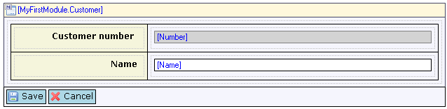
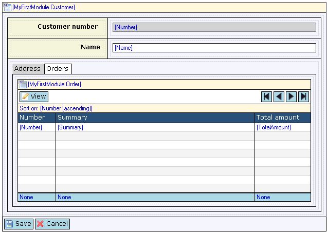

The data view is a central component in Mendix applications. It is the starting point for showing the contents of exactly one object. If, for example, you want to show details of a single customer you would use a data view to do this. The data view typically contains a table with labels and input widgets like text boxes. In more complex screens, a data view can contain tab controls per topic (address, payment information) and data views and data grids for related objects (order history, wish list).

{}

An empty data view.

{}{}

A simple data view showing the number and name of one customer.

{}{}

A more advanced data view with a tab control and a data grid inside.

{}

## Components

### Data View Contents Area

The data view contents area is the place where all the layout and input widgets go. Often the contents area contains a table with two columns with labels on the left and input widgets on the right. Other layouts are possible as you can see in the examples above.

### Data View Control Bar

The control bar of the data view is the bar with buttons at the bottom of the component. By default, it contains a Save and a Cancel button but the bar can be customized. A read-only data view would typically provide only a Close button. You can add buttons with custom behavior through the use of a microflow button.

See [Data View Control Bar](data-view-control-bar) for a description of the buttons and their properties.

## General Properties

### Editable (before version 4.1.0 only in web forms)

The editable property indicates whether the data view as a whole is editable or not. If the data view is not editable, no widget inside the data view will be editable. On the other hand, if the data view is editable, each widget can be editable or not based on its own editable property.

_Default value:_ Trueh3\. Show control bar (only in web forms)

### Show control bar (only in web forms)

With this property you can specify whether you want the control bar of the data view to be visible. The control bar of nested data views is invisible by default regardless of the value of this property.

_Default value:_ True

### Close on Save/Cancel (only in web forms)

Using this property you can specify whether you want the current form to be closed when the Save or Cancel button is clicked. After closing the current form, the client will return to the previous screen. This property only has effect for data views that are shown in the content pane (as opposed to in a popup).

For example, you have a data grid with customers and the edit button of the grid directs you to a data view in content showing the details of one customer. After clicking Save or Cancel you want the application to return to the form of the grid. In this case you want the property 'Close on Save/Cancel' to be true.

_Default value_: True

## Common Properties

### Tab index

See [Widget Properties](widget-properties).

### Name

See [Widget Properties](widget-properties).

### Class

See [Widget Properties](widget-properties).

### Style

See [Widget Properties](widget-properties).

## Data Source Properties

The data source determines which objects will be shown in the data view.

### Type

The data view supports the following types of data sources:

*   Entity (Path),
*   Microflow
*   Listen to grid (only in web forms)

### Entity (Path) (only for data source type "Entity (Path)")

The entity (path) property specifies the entity that will be shown in the data view. For a top-level data view it is simply an entity. In this case the caller of the form supplies the object that will be shown. A nested data view has an entity **path** that follows associations from the enclosing data view.

### Microflow (only for data source type "Microflow")

The microflow property specifies a microflow is executed when that data view is opened. The microflow returns the object that will be shown in the data view. Only a nested data view can have a microflow. The microflow gets the object of the containing data view as a parameter and returns an object of the type of the entity of its own the data view.

### Microflow settings (only for data source type "Microflow")

The microflow settings specify which parameters to pass to the microflow. See [Starting Microflows](starting-microflows).

### Listen target (only for data source type "Listen to grid")

This property specifies the grid or reference set selector that the data view listens to. The entity of the data view should be the same or a generalization of the entity in the grid.

A data view that listens to a grid or reference set selector in the same form shows detailed information about the object that is currently selected in the grid. An example of using listen target is a data grid showing orders and a data view showing detailed information about the order in the same form.

### Use schema

This defines whether only the required attributes and associations for the object(s) are retrieved. This can sometimes improve your performance but it can also reduce performance because the objects can not be cached entirely. If you have custom widgets in your form and they need access to other fields or associations, or if your next form contains other attributes or associations of the same object(s) you should not enable this. This is why the default value is false.

## Related Articles

*   [Entities](entities)
*   [Associations](associations)
