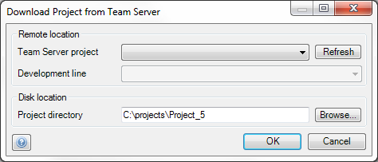

Use this dialog to download a project from the Team Server. Note that you can use the [Open Project Dialog](open-project-dialog) for this, too. You only need to use this form in the specialized case that you want a second download of the same project (and development line).

## Team Server project

Select the Team Server project you wish to download from the list.

## Development line

Choose the development line that you want to download.

## Disk location

Choose the directory where you want to download the Team Server project to. The suggested name includes the name of the development line ('main' or the name of the branch line).
