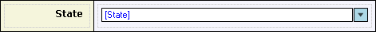

A drop-down widget can be used to display and/or select an enumeration value.

This drop-down widget allows the end-user to select the state of the customer.

A drop-down widget must be placed in a table cell within a data view, or within a template grid, and must be connected to an attribute of type Enumeration. The connected attribute is shown in blue, and between brackets, inside the text box.

## General Properties

### Required (only in web forms)

See [Widget Properties](widget-properties).

### Required message (only in web forms)

See [Widget Properties](widget-properties).

## Common Properties

### Tab index (only in web forms)

See [Widget Properties](widget-properties).

### Name

See [Widget Properties](widget-properties).

### Class

See [Widget Properties](widget-properties).

### Style

See [Widget Properties](widget-properties).

## Data Source Properties

### Attribute (path)

See [Widget Properties](widget-properties).

## Editability Properties

### Editable

See [Widget Properties](widget-properties).

### Condition

See [Widget Properties](widget-properties).

## Events

### On change

See [Widget Events](widget-events).

### On change settings

See [Widget Events](widget-events).

### On enter (only in web forms)

See [Widget Events](widget-events).

### On enter settings (only in web forms)

See [Widget Events](widget-events).

### On leave (only in web forms)

See [Widget Events](widget-events).

### On leave settings (only in web forms)

See [Widget Events](widget-events).

## See also

*   [Data View](data-view)
*   [Attributes](attributes)
