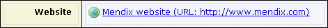
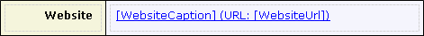

An external link can be used to display a clickable link that redirects to a given URL. This can either be a static URL or a dynamic URL that is determined by an attribute of an entity. The caption can also be static or dynamic.

This is what a static external link looks like in the modeler.

This is what a dynamic external link looks like in the modeler. The properties 'Caption Attribute', and 'Url Attribute', are both connected to attributes of the entity  'Company'.

An external link must always be placed into a table cell. If the caption, or URL, of the external link is dynamic, then the containing table must also be placed within a data view, or within a template grid. The connected attributes are shown in blue, and between brackets, inside the text box.

## Appearance Properties

### Caption

The caption property determines the static caption of the external link. This property is ignored if a caption attribute is specified.

### Render as

This property indicates whether this link must be shown as a button, or as a link.

| Value | Description |
| --- | --- |
| Button | The external link will look like a button. |
| Link | The external link will look like a link, i.e. underlined text. |

### Image

This property indicates which image will be shown in front of the link.

## Behavior Properties

### URL

This property specifies the static URL that will be opened when the end user clicks on this external link. This property is ignored if a URL attribute is specified.

## Common Properties

### Tab index

See [Widget Properties](widget-properties).

### Name

See [Widget Properties](widget-properties).

### Class

See [Widget Properties](widget-properties).

### Style

See [Widget Properties](widget-properties).

## Data Source Properties

### Caption attribute (path)

This property specifies the attribute (path) whose value will be shown in the external link as the caption. It can be either an attribute of the data view entity, or an attribute of an entity that is associated to the data view entity by following associations of type reference.

{}

If the attribute is set, the static caption is ignored.

{}

### URL attribute (path)

This property specifies the attribute (path) whose value will be the URL of the external link. It can be either an attribute of the data view entity, or an attribute of an entity that is associated to the data view entity by following associations of type reference.

{}

If the attribute is set, the static URL is ignored.

{}

## See also

*   [Data View](data-view)
*   [Attributes](attributes)
