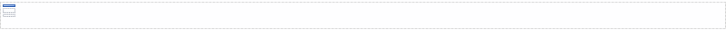

When enabled, the header will be inserted at the top of every page. Other widgets can be put in the header.

For inserting page numbers, see [Static Label](static-label-document-template)

A header

## Appearance

### TopMargin

The amount of space between the top of the page and the header in inches.
