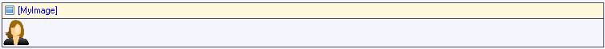

An image viewer can be used to display an image or its thumbnail.

This image viewer shows the product image.

An image viewer must be placed in a table cell inside a data view or template grid.

## Appearance Properties

### Default image

This is the image that is displayed if no image is uploaded.

### Width

This property determines the width of the image. The aspect ratio of the image is maintained. The image will be placed on a transparent background of the specified width and height so that multiple images with the same dimensions line up.

### Height

This property determines the height of the image. See width (above) for more information.

### Show as thumbnail

This property indicates whether the generated thumbnail is shown or the full image.

_Default value:_ True

## Common Properties

### Name

See [Widget Properties](widget-properties).

### Class

See [Widget Properties](widget-properties).

### Style

See [Widget Properties](widget-properties).

## Data Source Properties

### Entity (path)

The entity (path) property specifies which entity will be shown in the image viewer. It starts in the data view entity and must end in System.Image or a specialization thereof. If the data view entity itself is (a specialization of) System.Image you can use this entity on the image viewer as well.

## Events

### On click

This property specifies what happens when the image is clicked:

| Value | Meaning |
| --- | --- |
| Do nothing | Nothing happens. |
| Call microflow | The specified microflow is executed. |
| Enlarge | The image is shown at full size. |

_Default value:_ Do nothing

### Microflow (in the case 'Call microflow')

This property specifies the microflow that will be executed when the image is clicked.

### Microflow settings (in the case 'Call microflow')

The on click settings specify what parameters will be passed to the microflow, whether to show a progress bar or not, and more.

See [Starting Microflows](starting-microflows).

## Related Articles

*   [Data View](data-view)
*   [Entities](entities)
