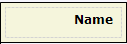

A label shows a line of static text. You can use it to place custom text on your form. You can change the look of the label by changing the render mode of the [Table Cell](table-cell) in which it is placed.

The label is placed in a cell here and the render mode of the cell is header:

A label must be placed in a table cell.

## General Properties

### Caption

The text that the label displays. This is a translatable text. See [Translatable Texts](translatable-texts).

## Common Properties

### Name

See [Widget Properties](widget-properties).

### Class

See [Widget Properties](widget-properties).

### Style

See [Widget Properties](widget-properties).
