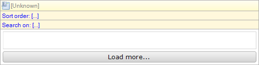

The list view is similar to the template grid available in web forms. The list view shows a list of objects arranged vertically. Each object is shown using a template. During development, the object template is defined by placing a widget inside the list view's dropzone. The list of objects shown is determined by a datasource.

An empty list view:

## General

### Click action

The click action defines what action is performed when a list view entry is 'clicked'. This can either be opening a form or calling a microflow. For opening a form see [Opening Forms](opening-forms) and for the microflow settings see [Starting Microflows](starting-microflows). The list view has no Confirmation or Advanced microflow settings.

### Page Size

With this property you can change the number of containers that will be shown in one page.

## Data Source Properties

The data source determines which objects will be shown in the list view. For general information about data sources, see [Data Sources](data-sources).

### Type

The list view supports the following types of data sources: Database Source, Association Source, Microflow Source. The database source retrieves objects from the database and supports searching and sorting. The association source follows an association from the enclosing data view to get to the objects. Finally, the microflow source calculates the list of objects by executing a microflow.

### Entity (Path) (for data source types "Database" and "Association")

The entity (path) property specifies of which entity instances will be shown in the list view. A top-level list view is always connected to an entity. A nested list view can either be connected to an entity or to an entity path starting in the entity of the containing data view.

{}

Let us say the domain model contains entities Order and OrderLine with a reference from OrderLine to Order. You can then create a data view on Order and inside it a grid on OrderLine that is connected to the entity path OrderLine_Order/OrderLine. This will ensure that the grid will only show order lines of the order in the data view.

{}

### XPath constraint (for data source type "Database")

See [Database Source](database-source).

### Microflow (for data source type "Microflow")

The microflow property specifies a microflow is executed when the list view is opened. The microflow returns the objects that will be shown in the list view.

### Microflow settings (for data source type "Microflow")

The microflow settings specify which parameters to pass to the microflow. See [Starting Microflows](starting-microflows).

## Common Properties

### Name

See [Widget Properties](widget-properties).

### Class

See [Widget Properties](widget-properties).

### Style

See [Widget Properties](widget-properties).
