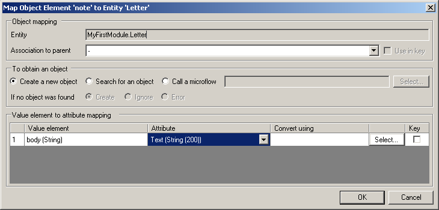

This describes how to map an xml element to a domain model entity for a XML-to-Domain mapping.

## Object mapping

### Entity

The entity that you selected to map the XML element to.

### Association to parent.

The relationship that should be set (can be empty). This can be an XML element above this element, or the XML parameter provided to the mapping.

## To obtain an object

This property specifies how the runtime should obtain the object to map this element to.

| Value | Description |
| --- | --- |
| Create a new object | Simply creates a new object. An error can be thrown if there are any before create microflows that fail. |
| Search for an object | Searches for an object, using keys defined in the attributes list. The runtime searches for the object by taking all attributes marked as "Key" (in the "Value element to attribute mapping" section below) and converting them to an XPath query. If more than one object is returned by the XPath query, an error will be thrown. |
| Call a microflow | Calls a microflow to obtain an object. If the microflow expects any parameters, these need to be specified in the "Select..." window. Possible parameters are the XML Mapping parameter, any parent entity in the mapping and of course any attributes in the current XML element. |

### If no object was found

This is the action that the runtime will perform when an error occurred in the specified "To obtain an object" action.

| Value | Description |
| --- | --- |
| Create | Create a domain entity to map to. |
| Ignore | Don't map this element and continue parsing the rest of the XML. |
| Error | Explicitly stop parsing the XML and throw an error. This error needs to be handled in the calling microflow. |

## Value element to attribute mapping

You must map each selected XML element to an attribute in the domain entity. If you don't want to map certain elements, simply uncheck them in the "Select elements..." dialog.

### Value element

This shows the name and type of the XML value element.

### Attribute

Here you can select an attribute to map this value element to. This property is required, except when you use the attribute as parameter in the microflow to obtain an object.

### Convert using

If the XML data of a value element is not in the right format, you can use a microflow to convert it to a different data type.

The conversion microflow should have one parameter that matches the element type. Alternatively, the parameter may be of type String, as all XML data is in fact a String. For example, when the XML data contains an exotic DateTime format, you can parse this format yourself by using a conversion microflow with a String parameter.

If this value element maps to an attribute, the return type of the conversion microflow must match the attribute type.

{}

Conversion microflows of value elements are executed before these value elements are used as search keys or microflow parameters to obtain an object. This means that when using a value element with a conversion microflow as parameter for the microflow to obtain an object, the parameter type should match the return type of the conversion microflow.

{}

### Key

This property specifies whether the value element is used as search key to obtain an object. If a value element is used as search key, you must specify the attribute it maps to. The XML value will be matched to the value of this attribute when searching for an object.

The map element to entity screen:

