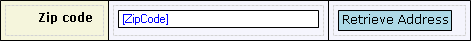

A microflow trigger can be used to create a button that starts a microflow on a form.

{}

This microflow trigger retrieves an address that belongs to the given zip code.

{}

A microflow trigger must always be placed in a table cell. If a microflow trigger is placed within a data view the connected microflow will receive the entity that is connected to the data view as an input parameter.

## Appearance Properties

### Caption

The text displayed on the trigger. This is a translatable text. See [Translatable Texts](translatable-texts).

### Render as

This property indicates how the trigger is rendered.

| Value | Description |
| --- | --- |
| Button | The trigger is rendered as a button. |
| Link | The trigger is rendered as a hyperlink. |

_Default value:_ Button

### Image

This property indicates the image that will be shown in front of the caption of the trigger.

## Common Properties

### Tab index

See [Widget Properties](widget-properties).

### Name

See [Widget Properties](widget-properties).

### Class

See [Widget Properties](widget-properties).

### Style

See [Widget Properties](widget-properties).

## Events

### On click

This property specifies the microflow that is triggered when the end user clicks on this trigger.

### On click settings

The on click settings specify what parameters will be passed to the microflow, whether to show a progress bar or not, and more.

See [Starting Microflows](starting-microflows).

## Visibility Properties

### Visible

A microflow trigger can be shown or hidden based on certain conditions. See [Conditions](conditions).

## Related Articles

*   [Data View](data-view)
*   [Microflows](microflows)
