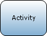
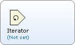
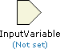
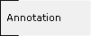
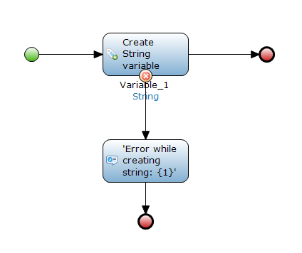

{}

This part is an overview of all the elements that can be used in a microflow. For the properties of the microflow itself, see [Microflow](microflow).

{}

Microflows allow you to express the logic of your application. A microflow can perform actions like creating and updating objects, opening forms and making choices. It is a visual way of expressing what traditionally ends up in textual program code.

## Notation

The graphical notation of microflows is based on the Business Process Modeling Notation (BPMN). BPMN is a standardized graphical notation for drawing business processes in a workflow.

A microflow is composed of elements. Below is a categorized overview of all elements. The following categories are used:

*   [Events](microflows) represent start and end points of a microflow and special operations in a loop.
*   [Flows](microflows) form the connection between elements.
*   [Gateways](microflows) deal with making choices and merging different paths again.
*   [Activities](microflows) are the actions that are executed in a microflow.
*   [Artifacts](microflows) provide the microflow with input and allow comments to be made.
*   [Error handlers](microflows) can be set on an activity, gateway or loop to define how to handle an error.

## Events

Events represent start and end points of a microflow and special operations in a loop.

| Graphic | Name | Description |
| --- | --- | --- |
|  | [Start Event](start-event) | A start event is the starting point of the microflow. A microflow can only have one start event. |
|  | [End Event](end-event) | An end event defines the location where the microflow will stop. Depending on the return type of the microflow in some cases a value must be specified. There can be more than one end event. |
|  | [Continue Event](continue-event) | A continue event is used to stop the current iteration of a loop and continue with the next iteration. Please note that continue events can only be used inside a [Loop](loop). |
|  | [Break Event](break-event) | A break event is used to stop iterating over the list of objects and continue with the rest of the flow after the loop. Please note that break events can only be used inside a [Loop](loop). |

## Flows

Flows form the connection between elements.

| Graphic | Name | Description |
| --- | --- | --- |
|  | [Sequence Flow](sequence-flow) | A sequence flow is an arrow that links events, activities, splits and merges with each other. Together they defined the order of execution within a microflow. |
|  | [Annotation flow](annotation-flow) | An association is a connection that can be used to connect an annotation to another element. |

## Gateways

Gateways deal with making choices and merging different paths again..

| Graphic | Name | Description |
| --- | --- | --- |
|  | [Exclusive Split](exclusive-split) | An exclusive split makes a decision based on a condition and follows one and only one of the outgoing flows.
**Note**: There is no parallell execution in microflows. |
|  | [Inheritance Split](inheritance-split) | An inheritance split is an element that makes a choice based on the [specialization](entities) of the selected object. You can give the specialized object a name using a [Cast object](cast-object) action. |
|  | [Merge](merge) | A merge can be used to combine multiple sequence flows into one. If a choice is made in a microflow and afterwards some common work needs to be done, you can combine the two (or more) paths using a merge. |

## Activities

Activities are the actions that are executed in a microflow.

| Graphic | Name | Description |
| --- | --- | --- |
|  | [Activity](activities) | An activity can be used to execute a specific action in a microflow. |
|  | [Loop](loop) | A looped activity is used to iterate over a list of objects. For every object the flow inside the looped activity is executed. A looped activity can contain all elements used in microflows, with the exception of start and stop events. The flow starts at the first element with no incoming flows. |

## Artifacts

Artifacts provide the microflow with input and allow comments to be made.

| Graphic | Name | Description |
| --- | --- | --- |
|  | [Parameter](parameter) | A parameter is data that serves as input for the microflow. Parameters are filled at the location from where the microflow is triggered. |
|  | [Annotation](annotation) | An annotation is an element that can be used to put comments in a microflow. |

## Errors

When an error occurs in a microflow, all changes that have been made to objects are rolled back and the microflow is aborted. Optionally, you can handle errors in the microflow itself by configuring different error handling settings. You can even inspect the details of the error by looking at the predefined variables `$latestError` and `$latestSoapFault`.

### Error handlers

An error handler can be set on an activity, gateway or loop.
On an activity or gateway it gives you three options:

*   Rollback (default)
*   Custom with rollback
*   Custom without rollback

For the latter two options you can draw an additional flow from the block and mark this flow as the error handler flow. When selecting 'Custom with rollback' it will trigger this path when the error occurs and still rollback your objects afterwards. The 'Custom without rollback' option does not rollback the objects. After you selected a flow as the error handler it will show this as in the following image.

On a loop you get two options:

*   Rollback (default)
*   Continue

The continue option means that when an error occurs, the loop will simply continue to the next iteration. It will show as a continue icon on the exit flow of the loop.

### Inspecting errors

{}

The error object variables described below were introduced in version 4.7.0\. Before that version, you could refer to error information in microflows by using the predefined variables `$lastErrorType` etc. See the auto-completion list inside the microflow expression editor for an overview of these variables in previous versions. Note that in previous versions, the SOAP fault variables were not reset to empty values if another error occurred.

{}

When an error occurs inside a microflow, under the hood a Java exception is raised that contains information about the error that occurred. Inside a custom error handler (i.e. after an error handling flow), you can inspect the type of this Java exception as well as several other properties. Every microflow contains two predefined error variables, `$latestError` and `$latestSoapFault`. `$latestError` is an object of entity System.Error, while `$latestSoapFault` is an object of entity System.SoapFault, which is a specialization of System.Error.

In a custom error handler that is executed after an error occurs, `$latestError` is set to an object containing information about the error that occurred. If the error is a SOAP fault (an error that occurs as a result of a web service call), `$latestSoapFault` is set to an object that contains more specific information about the SOAP fault. Otherwise, `$latestSoapFault` is `empty`.

{}

You can determine whether an error was a SOAP fault by checking `$latestSoapFault` for `empty`.

{}

The following table shows the members of System.Error and System.SoapFault.

| Entity | Attribute | Type | Description |
| --- | --- | --- | --- |
| System.Error | ErrorType | String | The Java exception type of the error that occurred. |
| System.Error | Message | String | The message of the Java exception. |
| System.Error | Stacktrace | String | The stacktrace of the Java exception. |
| System.SoapFault | Code | String | The Code element of the SOAP fault. |
| System.SoapFault | Reason | String | The Reason element of the SOAP fault. |
| System.SoapFault | Node | String | The Node element of the SOAP fault. |
| System.SoapFault | Role | String | The Role element of the SOAP fault. |
| System.SoapFault | Detail | String | The Detail element of the SOAP fault. |

See [here](http://www.w3.org/TR/soap12-part1/#soapfault) for more information on SOAP faults.

{}

In microflows that apply entity access, which are recognizable by their yellow background, it is not possible to inspect the attributes of error objects for security reasons. You can pass the error object to a submicroflow that does not apply entity access and inspect the attributes there.

{}

## Microflow Debugging

If you want to see what is happening while a microflow is executing, you can use the microflow debugger. See the following how-tos:

*   [Version 4.2 and earlier](/howto40/debugging-4.2-and-before)
*   [Version 4.3 and later](/howto40/debugging)
