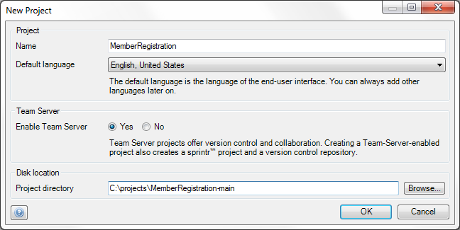

Use this dialog to create new projects. You can use it both for Team Server and for local projects. Local projects can always be uploaded to the Team Server at a later point in time.

## Name

The name of the project is used as the name of the project file on disk. If you enable Team Server for this project, the name is also used for the Team Server repository and a corresponding sprintr™ project.

## Default language

The default language is the language of the end-user interface. Choose the language that you will initially build your forms etcetera in. You can always add additional languages to your project later on.

## Enable Team Server

Team Server projects offer version control and collaboration. Creating such a project also creates a sprintr™ project and a corresponding version control repository. If you choose 'No' here, you will create a local project that is only on your disk. However, at a later point in time you can choose to upload such a local project to the Team Server and enjoy the benefits of version control.

## Disk location

Here you choose the project directory for your project. In the case of a Team Server enabled project you will see that "-main" will be appended to the directory name to indicate that it is the main line that is stored at this disk location. You can always create branches and download them later to other directories.
