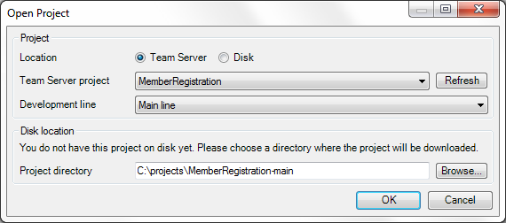

Use this dialog to open projects. It can be used to open projects on disk or through the Team Server. In the latter case the Modeler will check whether you have already downloaded the project. If so, it will simply open it. If not, the project will downloaded from the Team Server first.

## Location

You can open either a project from the Team Server or from disk. For opening a project on disk you simply point to the project file. A project on disk can also be a Team Server project and there is no difference in opening it via Team Server or via Disk.

## Team Server project

From the list select the Team Server project you wish to open.

For more information about the Mendix Team Server, see [Team Server](team-server).

## Development line

Choose the development line in which you want to start developing.

For more information about development lines, see [Version Control Concepts](version-control-concepts).

## Disk location

If you already have the development line of the project on disk, you will see the message "You already have this project on disk" and the directory will be shown. If you do not have it yet, you can now choose the directory where you want to download the Team Server project to. The suggested name includes the name of the development line ('main' or the name of the branch line).

{}

The Modeler remembers all projects that you open. In this way it can point you to existing downloads of Team Server projects. If you move a project directory, the Modeler will not see that directory anymore and offer to download a fresh copy. If you want to continue using the existing download, you will have to open it via the 'Disk' option.

{}
