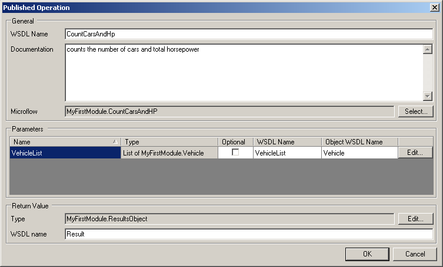
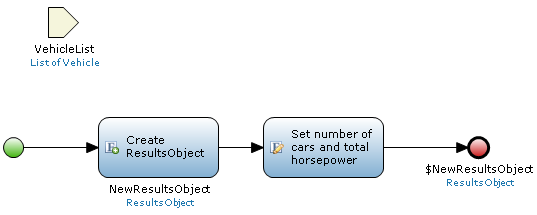
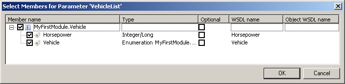

Provides the actual methods of which the webservice is composed.

Looking at an operation in more detail, you can see that a microflow can be selected. When you select a microflow, the other fields will be automatically filled These can be changed as needed.

An operation has the following properties:

## General

### WSDL Name

This is what the operation is called in the WSDL.

### Documentation

Describes the operation and is included in the WSDL.

### Microflow

Defines which microflow will be executed when this webservice is called.

## Parameters

### Name

Defines the name of the parameter in the microflow

### Type

Defines which type the parameter is, for example a List of Vehicle.

### Optional

Defines whether this parameter is optional in the webservice call.

### WSDL Name

Defines the name of the parameter in the webservice call. This is initially copied from the microflow parameter name but can be modified.

### Object WSDL Name

Is available when the parameter is a list, and can be used to name the object in the list.

{}

The CountCarsAndHp operation. It takes a non-optional list of Vehicle as a parameter which is called VehicleList and consists of objects called Vehicle. This information is based on the microflow and entity model but can be modified.

{}{}

The microflow attached to the CountCarsAndHp operation. It takes a list of objects of the entity Vehicle as input and returns an object that holds the number of cars and the total amount of horsepower of those cars.

{}

If you click 'edit' in the parameter menu, you can select individual members of the entity that is being passed as a parameter.

{}

Here you can select which members of the entity can be passed and/or are optional, as well as set their names.

{}

## Return value

This section pertains to the return value of the microflow and how it is transformed back to XML.

### Type

Defines what kind of object will be returned by the microflow. If the returned type is a complex type (i.e. something from your entity model) you can use the edit button to select which members will be returned in the same way as parameters.

### WSDL name

The name of the return type. This determines the output element name in the XML that results from a webservice call.
